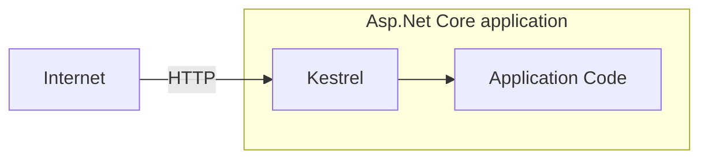
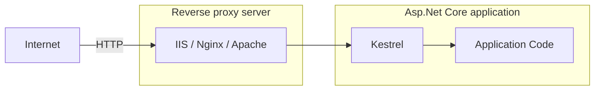
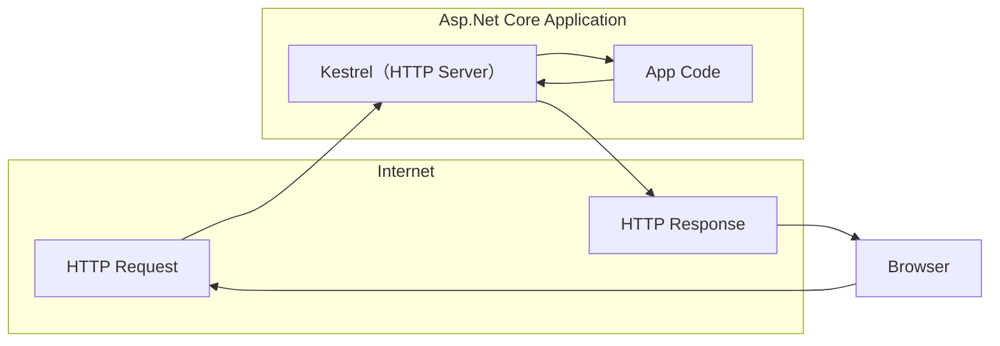

# learn-dotnet-ultimate

## Asp.Net Core 9 (.NET 9) | True Ultimate Guide

ASP .NET Core 6 to 9 | Asp.Net Core Projects | Bootcamp | Advanced | Interview Questions | Web API | MVC

### 内容概览

- [x] 01. 介绍 (Introduction)
- [x] 02. 入门 (Getting Started)
- [ ] 03. HTTP
- [ ] 04. 中间件 (Middleware)
- [ ] 05. 路由 (Routing)
- [ ] 06. 控制器与 IActionResult (Controllers & IActionResult)
- [ ] 07. 模型绑定与验证 (ModelBinding and Validations)
- [ ] 08. Razor 视图 (Razor Views)
- [ ] 09. 布局视图 (Layout Views)
- [ ] 10. 分部视图 (Partial Views)
- [ ] 11. 视图组件 (View Components)
- [ ] 12. 依赖注入 (Dependency Injection)
- [ ] 13. 环境 (Environments)
- [ ] 14. 配置 (Configuration)
- [ ] 15. 单元测试 (xUnit)
- [ ] 16. 增删改查 (CRUD Operations)
- [ ] 17. Tag Helpers
- [ ] 18. EntityFrameworkCore
- [ ] 19. 高级单元测试 (Advanced Unit Testing [Moq & Repository Pattern])
- [ ] 20. 日志 (Logging and Serilog)
- [ ] 21. 过滤器 (Filters)
- [ ] 22. 错误处理 (Error Handling)
- [ ] 23. SOLID原则 (SOLID Principles)
- [ ] 24. 整洁架构 (Clean Architecture)
- [ ] 25. 身份认证 (Identity, Authorization, Security)
- [ ] 26. Asp.Net Core Web API
- [ ] 27. Swagger / Open API
- [ ] 28. ~~Angular and CORS~~
- [ ] 29. 身份认证 (JWT & Web API Authorization)
- [ ] 30. 最小API Minimal API (new feature)
- [ ] 31. 新特性 New Feature of ASP.NET Core 8
- [ ] 32. 扩展 Extra: C# Essentials
- [ ] 33. ~~Practial Test~~
- [ ] 34. The End

## 一、介绍

### 001. Asp.Net Core 介绍

#### 什么是 ASP.NET Core？

ASP.NET Core 是一个跨平台、高性能的开源框架，用于构建支持云的现代Web应用程序的服务。

#### 跨平台 (Cross-platform)

ASP.NET Core 应用程序可以托管在 Windows、Linux和Mac上。

#### 可以托管的服务器类型。

支持 Kestrel、IIS、Nginx、Docker、Apache等。

#### 开源

由 GitHub 上超过 1000+ 的贡献者贡献 [aspnetcore](https://github.com/dotnet/aspnetcore)

#### 支持 Cloud

对 Microsoft Azure 的现成支持

#### 模块

- ASP.NET Core MVC - 用于创建大中型到复杂的Web应用程序。
- ASP.NET Core Web API - 用于为所有类型的客户端应用程序创建RESTFul服务。
- ASP.NET Core Razor Pages - 用于创建简单且以页面为中心的网络应用程序。
- ASP.NET Core Blazor - 用于在客户端和服务端使用C#代码创建Web应用程序。

> 先决条件：
> 1. C# - 类、接口、继承、异步、扩展方法、lambda表达式等。
> 2. HTML、CSS、JavaScript、jQuery等。

### 002. Asp.Net Web Forms、Asp.Net Mvc、Asp.Net Core 对比

| 框架 | 发布时间 | 性能 | 平台 | 云环境 | 开源 | 开发模型 |
| -- | -- | -- | -- | -- | -- | -- |
| Asp.Net Web Forms | 发布于2002年 | 由于服务器事件和视图状态而导致的性能问题。 | 仅限 Windows | 不适合 | 不开源 | 事件驱动的开发模型 |
| Asp.Net Mvc | 发布于2009年 | 由于 asp.net 的某些依赖性 (.net framework) 而导致的性能问题。 | 仅限 Windows | 略微适合 | 开源 | 模型-视图-控制器(MVC)模式 |
| Asp.Net Core | 发布于2016年 | 更快的性能。 | 跨平台 | 很适合 | 开源 | 模型-视图-控制器(MVC)模式 |

## 二、入门

### 003. 设置环境

- [Visual Studio](https://visualstudio.microsoft.com)

### 004. 创建第一个ASP.NET Core应用程序

```shell
# 创建文件夹
mkdir MyFirstApp

# 进入文件夹
cd ./MyFirstApp

# 创建解决方案
dotnet new sln

# 创建web项目
dotnet new web

# 将项目添加到解决方案中
dotnet sln add .
```

### 005. Kestrel 和 其他服务器

| 类型 | 服务器 |
| -- | -- |
| 应用服务器 | Kestrel |
| 反向代理服务器 | IIS、Nginx、Apache |

#### HTTP 与 Kestrel 的请求流程



#### HTTP 与 其他服务器的请求流程



#### 反向代理服务器的优势(Benefits)

- 负载均衡(Load Balancing)
- 缓存(Caching)
- URL重写(URL Rewriting)
- 解压缩请求(Decompressing the requests)
- 认证(Authentication)
- 解析SSL证书(Decryption of SSL Certificates)

### 006. launchSettings.json

应用程序的启动配置文件是在位于 `Properties` 文件夹内的 `launchSettings.json` 文件中。

- `iisSettings` - 该节点用于设置`IIS`相关的启动配置。
- `profiles` - 是自定义的启动相关配置。
    - `commandName` - 启动应用程序时要执行命令的类型，选项包括：
        - `Project` - 使用 **Kestrel** 启动项目。
        - `IISExpress` - 使用 **IISExpress** 启动项目。
    - `dotnetRunMessages` - 是否在命令行或终端窗口中显示详细的 **.NET CLI** 的运行时消息。如果设置为`false`则仅输出必要消息。
    - `launchBrowser` - 启动时是否打开默认浏览器。
    - `applicationUrl` - 应用的启动地址。
    - `environmentVariables` - 设置环境变量
        - `ASPNETCORE_ENVIRONMENT` - 指定 ASPNET.Core 应用程序的运行环境。它定义了三个标准的环境名称：
            - `Development` - 开发环境，通常用于本地开发，启用了更多的调试工具和详细错误信息。
            - `Staging` - 预发布环境，用于部署前的最后测试阶段，通常会模拟生产环境但会输出详细的日志和监控。
            - `Production` - 用于实际的生产环境，强调性能、安全性和稳定性。

## 三、HTTP

### 007. HTTP 介绍

HTTP(Hyper Text Transfer Protocol, 超文本传输协议)，是一种应用程序协议，它定义了一组规则，用于将请求从浏览器发送到服务器，并将响应从服务器发送到浏览器。

> 最初由 **Tim Berners Lee** 开发，后来由 IETE(Internet Engineering Task Force, 互联网工程任务组) 和 W3C(World Wide Web Consortium, 万维网联盟) 标准化。
> - SSL (Security Socket Layer, 安全套接层)
> - HTTPS (Hyper Text Transfer Protocol Security, 超文本传输安全协议)



### 008. HTTP 响应

| 响应格式 | 类型 |
| -- | -- |
| HTTP/1.1 状态码(StatusCode) 状态描述(StatusDescription) | 起始行(Start Line) |
| Key: Value | 响应头(Response Headers) |
| | 空行(Empty Line) |
| Response Body | 响应体 |

#### 响应起始行 (Response Start Line)

包含HTTP版本、状态码和状态描述。

**HTTP版本**: HTTP 1/1 | HTTP 2 | HTTP 3

| 状态码 | 状态描述 |
| -- | -- |
| 101 | Switching Protocols |
| 200 | OK |
| 302 | Found |
| 400 | Bad Request |
| 401 | Unauthorized |
| 404 | Not Found |
| 500 | Internal Server Error |

### 009. HTTP 状态码

| 状态码标识 | 状态码描述 | 状态码 |
| -- | -- | -- |
| 1xx | Information | `101` Swithching Protocols |
| 2xx | Success | `200` OK |
| 3xx | Redirection | `302` Found <br/> `304` Not MOdified |
| 4xx | Client error | `400` Bad Request <br/> `401` Unauthorized <br/> `404` Not Found |
| 5xx | Server error | `500` Internal Server Error |

#### 设置响应码

```csharp
var builder = WebApplication.CreateBuilder(args);
var app = builder.Build();

app.Run(async (HttpContext context) =>
{
    // 设置响应码
    context.Response.StatusCode = 400;
    await context.Response.WriteAsync("Hello");
    await context.Response.WriteAsync(" World");
});

app.Run();
```

### 010. HTTP 响应头


| 响应头类型 | 响应值 |
| -- | -- |
| Date | 响应的日期时间。 <br/>Ex: Tue, 15 Nov 1994 08:12:31 GMT |
| Server | 服务器名称。<br/>Ex: Server=Kestrel |
| Content-Type | 响应体的 MIME 类型。<br/>Ex: text/plain, text/html, application/json, application/xml etc. |
| Content-Length | 响应体长度（字节）。<br/>Ex: 100 |
| Cache-Control | 表示浏览器中可以缓存的响应时间的秒数。<br/>Ex: max-age=60 |
| Set-Cookie | 包含要发送给浏览器的 Cookies。<br/>Ex: x=10 |
| Access-Control-Allow-Origin | 启用 CORS (Cross-Origin-Resource-Sharing, 跨源资源共享) 功能。<br/>Ex: Access-Control-Allow-Origin: http://www.example.com |

#### 设置响应头

```csharp
var builder = WebApplication.CreateBuilder(args);
var app = builder.Build();

app.Run(async (HttpContext context) =>
{
    // 设置响应头
    context.Response.Headers["MyKey"] = "MyValue";
    context.Response.Headers["Server"] = "My Server";
    context.Response.Headers["Content-Type"] = "text/html";
    await context.Response.WriteAsync("<h1>Hello</h1>");
    await context.Response.WriteAsync("<h2> World</h2>");
});

app.Run();
```