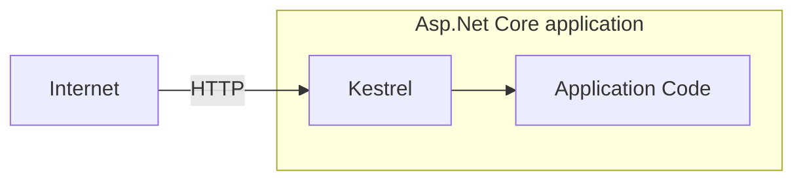
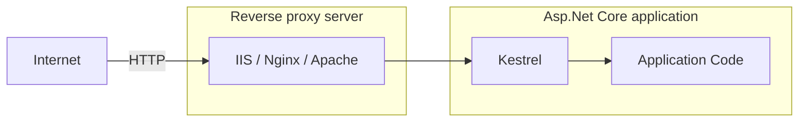
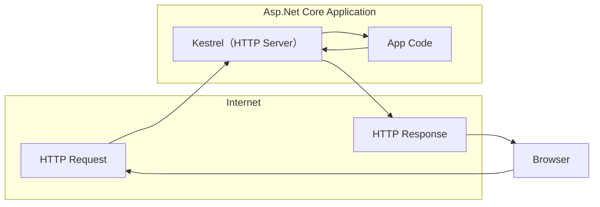
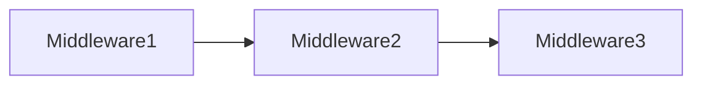
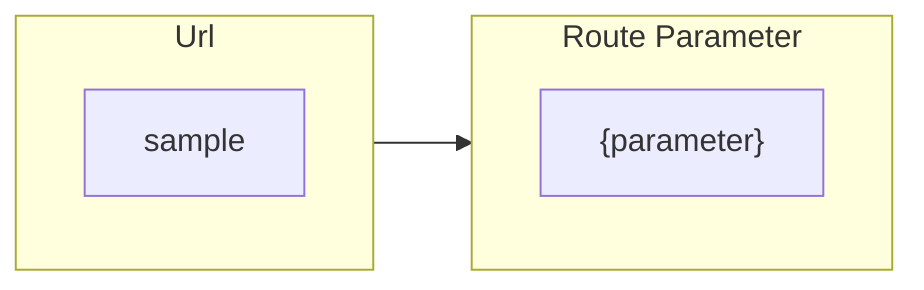
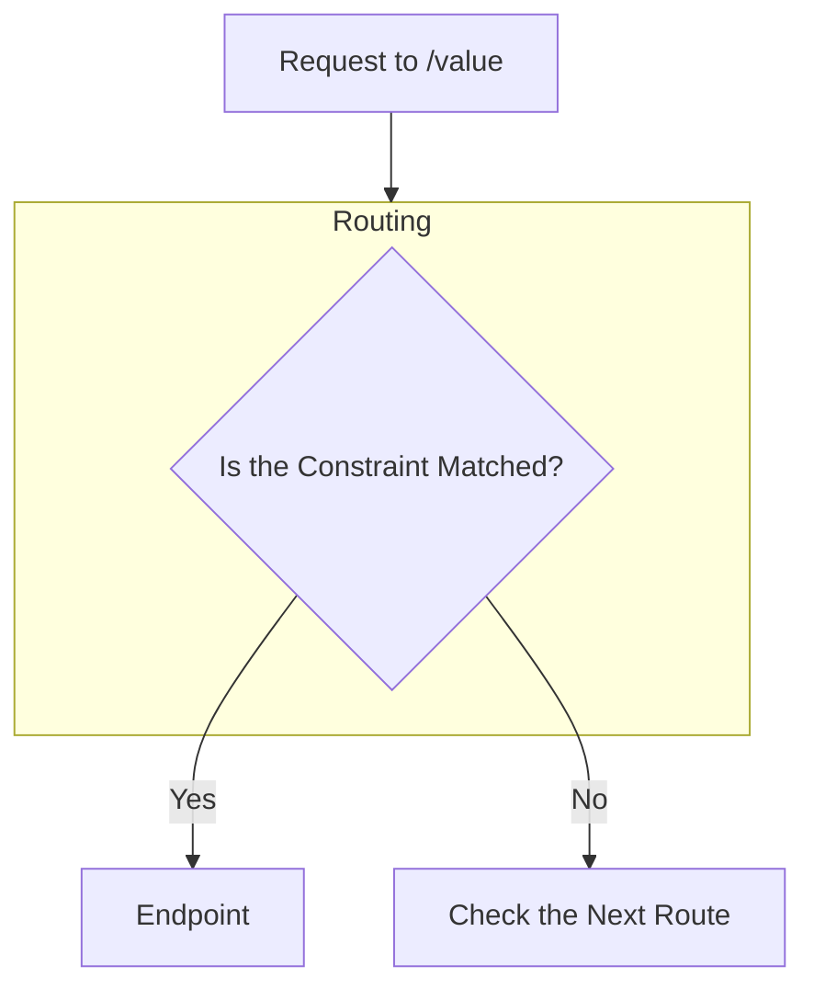
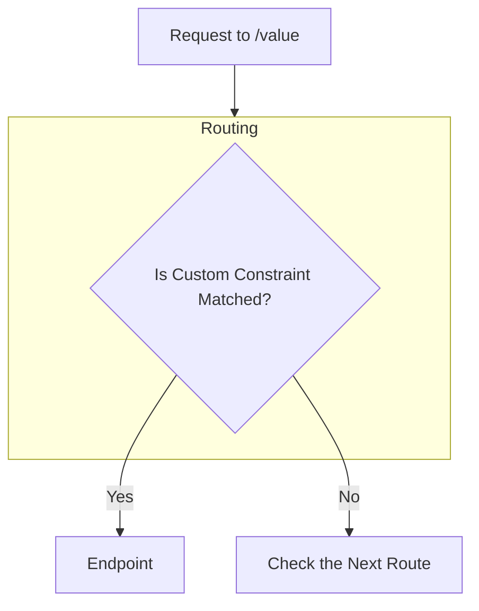
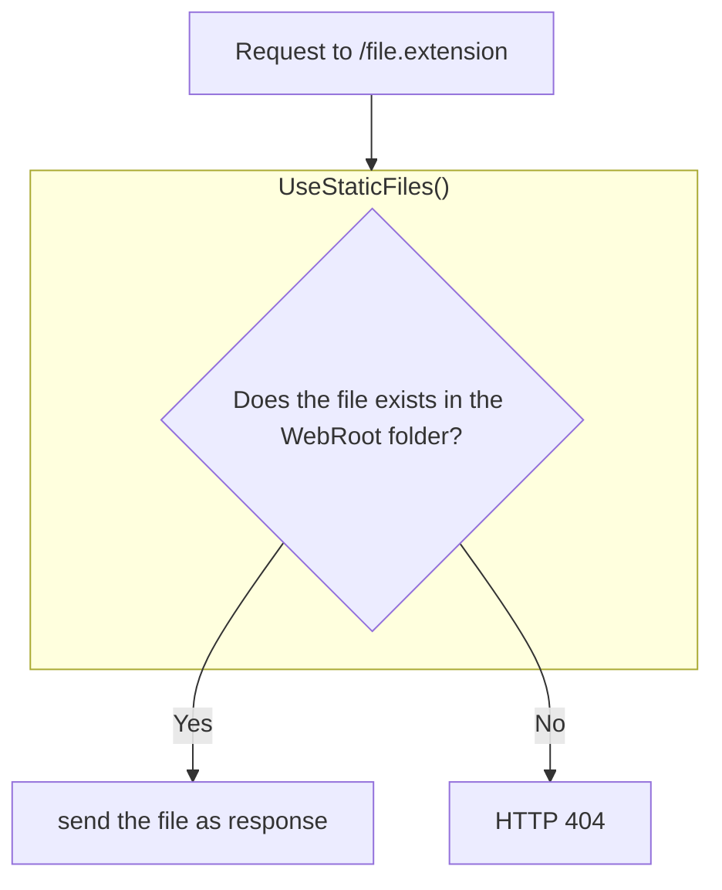
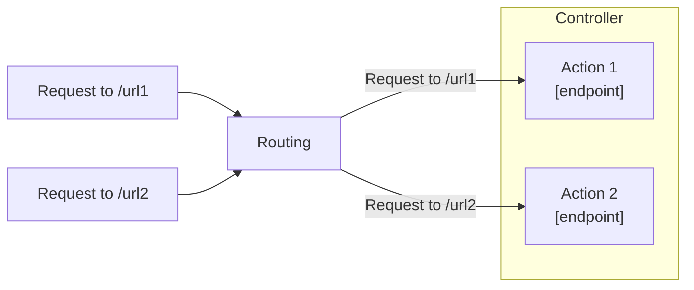
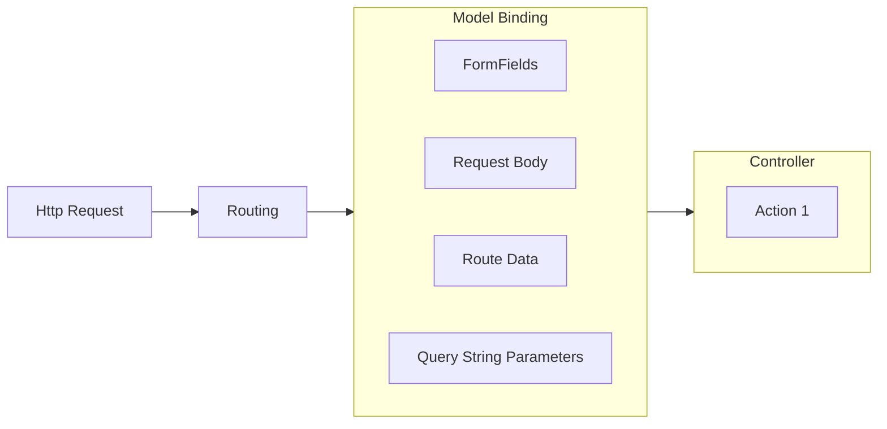

# learn-dotnet-ultimate

## Asp.Net Core 9 (.NET 9) | True Ultimate Guide

ASP .NET Core 6 to 9 | Asp.Net Core Projects | Bootcamp | Advanced | Interview Questions | Web API | MVC

### 内容概览

- [x] 01. 介绍 (Introduction)
- [x] 02. 入门 (Getting Started)
- [x] 03. HTTP
- [x] 04. 中间件 (Middleware)
- [x] 05. 路由 (Routing)
- [x] 06. 控制器与 IActionResult (Controllers & IActionResult)
- [ ] 07. 模型绑定与验证 (ModelBinding and Validations)
- [ ] 08. Razor 视图 (Razor Views)
- [ ] 09. 布局视图 (Layout Views)
- [ ] 10. 分部视图 (Partial Views)
- [ ] 11. 视图组件 (View Components)
- [ ] 12. 依赖注入 (Dependency Injection)
- [ ] 13. 环境 (Environments)
- [ ] 14. 配置 (Configuration)
- [ ] 15. 单元测试 (xUnit)
- [ ] 16. 增删改查 (CRUD Operations)
- [ ] 17. Tag Helpers
- [ ] 18. EntityFrameworkCore
- [ ] 19. 高级单元测试 (Advanced Unit Testing [Moq & Repository Pattern])
- [ ] 20. 日志 (Logging and Serilog)
- [ ] 21. 过滤器 (Filters)
- [ ] 22. 错误处理 (Error Handling)
- [ ] 23. SOLID原则 (SOLID Principles)
- [ ] 24. 整洁架构 (Clean Architecture)
- [ ] 25. 身份认证 (Identity, Authorization, Security)
- [ ] 26. Asp.Net Core Web API
- [ ] 27. Swagger / Open API
- [ ] 28. ~~Angular and CORS~~
- [ ] 29. 身份认证 (JWT & Web API Authorization)
- [ ] 30. 最小API Minimal API (new feature)
- [ ] 31. 新特性 New Feature of ASP.NET Core 8
- [ ] 32. 扩展 Extra: C# Essentials
- [ ] 33. ~~Practial Test~~
- [ ] 34. The End

## 一、介绍

### 001. Asp.Net Core 介绍

#### 什么是 ASP.NET Core？

ASP.NET Core 是一个跨平台、高性能的开源框架，用于构建支持云的现代Web应用程序的服务。

#### 跨平台 (Cross-platform)

ASP.NET Core 应用程序可以托管在 Windows、Linux和Mac上。

#### 可以托管的服务器类型。

支持 Kestrel、IIS、Nginx、Docker、Apache等。

#### 开源

由 GitHub 上超过 1000+ 的贡献者贡献 [aspnetcore](https://github.com/dotnet/aspnetcore)

#### 支持 Cloud

对 Microsoft Azure 的现成支持

#### 模块

- ASP.NET Core MVC - 用于创建大中型到复杂的Web应用程序。
- ASP.NET Core Web API - 用于为所有类型的客户端应用程序创建RESTFul服务。
- ASP.NET Core Razor Pages - 用于创建简单且以页面为中心的网络应用程序。
- ASP.NET Core Blazor - 用于在客户端和服务端使用C#代码创建Web应用程序。

> 先决条件：
> 1. C# - 类、接口、继承、异步、扩展方法、lambda表达式等。
> 2. HTML、CSS、JavaScript、jQuery等。

### 002. Asp.Net Web Forms、Asp.Net Mvc、Asp.Net Core 对比

| 框架 | 发布时间 | 性能 | 平台 | 云环境 | 开源 | 开发模型 |
| -- | -- | -- | -- | -- | -- | -- |
| Asp.Net Web Forms | 发布于2002年 | 由于服务器事件和视图状态而导致的性能问题。 | 仅限 Windows | 不适合 | 不开源 | 事件驱动的开发模型 |
| Asp.Net Mvc | 发布于2009年 | 由于 asp.net 的某些依赖性 (.net framework) 而导致的性能问题。 | 仅限 Windows | 略微适合 | 开源 | 模型-视图-控制器(MVC)模式 |
| Asp.Net Core | 发布于2016年 | 更快的性能。 | 跨平台 | 很适合 | 开源 | 模型-视图-控制器(MVC)模式 |

## 二、入门

### 003. 设置环境

- [Visual Studio](https://visualstudio.microsoft.com)

### 004. 创建第一个ASP.NET Core应用程序

```shell
# 创建文件夹
mkdir MyFirstApp

# 进入文件夹
cd ./MyFirstApp

# 创建解决方案
dotnet new sln

# 创建web项目
dotnet new web

# 将项目添加到解决方案中
dotnet sln add .
```

### 005. Kestrel 和 其他服务器

| 类型 | 服务器 |
| -- | -- |
| 应用服务器 | Kestrel |
| 反向代理服务器 | IIS、Nginx、Apache |

#### HTTP 与 Kestrel 的请求流程



#### HTTP 与 其他服务器的请求流程



#### 反向代理服务器的优势(Benefits)

- 负载均衡(Load Balancing)
- 缓存(Caching)
- URL重写(URL Rewriting)
- 解压缩请求(Decompressing the requests)
- 认证(Authentication)
- 解析SSL证书(Decryption of SSL Certificates)

### 006. launchSettings.json

应用程序的启动配置文件是在位于 `Properties` 文件夹内的 `launchSettings.json` 文件中。

- `iisSettings` - 该节点用于设置`IIS`相关的启动配置。
- `profiles` - 是自定义的启动相关配置。
    - `commandName` - 启动应用程序时要执行命令的类型，选项包括：
        - `Project` - 使用 **Kestrel** 启动项目。
        - `IISExpress` - 使用 **IISExpress** 启动项目。
    - `dotnetRunMessages` - 是否在命令行或终端窗口中显示详细的 **.NET CLI** 的运行时消息。如果设置为`false`则仅输出必要消息。
    - `launchBrowser` - 启动时是否打开默认浏览器。
    - `applicationUrl` - 应用的启动地址。
    - `environmentVariables` - 设置环境变量
        - `ASPNETCORE_ENVIRONMENT` - 指定 ASPNET.Core 应用程序的运行环境。它定义了三个标准的环境名称：
            - `Development` - 开发环境，通常用于本地开发，启用了更多的调试工具和详细错误信息。
            - `Staging` - 预发布环境，用于部署前的最后测试阶段，通常会模拟生产环境但会输出详细的日志和监控。
            - `Production` - 用于实际的生产环境，强调性能、安全性和稳定性。

## 三、HTTP

### 007. HTTP 介绍

HTTP(Hyper Text Transfer Protocol, 超文本传输协议)，是一种应用程序协议，它定义了一组规则，用于将请求从浏览器发送到服务器，并将响应从服务器发送到浏览器。

> 最初由 **Tim Berners Lee** 开发，后来由 IETE(Internet Engineering Task Force, 互联网工程任务组) 和 W3C(World Wide Web Consortium, 万维网联盟) 标准化。
> - SSL (Security Socket Layer, 安全套接层)
> - HTTPS (Hyper Text Transfer Protocol Security, 超文本传输安全协议)



### 008. HTTP 响应

| 响应格式 | 类型 |
| -- | -- |
| HTTP/1.1 状态码(StatusCode) 状态描述(StatusDescription) | 起始行(Start Line) |
| Key: Value | 响应头(Response Headers) |
| | 空行(Empty Line) |
| Response Body | 响应体 |

#### 响应起始行 (Response Start Line)

包含HTTP版本、状态码和状态描述。

**HTTP版本**: HTTP 1/1 | HTTP 2 | HTTP 3

| 状态码 | 状态描述 |
| -- | -- |
| 101 | Switching Protocols |
| 200 | OK |
| 302 | Found |
| 400 | Bad Request |
| 401 | Unauthorized |
| 404 | Not Found |
| 500 | Internal Server Error |

### 009. HTTP 状态码

| 状态码标识 | 状态码描述 | 状态码 |
| -- | -- | -- |
| 1xx | Information | `101` Swithching Protocols |
| 2xx | Success | `200` OK |
| 3xx | Redirection | `302` Found <br/> `304` Not MOdified |
| 4xx | Client error | `400` Bad Request <br/> `401` Unauthorized <br/> `404` Not Found |
| 5xx | Server error | `500` Internal Server Error |

#### 设置响应码

```csharp
var builder = WebApplication.CreateBuilder(args);
var app = builder.Build();

app.Run(async (HttpContext context) =>
{
    // 设置响应码
    context.Response.StatusCode = 400;
    await context.Response.WriteAsync("Hello");
    await context.Response.WriteAsync(" World");
});

app.Run();
```

### 010. HTTP 响应头

| 响应头类型 | 响应值 |
| -- | -- |
| Date | 响应的日期时间。 <br/>Ex: Tue, 15 Nov 1994 08:12:31 GMT |
| Server | 服务器名称。<br/>Ex: Server=Kestrel |
| Content-Type | 响应体的 MIME 类型。<br/>Ex: text/plain, text/html, application/json, application/xml etc. |
| Content-Length | 响应体长度（字节）。<br/>Ex: 100 |
| Cache-Control | 表示浏览器中可以缓存的响应时间的秒数。<br/>Ex: max-age=60 |
| Set-Cookie | 包含要发送给浏览器的 Cookies。<br/>Ex: x=10 |
| Access-Control-Allow-Origin | 启用 CORS (Cross-Origin-Resource-Sharing, 跨源资源共享) 功能。<br/>Ex: Access-Control-Allow-Origin: http://www.example.com |

#### 设置响应头

```csharp
var builder = WebApplication.CreateBuilder(args);
var app = builder.Build();

app.Run(async (HttpContext context) =>
{
    // 设置响应头
    context.Response.Headers["MyKey"] = "MyValue";
    context.Response.Headers["Server"] = "My Server";
    context.Response.Headers["Content-Type"] = "text/html";
    await context.Response.WriteAsync("<h1>Hello</h1>");
    await context.Response.WriteAsync("<h2> World</h2>");
});

app.Run();
```

### 011. HTTP 请求

| 请求格式 | 类型 |
| -- | -- |
| Method Url HTTP/1.1 | 起始行(Start Line) |
| Key: Value<br/>Key: Value | 请求头(Request Headers) |
| | 空行(Empty Line) |
| Request Body | 请求体 |

```csharp
var builder = WebApplication.CreateBuilder(args);
var app = builder.Build();

app.Run(async (HttpContext context) =>
{
    // 获取请求路径
    var path = context.Request.Path;
    // 获取请求方法
    var method = context.Request.Method;
    context.Response.Headers["Content-Type"] = "text/html";
    await context.Response.WriteAsync($"<p>{method} {path}</p>");
});

app.Run();
```

### 012. 查询字符串

| 请求格式 | 类型 |
| -- | -- |
| GET /dashboard?id=1&name=2 HTTP/1.1 | 起始行(Start Line) |
| HOst: www.website.com<br/>Accept: text/html | 请求头(Request Headers) |
| | 空行(Empty Line) |
| ... | 请求体 |

```csharp
var builder = WebApplication.CreateBuilder(args);
var app = builder.Build();

app.Run(async (HttpContext context) =>
{
    context.Response.Headers["Content-Type"] = "text/html";
    if (context.Request.Method == "GET")
    {
        if (context.Request.Query.ContainsKey("id"))
        {
            var id = context.Request.Query["id"];
            await context.Response.WriteAsync($"<p>{id}</p>");
        }
    }
});

app.Run();
```

### 013. HTTP 请求头

| 请求头类型 | 请求值 |
| -- | -- |
| Accept | 表示客户端要接受的响应内容的MIME类型。<br/>Ex: text/html |
| Accept-Language | 表示客户端可接受的响应内容的自然语言。<br/>Ex: en-US |
| Content-Type | 响应体的 MIME 类型。<br/>Ex: text/plain, text/html, application/json, application/xml etc. |
| Content-Length | 响应体长度（字节）。<br/>Ex: 100 |
| Date | 响应的日期时间。 <br/>Ex: Tue, 15 Nov 1994 08:12:31 GMT |
| Host | 服务器域名。<br/>Eg: www.example.com |
| User-Agent | 浏览器（客户端）详细信息。<br/>Eg: Mozilla/5.0 Firefox/12.0 |
| Cookie | 包含要发送到服务器的cookie。<br.>Eg: x=100 |

```csharp
var builder = WebApplication.CreateBuilder(args);
var app = builder.Build();

app.Run(async (HttpContext context) =>
{
    context.Response.Headers["Content-Type"] = "text/html";
    if (context.Request.Headers.ContainsKey("User-Agent"))
    {
        var userAgent = context.Request.Headers["User-Agent"];
        await context.Response.WriteAsync($"<p>{userAgent}</p>");
    }
});

app.Run();
```

### 014. Postman

- 安装Postman
- 使用Postman请求
- 从请求头中获取数据

### 015. HTTP Get请求与Post请求对比

| 请求方法 | 描述 | 
| -- | -- |
| GET | 检索信息（页面、实体对象或静态文件）的请求。 |
| POST | 将实体对象发送到服务器;通常，它将插入到数据库中。 |
| PUT | 将实体对象发送到服务器;通常会更新数据库中的所有属性 （full-update）。 |
| PATCH | 将实体对象发送到服务器;通常会更新数据库中的少量属性 （partial-update）。 |
| DELETE | 删除数据库中实体的请求。 |

#### HTTP 请求

| 请求格式 | 类型 |
| -- | -- |
| GET Url HTTP/1.1 | 起始行(Start Line) |
| Key: Value<br/>Key: Value | 请求头(Request Headers) |
| | 空行(Empty Line) |
| 请求体为空 | 请求体 |

#### HTTP 响应

| 响应格式 | 类型 |
| -- | -- |
| POST Url HTTP/1.1 | 起始行(Start Line) |
| Key: Value<br/>Key: Value | 请求头(Request Headers) |
| | 空行(Empty Line) |
| 请求体 <br/> ... <br/> ... | 请求体 |

### 016. HTTP Get请求与Post请求对比

```csharp
using System.IO;

var builder = WebApplication.CreateBuilder(args);
var app = builder.Build();

app.Run(async (HttpContext context) =>
{
    context.Response.Headers["Content-Type"] = "text/html";
    var reader = new StreamReader(context.Request.Body);
    var body = await reader.ReadToEndAsync();
    await context.Response.WriteAsync($"<p>{body}</p>");

    var query = Microsoft.AspNetCore.WebUtilities.QueryHelpers.ParseQuery(body);

    if (query.ContainsKey("name"))
    {
        foreach (var name in query["name"])
        {
            await context.Response.WriteAsync($"<h5>{name}</h5>");
        }
    }

});

app.Run();
```

## 四、中间件

### 017. 中间件介绍

中间件是组装到应用程序管道中以处理请求和响应的组件。

> Middleware 是一个接一个地链接起来的，并按照添加它们时的顺序执行。



> 中间件可以是请求委托(匿名方法或lambda表达式)或类。

### 018. Run 方法

```shell
# 创建文件夹
mkdir MiddlewareExample
# 进入文件夹
cd MiddlewareExample
# 创建解决方案
dotnet new sln
# 创建Web项目
dotnet new web
# 将项目添加至解决方案中
dotnet sln add .
```

名为 `Run` 的扩展方法用于执行一个终止/短路中间件，该中间件不会将请求转发到下一个中间件。

### 019. 中间件链

```csharp
// middleware 1
app.Use(async (HttpContext context, RequestDelegate next) =>
{
    // befire logic
    await context.Response.WriteAsync("Hello");
    await next(context);
    // after logic
});

// middleware 2
app.Use(async (context, next) =>
{
    // before logic
    await context.Response.WriteAsync("Hello 2");
    await next(context);
    // after logic
});

// middleware 3
app.Run(async (HttpContext context) =>
{
    await context.Response.WriteAsync("Hello 3");
});
```

名为 `Use` 的扩展方法用于执行非终止/短路的中间件，该中间件 可能会/可能不会（通过调用next()方法来控制） 将请求转发到下一个中间件。

### 020. 自定义中间件类

中间件类用于将中间件逻辑从lambda表达式分离到单独/可重用的类中。

```csharp
class MiddlewareClassName : IMiddleware
{
  public async Task InvokeAsync(HttpContext context, RequestDelegate next)
  {
    //before logic
    await next(context);
    //after logic
  }
}
app.UseMiddleware<MiddlewareClassName>();
```

### 021. 自定义中间件扩展

中间件扩展方法用于通过单个方法调用来调用中间件。

```csharp
public static class CustomMiddlewareExtensions
{
    public static IApplicationBuilder UseMyCustomMiddleware(this IApplicationBuilder app)
    {
        app.UseMiddleware<MyCustomMiddleware>();
        return app;
    }
}

app.UseMyCustomMiddleware();
```

### 022. 自定义传统中间件类

```csharp
namespace MiddlewareExample.CustomMiddleware;

public class HelloCustomMiddleware
{
    private readonly RequestDelegate _next;
    public HelloCustomMiddleware(RequestDelegate next)
    {
        _next = next;
    }
    public async Task InvokeAsync(HttpContext context)
    {
        await context.Response.WriteAsync("Hello Custom Middleware - Starts\n");
        await _next(context);
        await context.Response.WriteAsync("Hello Custom Middleware - Ends\n");
    }
}

public static class HelloCustomMiddlewareExtensions
{
    public static IApplicationBuilder UseHelloCustomMiddleware(this IApplicationBuilder app)
    {
        app.UseMiddleware<HelloCustomMiddleware>();
        return app;
    }
}

app.UseHelloCustomMiddleware();
```

### 023. 中间件的正确顺序

```csharp
app.UseExceptionHandler("/Error");
app.UseHsts();
app.UseHttpsRedirection();
app.UseStaticFiles();
app.UseRouting();
app.UseCors();
app.UseAuthentication();
app.UseAuthorization();
app.UseSession();
app.MapControllers();

// 添加自定义中间件

app.Run();
```

### 024. UseWhen

```csharp
app.UseWhen(context => context.Request.Query.ContainsKey("username"), app =>
{
    app.Use(async (context, next) =>
    {
        await conte.Response.WriteAsync("Hello from middleware UseWhen");
        await next();
    })
});
```

名为 `UseWhen` 的扩展方法仅用于仅在指定条件为 true 时执行中间件的分支。

## 五、路由

### 025. 路由介绍

路由是通过检查HTTP Method 和 Url 来匹配传入的 HTTP 请求的过程，然后调用相应的终端节点(Endpoint)。

```shell
# 创建文件夹
mkdir RoutingExample
# 进入文件夹
cd RoutingExample
# 创建解决方案
dotnet new sln
# 创建Web项目
dotnet new web
# 将Web项目添加至解决方案中
dotnet sln add .
```

#### UseRouting

```csharp
app.UseRouting();
```

启用路由并根据Url路径和HTTP Method选择合适的端点。

#### UseEndPoints

```csharp
app.UseEndpoints(endpoints => 
{
    endpoints.Map();
    endpoints.MapGet();
    endpoints.MapPost();
});
```

根据 `UseRouting()` 选择的端点执行相应的端点。

### 026. Map、MapGet、MapPost 的使用

```csharp
var builder = WebApplication.CreateBuilder(args);
var app = builder.Build();

// 启用路由
app.UseRouting();

// 创建终端节点
app.UseEndpoints(endpoints =>
{
    endpoints.Map("map1", async (context) =>
    {
        await context.Response.WriteAsync("In map1");
    });

    endpoints.Map("map2", async (context) =>
    {
        await context.Response.WriteAsync("In map2");
    });

    endpoints.MapGet("map_get", async (context) =>
    {
        await context.Response.WriteAsync("In map get");
    });

    endpoints.MapPost("map_post", async (context) =>
    {
        await context.Response.WriteAsync("In map post");
    });
});

app.Run(async context =>
{
    await context.Response.WriteAsync($"Request received at {context.Request.Path}");
});

app.Run();
```

### 027. GetEndPoint 方法

`context.GetEndPoint()` 方法返回 `Microsoft.AspNetCore.Http.Endpoint` 类型的实例，该类型表示终结点。该实例包含两个重要属性：`DisplayName`、`RequestDelegate`。

```csharp
var builder = WebApplication.CreateBuilder(args);
var app = builder.Build();

app.Use(async (context, next) =>
{
    Microsoft.AspNetCore.Http.Endpoint? endpoint = context.GetEndpoint();
    await context.Response.WriteAsync($"UseRouting Before is null {endpoint == null}\n");
    await next(context);
});

// 启用路由
app.UseRouting();

app.Use(async (context, next) =>
{
    Microsoft.AspNetCore.Http.Endpoint? endpoint = context.GetEndpoint();
    await context.Response.WriteAsync($"UseRouting After is null {endpoint == null}, DisplayName: {endpoint?.DisplayName}\n");
    await next(context);
});

app.Map("map1", async (context) =>
{
    await context.Response.WriteAsync($"In map1");
});

app.Run();
```

在调用 `GetEndpoint()` 方法时，必须要在 `UseRouting()` 方法之后调用，否则获取不到信息。

### 028. 路由参数

路由中的 `{parameter}` 参数可以与任何值匹配。



```csharp
app.UseEndpoints(endpoints =>
{
    endpoints.Map("files/{filename}.{extension}", async context =>
    {
        var filename = context.Request.RouteValues["filename"];
        var extension = context.Request.RouteValues["extension"];
        await context.Response.WriteAsync($"In files: FileName {filename}, Extension {extension}");
    });
});
```

通过 `{parameter}` 来定义路由中的参数，使用 `RouteValues` 获取路由中匹配的参数值(忽略大小写)。

### 029. 默认路由参数

路由中的 `{parameter=value}` 定义为具有默认值的参数，如果参数为空，则使用设置的默认值作为参数内容。

```csharp

app.UseEndpoints(endpoints =>
{
    endpoints.Map("employee/profile/{EmployeeName=MySelf}", async context =>
    {
        var employeeName = context.Request.RouteValues["employeename"];
        await context.Response.WriteAsync($"In employee: Name {employeeName}");
    });

    endpoints.Map("products/details/{id=1}", async context =>
    {
        var id = context.Request.RouteValues["ID"];
        await context.Response.WriteAsync($"In product: Id {id}");
    });
});
```

### 030. 可选路由参数

路由中的 `{parameter?}` 定义为可选参数，这意味着，它与空值也可以匹配。

```csharp
app.UseEndpoints(endpoints =>
{
    endpoints.Map("products/details/{id?}", async context =>
    {
        var id = context.Request.RouteValues["ID"];
        if (id != null)
        {
            await context.Response.WriteAsync($"In product: Id {id}");
        }
        else
        {
            await context.Response.WriteAsync($"In product: Id is not supplied");
        }
    });
});
```

### 031. 路由约束



| 数据类型约束 | 描述 | 语法 | 示例值 |
| -- | -- | -- | -- |
| `int` | 匹配有效的小数数值 | `{price:decimal}` | -2,147,483,648 到 2,147,483,647 |   
| `bool` | 匹配有效的布尔类型值，**不区分大小写** | `{active:bool}` | true、false |
| `datetime` | 匹配有效的日期值，格式包括 "yyyy-MM-dd HH:mm:ss tt" 和 "MM/dd/yyyy hh:mm:ss tt" | `{date:datetime}` | 2024/12/12 12:12:12 |

```csharp
app.UseEndpoints(endpoints =>
{
    endpoints.Map("daily-digest-report/{reportdate:datetime}", async context =>
    {
        var reportdate = context.Request.RouteValues["reportdate"];
        await context.Response.WriteAsync($"In daily-digest-report: reportdate {reportdate}");
    });
});
```

### 032. 路由约束

| 数据类型约束 | 描述 | 语法 | 示例值 |
| -- | -- | -- | -- |
| `decimal` | 匹配有效的小数数值 | `{price:decimal}` | 49.99、-1、0.01 |   
| `long` | 匹配有效的长整型数值 | `{id:long}` | -9,223,372,036,854,775,808 到 9,223,372,036,854,775,807 |
| `guid` | 匹配有效的Guid值 | `{id:guid}` | 8DE341A3-70AC-1F34-63D5-A2347456C9F0 |

```csharp
app.UseEndpoints(endpoints =>
{
    endpoints.Map("cities/{id:guid}", async context =>
    {
        var id = context.Request.RouteValues["ID"];
        await context.Response.WriteAsync($"In Cities: Id {id}");
    });
});
```

### 033. 路由约束

| 长度约束 | 描述 | 语法 | 示例值 |
| -- | -- | -- | -- |
| `minlength(value)` | 与至少具有指定字符数的字符串匹配 | `{username:minlength(4)}` | John、Alice、William |   
| `maxlength(value)` | 与小于或等于指定字符数的字符串匹配 | `{username:maxlength(7)}` | John、Allen、William |
| `length(min,max)` | 与具有给定最小长度和最大长度之间的字符数的字符串匹配，**包括最大最小两个数字** | `{username:length(4,7)}` | John、Allen、William |
| `length(value)` | 与具有精确指定字符数的字符串匹配 | `{tin:length(9)}` | 123456789 |
| `min(value)` | 与大于或等于指定值的整型数匹配 | `{age:min(18)}` | 18、19、20 |
| `max(value)` | 与小于或等于指定值的整型数匹配 | `{age:max(100)}` | -1、1、18、100 |
| `range(min,max)` | 与指定的最小值和最大值之间的整数值匹配，**包括最大最小两个数字** | `{age:range(18,100)}` | 18、19、99、100 |
| `alpha` | 与仅包含字母的字符串匹配，**忽略大小写** | `username:alpha` | rick、morty |
| `regex` | 与指定正则表达式匹配的字符串匹配 | `{age:regex(^[0-9]{2}$)}`<br/>`{age:regex(^\d{3}-\d{3}$)}` | 10、11、98、99<br/>123-456 |


```csharp
app.UseEndpoints(endpoints =>
{
    endpoints.Map("employee/profile/{EmployeeName:minlength(3):maxlength(7)}", async context =>
    {
        var employeename = context.Request.RouteValues["employeename"];
        await context.Response.WriteAsync($"In Employee: {employeename}");
    });

    endpoints.Map("sales-report/{year:int:min(1900)}/{month:regex(^(apr|jul|oct|jan)$)}", async context =>
    {
        var year = context.Request.RouteValues["year"];
        var month = context.Request.RouteValues["month"];
        await context.Response.WriteAsync($"In sales-report: year {year}, month {month}");
    });
});
```

### 034. 自定义路由约束



实现 `IRouteConstraint` 接口来实现自定义路由约束。

```csharp
public class MonthsCustomConstraint : IRouteConstraint
{
    public bool Match(HttpContext? httpContext, IRouter? route, string routeKey, RouteValueDictionary values,
        RouteDirection routeDirection)
    {
        // 检查值是否存在
        if (!values.ContainsKey(routeKey))
        {
            return false;
        }
        
        Regex regex = new(@"^(apr|jul|oct|jan)$");
        
        var monthValue = values[routeKey].ToString();
        
        return regex.IsMatch(monthValue);
    }
}
```

将自定义路由约束添加到路由中。

```csharp
builder.Services.AddRouting(options =>
{
    options.ConstraintMap.Add("months",typeof(MonthsCustomConstraint));
});
```

在路由中使用自定义约束。

```csharp
app.UseEndpoints(endpoints =>
{
    endpoints.Map("sales-report/{year:int:min(1900)}/{month:months}", async context =>
    {
        var year = context.Request.RouteValues["year"];
        var month = context.Request.RouteValues["month"];
        await context.Response.WriteAsync($"In sales-report: year {year}, month {month}");
    });
});
```

### 035. 端点选择顺序

| 优先级 | 描述 | 示例 |
| -- | -- | -- |
| 1 | 具有更多区段的URL模板 | "a/b/c/d" 高于 "a/b/c" |
| 2 | 带有文本文字的URL模板比路由参数具有更高的优先级 | "a/b" 高于 "a/{parameter}" |
| 3 | 带有路由约束参数的URL模板比没有约束的参数段具有更高的优先级 | "a/b:int" 高于 "a/b" |
| 4 | 捕获所有参数的优先级最低 | "a/{b}" 高于 "a/**" |

### 036. WebRoot 和 UseStaticFiles 方法

#### WebRoot



默认的 WebRoot 文件夹是 "wwwroot"，可以手动配置。

```csharp
var builder = WebApplication.CreateBuilder(new WebApplicationOptions
{
    WebRootPath = "myroot",
});
```

#### UseStaticFiles 方法

使用 `UseStaticFiles` 可以添加新的静态文件目录。

```csharp
app.UseStaticFiles(new StaticFileOptions
{
    FileProvider = new PhysicalFileProvider(Path.Combine(builder.Environment.ContentRootPath,"mywwwroot"))
});
```

## 六、控制器与 IActionResult

### 037. 创建控制器

控制器是一个类，用于对一组操作作进行分组。当收到请求并返回结果(响应)时，操作方法会执行某些操作。



#### 创建Web项目

```shell
# 创建文件夹
mkdir ControllersExample
# 进入文件夹
cd ControllersExample
# 创建解决方案
dotnet new sln
# 创建Web项目
dotnet new web
# 将Web项目添加至解决方案中
dotnet sln add .
```

#### 创建控制器类

控制器类名称应以 `Controller` 为后缀。

```csharp
using Microsoft.AspNetCore.Mvc;

namespace ControllersExample.Controllers;

public class HomeController
{
    [Route("index")]
    public string Index()
    {
        return "Hello from index";
    }
}
```

#### 添加控制器路由

- `AddControllers` 方法将所有控制器添加到容器中。这样匹配到对应的路由时，就可以访问到它们。
- `MapControllers` 方法将所有操作方法添加为路由节点，这样就不需要使用 `UseEndpoint` 方法来手动将方法添加为端点了。

```csharp
var builder = WebApplication.CreateBuilder(args);

// 注册所有控制器服务
builder.Services.AddControllers();

var app = builder.Build();

// 启用控制器路由
app.MapControllers();

app.Run();
```

### 038. 多个 Action 方法

可以在一个控制器中定义多个Action方法。

```csharp
public class HomeController
{
    [Route("home")]
    [Route("/")]
    public string Index()
    {
        return "Hello from Index";
    }

    [Route("about")]
    public string About()
    {
        return "Hello from About";
    }

    [Route("contact-us/{mobile:regex(^\\d{{11}}$)}")]
    public string Contact()
    {
        return "Hello from Contact";
    }
}
```
# learn-dotnet-ultimate

## Asp.Net Core 9 (.NET 9) | True Ultimate Guide

ASP .NET Core 6 to 9 | Asp.Net Core Projects | Bootcamp | Advanced | Interview Questions | Web API | MVC

### 内容概览

- [x] 01. 介绍 (Introduction)
- [x] 02. 入门 (Getting Started)
- [x] 03. HTTP
- [x] 04. 中间件 (Middleware)
- [x] 05. 路由 (Routing)
- [ ] 06. 控制器与 IActionResult (Controllers & IActionResult)
- [ ] 07. 模型绑定与验证 (ModelBinding and Validations)
- [ ] 08. Razor 视图 (Razor Views)
- [ ] 09. 布局视图 (Layout Views)
- [ ] 10. 分部视图 (Partial Views)
- [ ] 11. 视图组件 (View Components)
- [ ] 12. 依赖注入 (Dependency Injection)
- [ ] 13. 环境 (Environments)
- [ ] 14. 配置 (Configuration)
- [ ] 15. 单元测试 (xUnit)
- [ ] 16. 增删改查 (CRUD Operations)
- [ ] 17. Tag Helpers
- [ ] 18. EntityFrameworkCore
- [ ] 19. 高级单元测试 (Advanced Unit Testing [Moq & Repository Pattern])
- [ ] 20. 日志 (Logging and Serilog)
- [ ] 21. 过滤器 (Filters)
- [ ] 22. 错误处理 (Error Handling)
- [ ] 23. SOLID原则 (SOLID Principles)
- [ ] 24. 整洁架构 (Clean Architecture)
- [ ] 25. 身份认证 (Identity, Authorization, Security)
- [ ] 26. Asp.Net Core Web API
- [ ] 27. Swagger / Open API
- [ ] 28. ~~Angular and CORS~~
- [ ] 29. 身份认证 (JWT & Web API Authorization)
- [ ] 30. 最小API Minimal API (new feature)
- [ ] 31. 新特性 New Feature of ASP.NET Core 8
- [ ] 32. 扩展 Extra: C# Essentials
- [ ] 33. ~~Practial Test~~
- [ ] 34. The End

## 一、介绍

### 001. Asp.Net Core 介绍

#### 什么是 ASP.NET Core？

ASP.NET Core 是一个跨平台、高性能的开源框架，用于构建支持云的现代Web应用程序的服务。

#### 跨平台 (Cross-platform)

ASP.NET Core 应用程序可以托管在 Windows、Linux和Mac上。

#### 可以托管的服务器类型。

支持 Kestrel、IIS、Nginx、Docker、Apache等。

#### 开源

由 GitHub 上超过 1000+ 的贡献者贡献 [aspnetcore](https://github.com/dotnet/aspnetcore)

#### 支持 Cloud

对 Microsoft Azure 的现成支持

#### 模块

- ASP.NET Core MVC - 用于创建大中型到复杂的Web应用程序。
- ASP.NET Core Web API - 用于为所有类型的客户端应用程序创建RESTFul服务。
- ASP.NET Core Razor Pages - 用于创建简单且以页面为中心的网络应用程序。
- ASP.NET Core Blazor - 用于在客户端和服务端使用C#代码创建Web应用程序。

> 先决条件：
> 1. C# - 类、接口、继承、异步、扩展方法、lambda表达式等。
> 2. HTML、CSS、JavaScript、jQuery等。

### 002. Asp.Net Web Forms、Asp.Net Mvc、Asp.Net Core 对比

| 框架 | 发布时间 | 性能 | 平台 | 云环境 | 开源 | 开发模型 |
| -- | -- | -- | -- | -- | -- | -- |
| Asp.Net Web Forms | 发布于2002年 | 由于服务器事件和视图状态而导致的性能问题。 | 仅限 Windows | 不适合 | 不开源 | 事件驱动的开发模型 |
| Asp.Net Mvc | 发布于2009年 | 由于 asp.net 的某些依赖性 (.net framework) 而导致的性能问题。 | 仅限 Windows | 略微适合 | 开源 | 模型-视图-控制器(MVC)模式 |
| Asp.Net Core | 发布于2016年 | 更快的性能。 | 跨平台 | 很适合 | 开源 | 模型-视图-控制器(MVC)模式 |

## 二、入门

### 003. 设置环境

- [Visual Studio](https://visualstudio.microsoft.com)

### 004. 创建第一个ASP.NET Core应用程序

```shell
# 创建文件夹
mkdir MyFirstApp

# 进入文件夹
cd ./MyFirstApp

# 创建解决方案
dotnet new sln

# 创建web项目
dotnet new web

# 将项目添加到解决方案中
dotnet sln add .
```

### 005. Kestrel 和 其他服务器

| 类型 | 服务器 |
| -- | -- |
| 应用服务器 | Kestrel |
| 反向代理服务器 | IIS、Nginx、Apache |

#### HTTP 与 Kestrel 的请求流程


#### HTTP 与 其他服务器的请求流程


#### 反向代理服务器的优势(Benefits)

- 负载均衡(Load Balancing)
- 缓存(Caching)
- URL重写(URL Rewriting)
- 解压缩请求(Decompressing the requests)
- 认证(Authentication)
- 解析SSL证书(Decryption of SSL Certificates)

### 006. launchSettings.json

应用程序的启动配置文件是在位于 `Properties` 文件夹内的 `launchSettings.json` 文件中。

- `iisSettings` - 该节点用于设置`IIS`相关的启动配置。
- `profiles` - 是自定义的启动相关配置。
    - `commandName` - 启动应用程序时要执行命令的类型，选项包括：
        - `Project` - 使用 **Kestrel** 启动项目。
        - `IISExpress` - 使用 **IISExpress** 启动项目。
    - `dotnetRunMessages` - 是否在命令行或终端窗口中显示详细的 **.NET CLI** 的运行时消息。如果设置为`false`则仅输出必要消息。
    - `launchBrowser` - 启动时是否打开默认浏览器。
    - `applicationUrl` - 应用的启动地址。
    - `environmentVariables` - 设置环境变量
        - `ASPNETCORE_ENVIRONMENT` - 指定 ASPNET.Core 应用程序的运行环境。它定义了三个标准的环境名称：
            - `Development` - 开发环境，通常用于本地开发，启用了更多的调试工具和详细错误信息。
            - `Staging` - 预发布环境，用于部署前的最后测试阶段，通常会模拟生产环境但会输出详细的日志和监控。
            - `Production` - 用于实际的生产环境，强调性能、安全性和稳定性。

## 三、HTTP

### 007. HTTP 介绍

HTTP(Hyper Text Transfer Protocol, 超文本传输协议)，是一种应用程序协议，它定义了一组规则，用于将请求从浏览器发送到服务器，并将响应从服务器发送到浏览器。

> 最初由 **Tim Berners Lee** 开发，后来由 IETE(Internet Engineering Task Force, 互联网工程任务组) 和 W3C(World Wide Web Consortium, 万维网联盟) 标准化。
> - SSL (Security Socket Layer, 安全套接层)
> - HTTPS (Hyper Text Transfer Protocol Security, 超文本传输安全协议)


### 008. HTTP 响应

| 响应格式 | 类型 |
| -- | -- |
| HTTP/1.1 状态码(StatusCode) 状态描述(StatusDescription) | 起始行(Start Line) |
| Key: Value | 响应头(Response Headers) |
| | 空行(Empty Line) |
| Response Body | 响应体 |

#### 响应起始行 (Response Start Line)

包含HTTP版本、状态码和状态描述。

**HTTP版本**: HTTP 1/1 | HTTP 2 | HTTP 3

| 状态码 | 状态描述 |
| -- | -- |
| 101 | Switching Protocols |
| 200 | OK |
| 302 | Found |
| 400 | Bad Request |
| 401 | Unauthorized |
| 404 | Not Found |
| 500 | Internal Server Error |

### 009. HTTP 状态码

| 状态码标识 | 状态码描述 | 状态码 |
| -- | -- | -- |
| 1xx | Information | `101` Swithching Protocols |
| 2xx | Success | `200` OK |
| 3xx | Redirection | `302` Found <br/> `304` Not MOdified |
| 4xx | Client error | `400` Bad Request <br/> `401` Unauthorized <br/> `404` Not Found |
| 5xx | Server error | `500` Internal Server Error |

#### 设置响应码

```csharp
var builder = WebApplication.CreateBuilder(args);
var app = builder.Build();

app.Run(async (HttpContext context) =>
{
    // 设置响应码
    context.Response.StatusCode = 400;
    await context.Response.WriteAsync("Hello");
    await context.Response.WriteAsync(" World");
});

app.Run();
```

### 010. HTTP 响应头

| 响应头类型 | 响应值 |
| -- | -- |
| Date | 响应的日期时间。 <br/>Ex: Tue, 15 Nov 1994 08:12:31 GMT |
| Server | 服务器名称。<br/>Ex: Server=Kestrel |
| Content-Type | 响应体的 MIME 类型。<br/>Ex: text/plain, text/html, application/json, application/xml etc. |
| Content-Length | 响应体长度（字节）。<br/>Ex: 100 |
| Cache-Control | 表示浏览器中可以缓存的响应时间的秒数。<br/>Ex: max-age=60 |
| Set-Cookie | 包含要发送给浏览器的 Cookies。<br/>Ex: x=10 |
| Access-Control-Allow-Origin | 启用 CORS (Cross-Origin-Resource-Sharing, 跨源资源共享) 功能。<br/>Ex: Access-Control-Allow-Origin: http://www.example.com |

#### 设置响应头

```csharp
var builder = WebApplication.CreateBuilder(args);
var app = builder.Build();

app.Run(async (HttpContext context) =>
{
    // 设置响应头
    context.Response.Headers["MyKey"] = "MyValue";
    context.Response.Headers["Server"] = "My Server";
    context.Response.Headers["Content-Type"] = "text/html";
    await context.Response.WriteAsync("<h1>Hello</h1>");
    await context.Response.WriteAsync("<h2> World</h2>");
});

app.Run();
```

### 011. HTTP 请求

| 请求格式 | 类型 |
| -- | -- |
| Method Url HTTP/1.1 | 起始行(Start Line) |
| Key: Value<br/>Key: Value | 请求头(Request Headers) |
| | 空行(Empty Line) |
| Request Body | 请求体 |

```csharp
var builder = WebApplication.CreateBuilder(args);
var app = builder.Build();

app.Run(async (HttpContext context) =>
{
    // 获取请求路径
    var path = context.Request.Path;
    // 获取请求方法
    var method = context.Request.Method;
    context.Response.Headers["Content-Type"] = "text/html";
    await context.Response.WriteAsync($"<p>{method} {path}</p>");
});

app.Run();
```

### 012. 查询字符串

| 请求格式 | 类型 |
| -- | -- |
| GET /dashboard?id=1&name=2 HTTP/1.1 | 起始行(Start Line) |
| HOst: www.website.com<br/>Accept: text/html | 请求头(Request Headers) |
| | 空行(Empty Line) |
| ... | 请求体 |

```csharp
var builder = WebApplication.CreateBuilder(args);
var app = builder.Build();

app.Run(async (HttpContext context) =>
{
    context.Response.Headers["Content-Type"] = "text/html";
    if (context.Request.Method == "GET")
    {
        if (context.Request.Query.ContainsKey("id"))
        {
            var id = context.Request.Query["id"];
            await context.Response.WriteAsync($"<p>{id}</p>");
        }
    }
});

app.Run();
```

### 013. HTTP 请求头

| 请求头类型 | 请求值 |
| -- | -- |
| Accept | 表示客户端要接受的响应内容的MIME类型。<br/>Ex: text/html |
| Accept-Language | 表示客户端可接受的响应内容的自然语言。<br/>Ex: en-US |
| Content-Type | 响应体的 MIME 类型。<br/>Ex: text/plain, text/html, application/json, application/xml etc. |
| Content-Length | 响应体长度（字节）。<br/>Ex: 100 |
| Date | 响应的日期时间。 <br/>Ex: Tue, 15 Nov 1994 08:12:31 GMT |
| Host | 服务器域名。<br/>Eg: www.example.com |
| User-Agent | 浏览器（客户端）详细信息。<br/>Eg: Mozilla/5.0 Firefox/12.0 |
| Cookie | 包含要发送到服务器的cookie。<br.>Eg: x=100 |

```csharp
var builder = WebApplication.CreateBuilder(args);
var app = builder.Build();

app.Run(async (HttpContext context) =>
{
    context.Response.Headers["Content-Type"] = "text/html";
    if (context.Request.Headers.ContainsKey("User-Agent"))
    {
        var userAgent = context.Request.Headers["User-Agent"];
        await context.Response.WriteAsync($"<p>{userAgent}</p>");
    }
});

app.Run();
```

### 014. Postman

- 安装Postman
- 使用Postman请求
- 从请求头中获取数据

### 015. HTTP Get请求与Post请求对比

| 请求方法 | 描述 | 
| -- | -- |
| GET | 检索信息（页面、实体对象或静态文件）的请求。 |
| POST | 将实体对象发送到服务器;通常，它将插入到数据库中。 |
| PUT | 将实体对象发送到服务器;通常会更新数据库中的所有属性 （full-update）。 |
| PATCH | 将实体对象发送到服务器;通常会更新数据库中的少量属性 （partial-update）。 |
| DELETE | 删除数据库中实体的请求。 |

#### HTTP 请求

| 请求格式 | 类型 |
| -- | -- |
| GET Url HTTP/1.1 | 起始行(Start Line) |
| Key: Value<br/>Key: Value | 请求头(Request Headers) |
| | 空行(Empty Line) |
| 请求体为空 | 请求体 |

#### HTTP 响应

| 响应格式 | 类型 |
| -- | -- |
| POST Url HTTP/1.1 | 起始行(Start Line) |
| Key: Value<br/>Key: Value | 请求头(Request Headers) |
| | 空行(Empty Line) |
| 请求体 <br/> ... <br/> ... | 请求体 |

### 016. HTTP Get请求与Post请求对比

```csharp
using System.IO;

var builder = WebApplication.CreateBuilder(args);
var app = builder.Build();

app.Run(async (HttpContext context) =>
{
    context.Response.Headers["Content-Type"] = "text/html";
    var reader = new StreamReader(context.Request.Body);
    var body = await reader.ReadToEndAsync();
    await context.Response.WriteAsync($"<p>{body}</p>");

    var query = Microsoft.AspNetCore.WebUtilities.QueryHelpers.ParseQuery(body);

    if (query.ContainsKey("name"))
    {
        foreach (var name in query["name"])
        {
            await context.Response.WriteAsync($"<h5>{name}</h5>");
        }
    }

});

app.Run();
```

## 四、中间件

### 017. 中间件介绍

中间件是组装到应用程序管道中以处理请求和响应的组件。

> Middleware 是一个接一个地链接起来的，并按照添加它们时的顺序执行。


> 中间件可以是请求委托(匿名方法或lambda表达式)或类。

### 018. Run 方法

```shell
# 创建文件夹
mkdir MiddlewareExample
# 进入文件夹
cd MiddlewareExample
# 创建解决方案
dotnet new sln
# 创建Web项目
dotnet new web
# 将项目添加至解决方案中
dotnet sln add .
```

名为 `Run` 的扩展方法用于执行一个终止/短路中间件，该中间件不会将请求转发到下一个中间件。

### 019. 中间件链

```csharp
// middleware 1
app.Use(async (HttpContext context, RequestDelegate next) =>
{
    // befire logic
    await context.Response.WriteAsync("Hello");
    await next(context);
    // after logic
});

// middleware 2
app.Use(async (context, next) =>
{
    // before logic
    await context.Response.WriteAsync("Hello 2");
    await next(context);
    // after logic
});

// middleware 3
app.Run(async (HttpContext context) =>
{
    await context.Response.WriteAsync("Hello 3");
});
```

名为 `Use` 的扩展方法用于执行非终止/短路的中间件，该中间件 可能会/可能不会（通过调用next()方法来控制） 将请求转发到下一个中间件。

### 020. 自定义中间件类

中间件类用于将中间件逻辑从lambda表达式分离到单独/可重用的类中。

```csharp
class MiddlewareClassName : IMiddleware
{
  public async Task InvokeAsync(HttpContext context, RequestDelegate next)
  {
    //before logic
    await next(context);
    //after logic
  }
}
app.UseMiddleware<MiddlewareClassName>();
```

### 021. 自定义中间件扩展

中间件扩展方法用于通过单个方法调用来调用中间件。

```csharp
public static class CustomMiddlewareExtensions
{
    public static IApplicationBuilder UseMyCustomMiddleware(this IApplicationBuilder app)
    {
        app.UseMiddleware<MyCustomMiddleware>();
        return app;
    }
}

app.UseMyCustomMiddleware();
```

### 022. 自定义传统中间件类

```csharp
namespace MiddlewareExample.CustomMiddleware;

public class HelloCustomMiddleware
{
    private readonly RequestDelegate _next;
    public HelloCustomMiddleware(RequestDelegate next)
    {
        _next = next;
    }
    public async Task InvokeAsync(HttpContext context)
    {
        await context.Response.WriteAsync("Hello Custom Middleware - Starts\n");
        await _next(context);
        await context.Response.WriteAsync("Hello Custom Middleware - Ends\n");
    }
}

public static class HelloCustomMiddlewareExtensions
{
    public static IApplicationBuilder UseHelloCustomMiddleware(this IApplicationBuilder app)
    {
        app.UseMiddleware<HelloCustomMiddleware>();
        return app;
    }
}

app.UseHelloCustomMiddleware();
```

### 023. 中间件的正确顺序

```csharp
app.UseExceptionHandler("/Error");
app.UseHsts();
app.UseHttpsRedirection();
app.UseStaticFiles();
app.UseRouting();
app.UseCors();
app.UseAuthentication();
app.UseAuthorization();
app.UseSession();
app.MapControllers();

// 添加自定义中间件

app.Run();
```

### 024. UseWhen

```csharp
app.UseWhen(context => context.Request.Query.ContainsKey("username"), app =>
{
    app.Use(async (context, next) =>
    {
        await conte.Response.WriteAsync("Hello from middleware UseWhen");
        await next();
    })
});
```

名为 `UseWhen` 的扩展方法仅用于仅在指定条件为 true 时执行中间件的分支。

## 五、路由

### 025. 路由介绍

路由是通过检查HTTP Method 和 Url 来匹配传入的 HTTP 请求的过程，然后调用相应的终端节点(Endpoint)。

```shell
# 创建文件夹
mkdir RoutingExample
# 进入文件夹
cd RoutingExample
# 创建解决方案
dotnet new sln
# 创建Web项目
dotnet new web
# 将Web项目添加至解决方案中
dotnet sln add .
```

#### UseRouting

```csharp
app.UseRouting();
```

启用路由并根据Url路径和HTTP Method选择合适的端点。

#### UseEndPoints

```csharp
app.UseEndpoints(endpoints => 
{
    endpoints.Map();
    endpoints.MapGet();
    endpoints.MapPost();
});
```

根据 `UseRouting()` 选择的端点执行相应的端点。

### 026. Map、MapGet、MapPost 的使用

```csharp
var builder = WebApplication.CreateBuilder(args);
var app = builder.Build();

// 启用路由
app.UseRouting();

// 创建终端节点
app.UseEndpoints(endpoints =>
{
    endpoints.Map("map1", async (context) =>
    {
        await context.Response.WriteAsync("In map1");
    });

    endpoints.Map("map2", async (context) =>
    {
        await context.Response.WriteAsync("In map2");
    });

    endpoints.MapGet("map_get", async (context) =>
    {
        await context.Response.WriteAsync("In map get");
    });

    endpoints.MapPost("map_post", async (context) =>
    {
        await context.Response.WriteAsync("In map post");
    });
});

app.Run(async context =>
{
    await context.Response.WriteAsync($"Request received at {context.Request.Path}");
});

app.Run();
```

### 027. GetEndPoint 方法

`context.GetEndPoint()` 方法返回 `Microsoft.AspNetCore.Http.Endpoint` 类型的实例，该类型表示终结点。该实例包含两个重要属性：`DisplayName`、`RequestDelegate`。

```csharp
var builder = WebApplication.CreateBuilder(args);
var app = builder.Build();

app.Use(async (context, next) =>
{
    Microsoft.AspNetCore.Http.Endpoint? endpoint = context.GetEndpoint();
    await context.Response.WriteAsync($"UseRouting Before is null {endpoint == null}\n");
    await next(context);
});

// 启用路由
app.UseRouting();

app.Use(async (context, next) =>
{
    Microsoft.AspNetCore.Http.Endpoint? endpoint = context.GetEndpoint();
    await context.Response.WriteAsync($"UseRouting After is null {endpoint == null}, DisplayName: {endpoint?.DisplayName}\n");
    await next(context);
});

app.Map("map1", async (context) =>
{
    await context.Response.WriteAsync($"In map1");
});

app.Run();
```

在调用 `GetEndpoint()` 方法时，必须要在 `UseRouting()` 方法之后调用，否则获取不到信息。

### 028. 路由参数

路由中的 `{parameter}` 参数可以与任何值匹配。


```csharp
app.UseEndpoints(endpoints =>
{
    endpoints.Map("files/{filename}.{extension}", async context =>
    {
        var filename = context.Request.RouteValues["filename"];
        var extension = context.Request.RouteValues["extension"];
        await context.Response.WriteAsync($"In files: FileName {filename}, Extension {extension}");
    });
});
```

通过 `{parameter}` 来定义路由中的参数，使用 `RouteValues` 获取路由中匹配的参数值(忽略大小写)。

### 029. 默认路由参数

路由中的 `{parameter=value}` 定义为具有默认值的参数，如果参数为空，则使用设置的默认值作为参数内容。

```csharp

app.UseEndpoints(endpoints =>
{
    endpoints.Map("employee/profile/{EmployeeName=MySelf}", async context =>
    {
        var employeeName = context.Request.RouteValues["employeename"];
        await context.Response.WriteAsync($"In employee: Name {employeeName}");
    });

    endpoints.Map("products/details/{id=1}", async context =>
    {
        var id = context.Request.RouteValues["ID"];
        await context.Response.WriteAsync($"In product: Id {id}");
    });
});
```

### 030. 可选路由参数

路由中的 `{parameter?}` 定义为可选参数，这意味着，它与空值也可以匹配。

```csharp
app.UseEndpoints(endpoints =>
{
    endpoints.Map("products/details/{id?}", async context =>
    {
        var id = context.Request.RouteValues["ID"];
        if (id != null)
        {
            await context.Response.WriteAsync($"In product: Id {id}");
        }
        else
        {
            await context.Response.WriteAsync($"In product: Id is not supplied");
        }
    });
});
```

### 031. 路由约束


| 数据类型约束 | 描述 | 语法 | 示例值 |
| -- | -- | -- | -- |
| `int` | 匹配有效的小数数值 | `{price:decimal}` | -2,147,483,648 到 2,147,483,647 |   
| `bool` | 匹配有效的布尔类型值，**不区分大小写** | `{active:bool}` | true、false |
| `datetime` | 匹配有效的日期值，格式包括 "yyyy-MM-dd HH:mm:ss tt" 和 "MM/dd/yyyy hh:mm:ss tt" | `{date:datetime}` | 2024/12/12 12:12:12 |

```csharp
app.UseEndpoints(endpoints =>
{
    endpoints.Map("daily-digest-report/{reportdate:datetime}", async context =>
    {
        var reportdate = context.Request.RouteValues["reportdate"];
        await context.Response.WriteAsync($"In daily-digest-report: reportdate {reportdate}");
    });
});
```

### 032. 路由约束

| 数据类型约束 | 描述 | 语法 | 示例值 |
| -- | -- | -- | -- |
| `decimal` | 匹配有效的小数数值 | `{price:decimal}` | 49.99、-1、0.01 |   
| `long` | 匹配有效的长整型数值 | `{id:long}` | -9,223,372,036,854,775,808 到 9,223,372,036,854,775,807 |
| `guid` | 匹配有效的Guid值 | `{id:guid}` | 8DE341A3-70AC-1F34-63D5-A2347456C9F0 |

```csharp
app.UseEndpoints(endpoints =>
{
    endpoints.Map("cities/{id:guid}", async context =>
    {
        var id = context.Request.RouteValues["ID"];
        await context.Response.WriteAsync($"In Cities: Id {id}");
    });
});
```

### 033. 路由约束

| 长度约束 | 描述 | 语法 | 示例值 |
| -- | -- | -- | -- |
| `minlength(value)` | 与至少具有指定字符数的字符串匹配 | `{username:minlength(4)}` | John、Alice、William |   
| `maxlength(value)` | 与小于或等于指定字符数的字符串匹配 | `{username:maxlength(7)}` | John、Allen、William |
| `length(min,max)` | 与具有给定最小长度和最大长度之间的字符数的字符串匹配，**包括最大最小两个数字** | `{username:length(4,7)}` | John、Allen、William |
| `length(value)` | 与具有精确指定字符数的字符串匹配 | `{tin:length(9)}` | 123456789 |
| `min(value)` | 与大于或等于指定值的整型数匹配 | `{age:min(18)}` | 18、19、20 |
| `max(value)` | 与小于或等于指定值的整型数匹配 | `{age:max(100)}` | -1、1、18、100 |
| `range(min,max)` | 与指定的最小值和最大值之间的整数值匹配，**包括最大最小两个数字** | `{age:range(18,100)}` | 18、19、99、100 |
| `alpha` | 与仅包含字母的字符串匹配，**忽略大小写** | `username:alpha` | rick、morty |
| `regex` | 与指定正则表达式匹配的字符串匹配 | `{age:regex(^[0-9]{2}$)}`<br/>`{age:regex(^\d{3}-\d{3}$)}` | 10、11、98、99<br/>123-456 |


```csharp
app.UseEndpoints(endpoints =>
{
    endpoints.Map("employee/profile/{EmployeeName:minlength(3):maxlength(7)}", async context =>
    {
        var employeename = context.Request.RouteValues["employeename"];
        await context.Response.WriteAsync($"In Employee: {employeename}");
    });

    endpoints.Map("sales-report/{year:int:min(1900)}/{month:regex(^(apr|jul|oct|jan)$)}", async context =>
    {
        var year = context.Request.RouteValues["year"];
        var month = context.Request.RouteValues["month"];
        await context.Response.WriteAsync($"In sales-report: year {year}, month {month}");
    });
});
```

### 034. 自定义路由约束


实现 `IRouteConstraint` 接口来实现自定义路由约束。

```csharp
public class MonthsCustomConstraint : IRouteConstraint
{
    public bool Match(HttpContext? httpContext, IRouter? route, string routeKey, RouteValueDictionary values,
        RouteDirection routeDirection)
    {
        // 检查值是否存在
        if (!values.ContainsKey(routeKey))
        {
            return false;
        }
        
        Regex regex = new(@"^(apr|jul|oct|jan)$");
        
        var monthValue = values[routeKey].ToString();
        
        return regex.IsMatch(monthValue);
    }
}
```

将自定义路由约束添加到路由中。

```csharp
builder.Services.AddRouting(options =>
{
    options.ConstraintMap.Add("months",typeof(MonthsCustomConstraint));
});
```

在路由中使用自定义约束。

```csharp
app.UseEndpoints(endpoints =>
{
    endpoints.Map("sales-report/{year:int:min(1900)}/{month:months}", async context =>
    {
        var year = context.Request.RouteValues["year"];
        var month = context.Request.RouteValues["month"];
        await context.Response.WriteAsync($"In sales-report: year {year}, month {month}");
    });
});
```

### 035. 端点选择顺序

| 优先级 | 描述 | 示例 |
| -- | -- | -- |
| 1 | 具有更多区段的URL模板 | "a/b/c/d" 高于 "a/b/c" |
| 2 | 带有文本文字的URL模板比路由参数具有更高的优先级 | "a/b" 高于 "a/{parameter}" |
| 3 | 带有路由约束参数的URL模板比没有约束的参数段具有更高的优先级 | "a/b:int" 高于 "a/b" |
| 4 | 捕获所有参数的优先级最低 | "a/{b}" 高于 "a/**" |

### 036. WebRoot 和 UseStaticFiles 方法

#### WebRoot


默认的 WebRoot 文件夹是 "wwwroot"，可以手动配置。

```csharp
var builder = WebApplication.CreateBuilder(new WebApplicationOptions
{
    WebRootPath = "myroot",
});
```

#### UseStaticFiles 方法

使用 `UseStaticFiles` 可以添加新的静态文件目录。

```csharp
app.UseStaticFiles(new StaticFileOptions
{
    FileProvider = new PhysicalFileProvider(Path.Combine(builder.Environment.ContentRootPath,"mywwwroot"))
});
```

## 六、控制器与 IActionResult

### 037. 创建控制器

控制器是一个类，用于对一组操作作进行分组。当收到请求并返回结果(响应)时，操作方法会执行某些操作。


#### 创建Web项目

```shell
# 创建文件夹
mkdir ControllersExample
# 进入文件夹
cd ControllersExample
# 创建解决方案
dotnet new sln
# 创建Web项目
dotnet new web
# 将Web项目添加至解决方案中
dotnet sln add .
```

#### 创建控制器类

控制器类名称应以 `Controller` 为后缀。

```csharp
using Microsoft.AspNetCore.Mvc;

namespace ControllersExample.Controllers;

public class HomeController
{
    [Route("index")]
    public string Index()
    {
        return "Hello from index";
    }
}
```

#### 添加控制器路由

- `AddControllers` 方法将所有控制器添加到容器中。这样匹配到对应的路由时，就可以访问到它们。
- `MapControllers` 方法将所有操作方法添加为路由节点，这样就不需要使用 `UseEndpoint` 方法来手动将方法添加为端点了。

```csharp
var builder = WebApplication.CreateBuilder(args);

// 注册所有控制器服务
builder.Services.AddControllers();

var app = builder.Build();

// 启用控制器路由
app.MapControllers();

app.Run();
```

### 038. 多个 Action 方法

可以在一个控制器中定义多个Action方法。

```csharp
public class HomeController
{
    [Route("home")]
    [Route("/")]
    public string Index()
    {
        return "Hello from Index";
    }

    [Route("about")]
    public string About()
    {
        return "Hello from About";
    }

    [Route("contact-us/{mobile:regex(^\\d{{11}}$)}")]
    public string Contact()
    {
        return "Hello from Contact";
    }
}
```

### 039. 控制器的注意事项

#### 创建控制器

控制器应满足以下要求(任一即可)。
1. 控制器类名要以 `Controller` 作为后缀,例如 `HomeController`。
2. `[Controller]` 属性应用于类或基类上。

> 可选：
> - 是一个公共类。
> - 继承自 `Microsoft.AspNetCore.Mvc.Controller`。

#### 控制器的职责

| 职责 | 描述 |
| -- | -- |
| 读取请求 | 从请求中提取数据值，例如查询字符串参数、请求正文、请求 Cookie、请求标头等。 |
| 调用模型 | 调用业务逻辑方法。通常，以 “服务” 的形式提供。 |
| 验证参数 | 验证传入请求详细信息，例如：查询字符串(query string)参数、请求正文、请求Cookie、请求头等。 |
| 准备响应 | 选择向客户端发送什么样的响应 |


### 040. ContentResult

`ContentResult` 可以根据指定的MIME类型来表示任何类型的响应。MIME类型表示内容的类型，例如 `text/plain`、`text/html`、`application/json`、`application/xml`、`application/pdf`等。

使用方式可以在接口中直接实例化`ContentResult`类型：
```csharp
public ContentResult Index()
{
    return new ContentResult
    {
        Content = "<h1>Hello World!</h1>",
        ContentType = "text/html",
    };
}
```

或者将控制器继承自 `Microsoft.AspNetCore.Mvc.Controller` 类后，直接在接口中返回 `Content()` 方法。

```csharp
public class HomeController : Controller
{
    [Route("about")]
    public ContentResult About()
    {
        return Content("Hello from About", "text/plain"); ;
    }
}
```

### 041. JsonResult

`JsonResult` 可以用于表示JSON（JavaScript Object Notation）格式的对象。

使用方式同样可以直接返回`JsonResult`实例：
```csharp
[Route("person")]
public JsonResult Person()
{
    var person = new Person
    {
        Id = Guid.NewGuid(),
        Name = "James",
        Age = 25
    };
    return new JsonResult(person);
}
```

或者直接返回 `Json()` 方法。

```csharp
[Route("person")]
public JsonResult Person()
{
    var person = new Person
    {
        Id = Guid.NewGuid(),
        Name = "James",
        Age = 25
    };
    return Json(person);
}
```

### 042. FileResult

`FileResult`将文件内容作为响应发送出去。例如`pdf`、`txt`、`exe`、`zip`文件等。

#### VirtualFileResult（虚拟文件）

`VirtualFileResult` 类型返回位于WebRoot文件夹中的文件，默认为 `wwwroot`。

> 当文件位于WebRoot文件夹中时使用。

```csharp
[Route("file-download-virtual")]
public FileResult FileDownloadVirtual()
{
    return new VirtualFileResult("/sample.txt", "text/plain");
}
```

#### PhysicalFileResult（物理文件）

`PhysicalFileResult` 类型返回位于物理位置的文件。

> 当文件位于WebRoot文件夹之外的位置时使用。

```csharp
[Route("file-download-physical")]
public FileResult FileDownloadPhysical()
{
    return new PhysicalFileResult("d:/sample.txt", "text/plain");
}
```

#### FileContentResult（文件内容）

`FileContentResult` 类型返回文件的字节数组。

> 当文件来自其他数据源的文件或`byte[]`的一部分作为响应返回时使用。

```csharp
[Route("file-download-bytes")]
public FileResult FileDownloadBytes()
{
    var bytes = System.IO.File.ReadAllBytes("sample.txt");
    return new FileContentResult(bytes, "text/plain");
}
```

#### File

`File()`方法有多种重载，支持返回相对路径、文件字节数组以及文件流等。

```csharp
[Route("file-download")]
public FileResult FileDownload()
{
    return File("sample.txt", "text/plain");
}
```

### 043. IActionResult

`IActionResult` 是所有操作结果类的父接口。例如：`ContentResult`、`JsonResult`、`RedirectResult`、`StatusCodeResult`、`ViewResult` 等。

通过将结构的返回值类型改为 `IActionResult`，可以返回任一子类型。

```csharp
[Route("book")]
public IActionResult Index()
{
    if (!Request.Query.ContainsKey("bookid"))
    {
        Response.StatusCode = 400;  
        return Content("Book ID is required"); 
    }

    if (string.IsNullOrEmpty(Convert.ToString(Request.Query["bookid"])))
    {
        Response.StatusCode = 400;
        return Content("Book ID can't be null or empty");
    }
    
    var bookId = Convert.ToInt16(Request.Query["bookid"]);
    if (bookId<=0)
    {
        Response.StatusCode = 400;
        return Content("Book ID can't be less than or equal to zero");
    }

    if (bookId > 1000)
    {
        Response.StatusCode = 400;
        return Content("Book ID can't be greater than 1000");
    }

    if (!Convert.ToBoolean(Request.Query["isloggedin"]))
    {
        Response.StatusCode = 401;
        return Content("User must be authenticated");
    }
    
    return File("/sample.txt", "text/plain");
}
```

### 044. StatusCodeResult

`StatusCodeResult` 发送具有指定状态码的空响应。例如 `200`、`400`、`401`、`404`、`500`等。

用于想要发送特定HTTP状态码作为响应时使用。

```csharp
return StatusCode(401);
```

#### UnauthorizedResult

`UnauthorizedResult` 发送状态码为`401 Unauthorized` 的响应。

用于在用户未授权（未登录）时使用。

```csharp
return Unauthorized("User must be authenticated");
```

#### BadRequestResult

`BadRequestResult` 发送状态码为 `400 Bad Request` 的响应。

当请求的参数无效（参数验证失败）时使用。

```csharp
return BadRequest("Book ID is not supplied");
```

#### NotFoundResult

`NotFoundResult` 发送状态码为 `404 Not Found` 的响应。

当请求的信息在服务器上不存在时使用。

```csharp
return NotFound("Book ID can't be greater than 1000");
```

### 045. RedirectResult

`RedirectResult` 向浏览器发送状态码 `301` 或 `302` 的响应，以便重定向到特定操作或URL中。

```csharp
```
#### RedirectToActionResult

`RedirectToActionResult` 发送状态码为 `302 Found` 的响应，用于根据操作方法名和控制器名从当前操作方法重定向到另一个操作方法的响应。

第一个参数是要跳转的方法，第二个参数是方法所在的控制器，第三个参数是要传递的数据。

```csharp
[Route("store")]
public IActionResult Store()
{
    return RedirectToAction("Book","Store", new {});
}
```

可以通过 `RedirectToActionResult` 的第四个参数设置为`true`，将返回状态码 `301 Move Permanently` 的响应。

```csharp
[Route("store")]
public IActionResult Store()
{
    return new RedirectToActionResult("Book","Store", new {}, true);
}
```

或者使用 `RedirectToActionPermanent` 方法。

```csharp
return RedirectToActionPermanent("Book","Store", new {});
```

### 046. RedirectResult

#### LocalRedirectResult

`LocalRedirectResult` 用于根据特定的URL从当前操作方法重定向到另一个操作方法的响应。

```csharp
return LocalRedirect($"store/book/{1123}");
```

或者返回 `301 Move Permanently` 状态码。

```csharp
return LocalRedirectPermanent($"store/book/{2223}");
```

#### RedirectResult

`RedirectResult` 表示从当前操作方法重定向到任何其他URL（可以是当前Web应用程序或其他Web应用程序）的响应。

```csharp
return Redirect($"store/book/{1123}");
```

或者返回 `301 Move Permanently` 状态码。

```csharp
return RedirectPermanent($"store/book/{2223}");
```

## 七、模型绑定与验证

### 047. 模型绑定介绍

模型绑定是从HTTP请求中读取值并将其作为参数传递给操作方法。



### 048. Query String 与 Route Data 的对比

使用QueryString的形式传入参数，例如：“/bookstore?bookid=123&isloggedin=false”。

```csharp
[Route("bookstore")]
public IActionResult Query(int? bookid, bool? isloggedin)
{
    if (!bookid.HasValue)
    {
        return BadRequest("Book ID is not supplied");
    }

    if (bookid <= 0)
    {
        return BadRequest("Book ID can't be less than or equal to zero");
    }

    if (bookid > 1000)
    {
        return NotFound("Book ID can't be greater than 1000");
    }

    if (!isloggedin.HasValue || !isloggedin.Value)
    {
        return Unauthorized("User must be authenticated");
    }

    return File("/sample.txt", "text/plain");
}
```

使用 Route Data 的形式传入，可以将参数直接写在路径中。例如：“/bookstore/1234/true”。

```csharp
[Route("bookstore/{bookid}/{isloggedin}")]
public IActionResult Query(int? bookid, bool? isloggedin)
{
    if (!bookid.HasValue)
    {
        return BadRequest("Book ID is not supplied");
    }

    if (bookid <= 0)
    {
        return BadRequest("Book ID can't be less than or equal to zero");
    }

    if (bookid > 1000)
    {
        return NotFound("Book ID can't be greater than 1000");
    }

    if (!isloggedin.HasValue || !isloggedin.Value)
    {
        return Unauthorized("User must be authenticated");
    }

    return File("/sample.txt", "text/plain");
}
```

### 049. FromQuery 和 FromRoute

#### [FromQuery]

从Query String中获取参数值。

```csharp
[Route("bookstore/{bookid}/{isloggedin}")]
public IActionResult Query([FromQuery] int? bookid, [FromQuery] bool? isloggedin)
{
    
}
```

#### [FromRoute]

从路由中获取参数值

```csharp
[Route("bookstore/{bookid}/{isloggedin}")]
public IActionResult Query([FromRoute] int? bookid, [FromRoute] bool? isloggedin)
{
    
}
```

### 050. 模型类

`Model` 是一个类，它用于从请求中接收或发送到响应的数据结构。也成为 **POCO**（Plain Old CLR Objects）

定义一个模型类，可以标记特性用以选择从查询字符串中获取数据，或者路由数据等。默认相同名称可以自动绑定。
```csharp
using Microsoft.AspNetCore.Mvc;

public class Book
{
    [FromQuery]
    public int? BookId { get; set; }
    public string? Author { get; set; }

    public override string ToString()
    {
        return $"Book: Id {BookId}, Author {Author}";
    }
}
```

在定义的方法中增加模型类参数，当接口请求时，会将请求参数自动绑定到该模型类上。

```csharp
[Route("bookstore/{bookid?}/{isloggedin?}")]
public IActionResult Query([FromRoute] bool? isloggedin, Book book)
{
    
}
```

### 051. form-urlencoded 和 form-data

#### form-urlencoded

`form-urlencoded` 是默认的请求方式。

- 请求头：

```
Content-Type: `application/x-www-form-urlencoded`
```

- 请求正文：
```
?param1=value1&param2=value2
```

#### form-data

- 请求头：

```
Content-Type: multipart/form-data
```

- 请求正文：

```
--------------------------d74496d66958873e

Content-Disposition: form-data; name="param1"

value1

--------------------------d74496d66958873e

Content-Disposition: form-data; name="param2"

value2
```

> - 当使用 `application/x-www-form-urlencoded` 时，只有从[FromQuery]和模型绑定参数才能接收数据。
> - 当使用 `multipart/form-data` 时，只有[FromRoute]和模型绑定参数才能接收数据。


### 052. 模型验证介绍

创建项目

```shell
# 创建文件夹
mkdir ModelValidationsExample
# 进入文件夹
cd ModelValidationsExample
# 创建解决方案
dotnet new sln
# 创建Web项目
dotnet new web
# 将项目添加至解决方案中
dotnet sln add .
```

可以在模型类中的属性上面增加验证特性，用以验证参数是否有效。

```csharp
using System.ComponentModel.DataAnnotations;

public class Person
{
    [Required]
    public string? Name { get; set; }
    public string? Email { get; set; }
    public string? Phone { get; set; }
    public string? Password { get; set; }
    public string? ConfirmPassword { get; set; }
    public double? Price { get; set; }

    public override string ToString()
    {
        return $"Person: {Name}, {Email}, {Phone}, {Password}, {ConfirmPassword}, {Price}";
    }
}
```

### 053. ModelState

`ModelState` 是验证模型属性是否验证通过的状态结果。

#### IsValid

当验证的结果没有任何错误时结果为`true`否则为`false`。

#### Values

包含每个模型属性值和相应的 `Errors` 属性，该属性包含模型属性的验证错误列表。

#### ErrorCount

返回错误数量。

#### 输出所有错误结果

```csharp
[Route("register")]
public IActionResult Register(Person person)
{
    if (ModelState.IsValid)
    {
        var errors = new List<string>();
        foreach (var value in ModelState.Values)
        {
            foreach (var error in value.Errors)
            {
                errors.Add(error.ErrorMessage);
            }
        }
        var errorMessage = string.Join(',', errors);
        return BadRequest(errorMessage);
    }
    
    return Content($"{person}");
}
```

使用LINQ优化双重循环。

```csharp
[Route("register")]
public IActionResult Register(Person person)
{
    if (ModelState.IsValid)
    {
        var errors = string.Join(',', ModelState.Values
            .SelectMany(x => x.Errors)
            .Select(x => x.ErrorMessage));
        return BadRequest(errors);
    }
    
    return Content($"{person}");
}
```

可以在特性中增加自定义错误消息。

```csharp
public class Person
{
    [Required(ErrorMessage = "Name can't be empty or null")]
    public string? Name { get; set; }
}
```

### 054. 模型验证

通过在模型的属性上方添加特性来验证模型中的值是否有效，可以给特性中的`ErrorMessage`填写自定义消息内容。

#### [Required(ErrorMessage = "")]

验证当前属性值不允许为空。

如果错误内容中需要增加属性名称使用`{0}`来占位，它会自动替换掉该占位符。

```csharp
[Required(ErrorMessage = "{0} can't be empty or null")]
public string Name { get; set; }
```

我们可以为属性起一个别名，这样错误消息的内容就会使用该别名。

```csharp
[Required(ErrorMessage = "{0} can't be empty or null")]
[Display(Name = "Person Name")]
public string Name { get; set; }
```

#### [StringLength(int maximumLength，int minimumLength = value， ErrorMessage = "")]

验证字符串中允许的最小长度和最大长度（字符数）。

```csharp
[StringLength(40, MinimumLength = 3, ErrorMessage = "{0} must be between {2} and {1} characters")]
public string? Name { get; set; }
```

字符串中的占位符：
- `{0}` - 属性名称。
- `{1}` - 最大长度。
- `{2}` - 最小长度。

#### [Range(int maximumLength， MinimumLength = value， ErrorMessage = "")]

验证数值的大小范围。

```csharp
[Range(0, 999.99, ErrorMessage = "{0} must be between {1} and {2}")]
public double? Price { get; set; }
```

字符串中的占位符：
- `{0}` - 属性名称。
- `{1}` - 最小数值。
- `{2}` - 最大数值。

### 055. 模型验证

#### [RegularExpression(string pattern, ErrorMessage = "")]

验证该值是否有效的匹配模式（正则表达式）。

```csharp
[RegularExpression("^[A-Za-z .]$", ErrorMessage = "{0} must only contain alphanumeric characters, space and dot (.)")]
public string? Name { get; set; }
```

#### [EmailAddress(ErrorMessage = "")]

验证该值是否是有效的电子邮箱地址。

```csharp
[EmailAddress(ErrorMessage = "{0} must be a valid email address")]
public string? Email { get; set; }
```

#### [Phone(ErrorMessage = "")]

验证该值是否是有效的电话号码。

```csharp
[Phone(ErrorMessage = "{0} must be a valid phone number")]
public string? Phone { get; set; }
```

#### [Compare(string otherProperty, ErrorMessage = "")]

验证该值与其他属性值是否一致。

```csharp
public string? Password { get; set; }

[Compare("Password", ErrorMessage = "{0} and {1} do not match")]
public string? ConfirmPassword { get; set; }
```

字符串中的占位符：
- `{0}` - 当前属性名称。
- `{1}` - 对比属性名称。

#### [Url(ErrorMessage = "")]

验证该值是否是有效的URL地址。

#### [ValidateNever]

不验证该属性（从模型验证中排除属性）。

```csharp
using Microsoft.AspNetCore.Mvc.ModelBinding.Validation;

public class Person 
{
    [ValidateNever]
    public double? Price { get; set; }
}
```

### 056. 自定义验证

创建一个自定义验证的类，继承自 `ValidationAttribute` 类并重写 `IsValid` 方法。
 
```csharp
using System.ComponentModel.DataAnnotations;

namespace ModelValidationsExample.CustomValidators;

public class MinimumYearValidatorAttribute : ValidationAttribute
{
    public int MinimumYear { get; set; } = 2000;
    public string DefaultErrorMessage { get; set; } = "Year should not be less than {0}.";
    
    public MinimumYearValidatorAttribute()
    {
        
    }

    public MinimumYearValidatorAttribute(int minimumYear)
    {
        MinimumYear = minimumYear;
    }
    
    
    protected override ValidationResult? IsValid(object? value, ValidationContext validationContext)
    {
        if (value != null)
        {
            var date = (DateTime)value;
            if (date.Year >= MinimumYear)
            {
                return new ValidationResult(string.Format(ErrorMessage?? DefaultErrorMessage, nameof(MinimumYear)));
            }
            else
            {
                return ValidationResult.Success;
            }
        }

        return null;
    }
}
```

使用方法同样在模型属性上天标记该特性即可。

```csharp
[MinimumYearValidator(2000, ErrorMessage = "Date of Birth should be newer than {0} year")]
public DateTime? DateOfBirth { get; set; }
```

#### ValidationAttribute

- 该类是所有验证特性的基类。（例如：RequiredAttribute、RegularExpressionAttribute、RangeAttribute、StringLengthAttribute、CompareAttribute 等）
- 它提供了 `ErrorMessage` 属性 以及 `Validate()`和`IsValid()` 方法等。

#### ValidationContext

- 充当自定义验证属性类的 “IsValid（）” 方法的参数。
- 提供 ObjectType、ObjectInstance 等属性。

### 057. 多个属性的自定义验证

通过反射来获取 `ValidationContext` 类中的 `ObjectType` 下指定的属性值。 

```csharp
using System.ComponentModel.DataAnnotations;

namespace ModelValidationsExample.CustomValidators;

public class DateRangeValidatorAttribute : ValidationAttribute
{
    public string OtherPropertyName { get; set; }

    public DateRangeValidatorAttribute(string otherPropertyName)
    {
        OtherPropertyName = otherPropertyName;
    }

    protected override ValidationResult? IsValid(object? value, ValidationContext validationContext)
    {
        if (value == null)
            return null;

        var toDate = (DateTime)value;

        var otherProperty = validationContext.ObjectType.GetProperty(OtherPropertyName);
        if (otherProperty != null)
        {
            var fromDate = (DateTime)otherProperty.GetValue(validationContext.ObjectInstance);
            if (fromDate > toDate)
            {
                return new ValidationResult(ErrorMessage, [OtherPropertyName, validationContext.MemberName]);
            } 
        }

        return null;
    }
}
```

### 058. IValidatableObject

通过继承 `IValidatableObject` 接口并实现 `Validate` 方法，可以实现自定义参数验证。

> 前提是模型类中的其他验证均已通过，才会进入 `Validate` 方法中进行验证。

```csharp
using System.ComponentModel.DataAnnotations;
using Microsoft.AspNetCore.Mvc.ModelBinding.Validation;
using ModelValidationsExample.CustomValidators;

namespace ModelValidationsExample.Models;

public class Person : IValidatableObject
{
    [Required(ErrorMessage = "{0} can't be empty or null")]
    [Display(Name = "Person Name")]
    [StringLength(40, MinimumLength = 3, ErrorMessage = "{0} must be between {2} and {1} characters")]
    [RegularExpression("^[A-Za-z .]$",
        ErrorMessage = "{0} must only contain alphanumeric characters, space and dot (.)")]
    public string? Name { get; set; }

    [EmailAddress(ErrorMessage = "{0} must be a valid email address")]
    public string? Email { get; set; }

    [Phone(ErrorMessage = "{0} must be a valid phone number")]
    public string? Phone { get; set; }

    [Required(ErrorMessage = "{0} can't be blank")]
    public string? Password { get; set; }

    [Required(ErrorMessage = "{0} can't be blank")]
    [Compare("Password", ErrorMessage = "{0} and {1} do not match")]
    public string? ConfirmPassword { get; set; }

    [Range(0, 999.99, ErrorMessage = "{0} must be between {1} and {2}")]
    [ValidateNever]
    public double? Price { get; set; }

    [MinimumYearValidator(2000, ErrorMessage = "Date of Birth should be newer than {0} year")]
    public DateTime? DateOfBirth { get; set; }


    public DateTime? FromDate { get; set; }

    [DateRangeValidator("FromDate", ErrorMessage = "{1} should be older than or equal to {0}")]
    public DateTime? ToDate { get; set; }

    public int? Age { get; set; }

    public override string ToString()
    {
        return $"Person: {Name}, {Email}, {Phone}, {Password}, {ConfirmPassword}, {Price}";
    }

    public IEnumerable<ValidationResult> Validate(ValidationContext validationContext)
    {
        if (!DateOfBirth.HasValue && !Age.HasValue)
        {
            yield return new ValidationResult("Either the Date of Birth or Age must be supplied",
                new[] { nameof(DateOfBirth), nameof(Age) });
        }
    }
}
```

### 059. Bind 和 BindNever

#### [Bind]

- 该特性用于在模型绑定中，仅指定的属性包含在模型绑定中。
- 防止过度暴露其他属性，尤其是创建场景。

仅绑定 `Name`、`Email` 属性，其他属性将忽略。
```csharp
[Route("register")]
public IActionResult Register([Bind(nameof(Person.Name), nameof(Person.Email))]Person person)
{
    ...
}
```

#### [BindNever]

- 该特性用于在模型绑定中，指定的属性不包含在模型绑定中。
- 当指定不绑定的属性很少时，会很方便。


模型绑定时忽略`Age`属性。
```csharp
using Microsoft.AspNetCore.Mvc.ModelBinding;

public class Person : IValidatableObject
{
    ...

    [BindNever]
    public int? Age { get; set; }

    ...
}
```

### 060. FromBody

在参数上标记 `[FromBody]` 特性从请求体（JSON、XML或其他）获取数据。

```csharp
[Route("register")]
public IActionResult Register([FromBody] Person person)
{
    ...
}
```

### 061. 输入格式化器

`InputFormatter` 用于将请求参数以对应格式进行转换。

内置以下两种格式化器：
- XmlSerializerInputFormatter
- JsonInputFormatter

可以将 `XmlSerializerInputFormatter` 注册到容器中，用以支持Xml格式的参数。

```csharp
builder.Services.AddControllers()
    .AddXmlSerializerFormatters();
```

### 062. 自定义模型绑定器

#### IModelBinder

- `IModelBinder` 是所有自定义模型绑定器的父接口。
- 该接口提供 `BindModelAsync` 方法，用于定义从请求中绑定（读取）数据并创建已在操作方法中作为参数接收的模型对象的逻辑。

#### ModelBindingContext

- 作为自定义模型绑定器接口中的 `BindModelAsync` 方法里的参数。
- 提供 `HttpContext`、`ModelState`、`ValueProvider`、`Result` 等属性。

#### 实际使用

创建自定义模型绑定器类，继承接口 `IModelBinder` 并实现 `BindModelAsync` 方法，用以实现自定义的模型绑定。

```csharp
using Microsoft.AspNetCore.Mvc.ModelBinding;
using ModelValidationsExample.Models;

namespace ModelValidationsExample.CustomModelBinders;

public class PersonModelBinder : IModelBinder
{
    public Task BindModelAsync(ModelBindingContext bindingContext)
    {
        var person = new Person();
        
        // 名称
        var name = bindingContext.ValueProvider.GetValue("Name");
        if (name.Length > 0)
        {
            person.Name = name.FirstValue;
        } 
        
        // 邮箱
        var email = bindingContext.ValueProvider.GetValue("Email");
        if (email.Length > 0)
        {
            person.Email = email.FirstValue;
        }
        
        bindingContext.Result = ModelBindingResult.Success(person);
        return Task.CompletedTask;
    }
}
```

在控制器方法中的参数上标记 `[ModelBinder]` 特性，并指定创建好的自定义模型绑定器。

```csharp
[Route("register")]
public IActionResult Register([FromBody] [ModelBinder(BinderType = typeof(PersonModelBinder))] Person person)
{
    if (ModelState.IsValid)
    {
        var errors = string.Join(',', ModelState.Values
            .SelectMany(x => x.Errors)
            .Select(x => x.ErrorMessage));
        return BadRequest(errors);
    }

    return Content($"{person}");
}
```

### 063. 自定义模型绑定器提供程序

#### IModelBinderProvider

- 它是所有自定义模型绑定器提供程序的父接口。
- 提供名为 `GetBinder()` 的方法，以返回自定义模型绑定器类的类型。

#### ModelBinderProviderContext

- 作为自定义模型绑定器提供程序类的 `GetBinder()` 方法的参数。
- 提供 Metadata、BindingInfo、Services 等属性。

#### 实际使用

创建自定义模型绑定器提供程序类，继承接口 `IModelBinderProvider` 并实现 `GetBinder` 方法，用以实现自定义模型绑定器提供程序。

```csharp
using Microsoft.AspNetCore.Mvc.ModelBinding;
using Microsoft.AspNetCore.Mvc.ModelBinding.Binders;
using ModelValidationsExample.Models;

namespace ModelValidationsExample.CustomModelBinders;

public class PersonBinderProvider : IModelBinderProvider
{
    public IModelBinder? GetBinder(ModelBinderProviderContext context)
    {
        if (context.Metadata.ModelType == typeof(Person))
        {
            return new BinderTypeModelBinder(typeof(PersonModelBinder));
        }

        return null;
    }
}
```

将自定义模型绑定器提供程序注册到容器中，即可实现自定匹配参数类的模型绑定器。

```csharp
builder.Services.AddControllers(options =>
    {
        options.ModelBinderProviders.Insert(0, new PersonBinderProvider());
    });
```

### 064. 集合绑定

可以在模型中定义集合属性，用于接收一组数据。

```csharp
public class Person
{
    ...

    public List<string> Tags { get; set; } = new List<string>();

    ...
}
```

使用 `form-data` 调用时，可以传入：

```
Tags[0]  #dotnet
Tags[1]  #python
```

### 065. FromHeader

可以使用 [FromHeader] 特性，用于从请求头中获取数据。

```csharp
[Route("register")]
public IActionResult Register([FromBody] Person person, [FromHeader(Name = "User-Agent")] string userAgent)
{
    ...
}
```