# learn-dotnet-ultimate

## Asp.Net Core 9 (.NET 9) | True Ultimate Guide

ASP .NET Core 6 to 9 | Asp.Net Core Projects | Bootcamp | Advanced | Interview Questions | Web API | MVC

### 内容概览

- [x] 01. 介绍 (Introduction)
- [x] 02. 入门 (Getting Started)
- [x] 03. HTTP
- [x] 04. 中间件 (Middleware)
- [x] 05. 路由 (Routing)
- [x] 06. 控制器与 IActionResult (Controllers & IActionResult)
- [x] 07. 模型绑定与验证 (ModelBinding and Validations)
- [x] 08. Razor 视图 (Razor Views)
- [x] 09. 布局视图 (Layout Views)
- [x] 10. 分部视图 (Partial Views)
- [x] 11. 视图组件 (View Components)
- [x] 12. 依赖注入 (Dependency Injection)
- [x] 13. 环境 (Environments)
- [x] 14. 配置 (Configuration)
- [x] 15. 单元测试 (xUnit)
- [x] 16. 增删改查 (CRUD Operations)
- [x] 17. Tag Helpers
- [ ] 18. EntityFrameworkCore
- [ ] 19. 高级单元测试 (Advanced Unit Testing [Moq & Repository Pattern])
- [ ] 20. 日志 (Logging and Serilog)
- [ ] 21. 过滤器 (Filters)
- [ ] 22. 错误处理 (Error Handling)
- [ ] 23. SOLID原则 (SOLID Principles)
- [ ] 24. 整洁架构 (Clean Architecture)
- [ ] 25. 身份认证 (Identity, Authorization, Security)
- [ ] 26. Asp.Net Core Web API
- [ ] 27. Swagger / Open API
- [ ] 28. ~~Angular and CORS~~
- [ ] 29. 身份认证 (JWT & Web API Authorization)
- [ ] 30. 最小API Minimal API (new feature)
- [ ] 31. 新特性 New Feature of ASP.NET Core 8
- [ ] 32. 扩展 Extra: C# Essentials
- [ ] 33. ~~Practial Test~~
- [ ] 34. The End

## 一、介绍

### 001. Asp.Net Core 介绍

#### 什么是 ASP.NET Core？

ASP.NET Core 是一个跨平台、高性能的开源框架，用于构建支持云的现代Web应用程序的服务。

#### 跨平台 (Cross-platform)

ASP.NET Core 应用程序可以托管在 Windows、Linux和Mac上。

#### 可以托管的服务器类型。

支持 Kestrel、IIS、Nginx、Docker、Apache等。

#### 开源

由 GitHub 上超过 1000+ 的贡献者贡献 [aspnetcore](https://github.com/dotnet/aspnetcore)

#### 支持 Cloud

对 Microsoft Azure 的现成支持

#### 模块

- ASP.NET Core MVC - 用于创建大中型到复杂的Web应用程序。
- ASP.NET Core Web API - 用于为所有类型的客户端应用程序创建RESTFul服务。
- ASP.NET Core Razor Pages - 用于创建简单且以页面为中心的网络应用程序。
- ASP.NET Core Blazor - 用于在客户端和服务端使用C#代码创建Web应用程序。

> 先决条件：
> 1. C# - 类、接口、继承、异步、扩展方法、lambda表达式等。
> 2. HTML、CSS、JavaScript、jQuery等。

### 002. Asp.Net Web Forms、Asp.Net Mvc、Asp.Net Core 对比

| 框架 | 发布时间 | 性能 | 平台 | 云环境 | 开源 | 开发模型 |
| -- | -- | -- | -- | -- | -- | -- |
| Asp.Net Web Forms | 发布于2002年 | 由于服务器事件和视图状态而导致的性能问题。 | 仅限 Windows | 不适合 | 不开源 | 事件驱动的开发模型 |
| Asp.Net Mvc | 发布于2009年 | 由于 asp.net 的某些依赖性 (.net framework) 而导致的性能问题。 | 仅限 Windows | 略微适合 | 开源 | 模型-视图-控制器(MVC)模式 |
| Asp.Net Core | 发布于2016年 | 更快的性能。 | 跨平台 | 很适合 | 开源 | 模型-视图-控制器(MVC)模式 |

## 二、入门

### 003. 设置环境

- [Visual Studio](https://visualstudio.microsoft.com)

### 004. 创建第一个ASP.NET Core应用程序

```shell
# 创建文件夹
mkdir MyFirstApp

# 进入文件夹
cd ./MyFirstApp

# 创建解决方案
dotnet new sln

# 创建web项目
dotnet new web

# 将项目添加到解决方案中
dotnet sln add .
```

### 005. Kestrel 和 其他服务器

| 类型 | 服务器 |
| -- | -- |
| 应用服务器 | Kestrel |
| 反向代理服务器 | IIS、Nginx、Apache |

#### HTTP 与 Kestrel 的请求流程

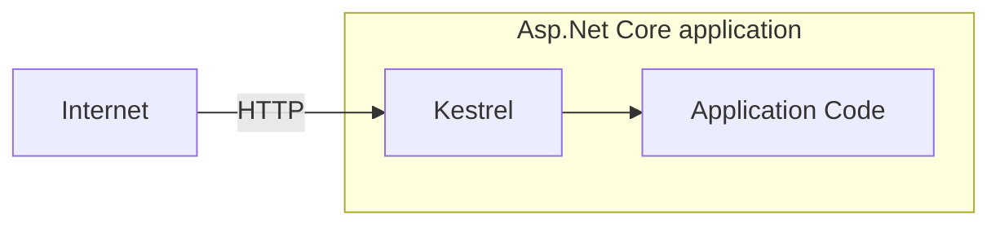

#### HTTP 与 其他服务器的请求流程

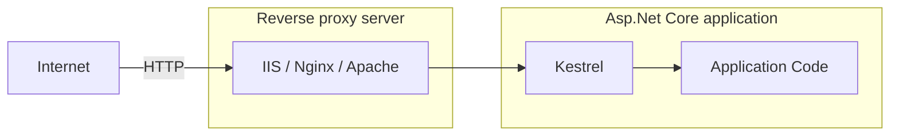

#### 反向代理服务器的优势(Benefits)

- 负载均衡(Load Balancing)
- 缓存(Caching)
- URL重写(URL Rewriting)
- 解压缩请求(Decompressing the requests)
- 认证(Authentication)
- 解析SSL证书(Decryption of SSL Certificates)

### 006. launchSettings.json

应用程序的启动配置文件是在位于 `Properties` 文件夹内的 `launchSettings.json` 文件中。

- `iisSettings` - 该节点用于设置`IIS`相关的启动配置。
- `profiles` - 是自定义的启动相关配置。
    - `commandName` - 启动应用程序时要执行命令的类型，选项包括：
        - `Project` - 使用 **Kestrel** 启动项目。
        - `IISExpress` - 使用 **IISExpress** 启动项目。
    - `dotnetRunMessages` - 是否在命令行或终端窗口中显示详细的 **.NET CLI** 的运行时消息。如果设置为`false`则仅输出必要消息。
    - `launchBrowser` - 启动时是否打开默认浏览器。
    - `applicationUrl` - 应用的启动地址。
    - `environmentVariables` - 设置环境变量
        - `ASPNETCORE_ENVIRONMENT` - 指定 ASPNET.Core 应用程序的运行环境。它定义了三个标准的环境名称：
            - `Development` - 开发环境，通常用于本地开发，启用了更多的调试工具和详细错误信息。
            - `Staging` - 预发布环境，用于部署前的最后测试阶段，通常会模拟生产环境但会输出详细的日志和监控。
            - `Production` - 用于实际的生产环境，强调性能、安全性和稳定性。

## 三、HTTP

### 007. HTTP 介绍

HTTP(Hyper Text Transfer Protocol, 超文本传输协议)，是一种应用程序协议，它定义了一组规则，用于将请求从浏览器发送到服务器，并将响应从服务器发送到浏览器。

> 最初由 **Tim Berners Lee** 开发，后来由 IETE(Internet Engineering Task Force, 互联网工程任务组) 和 W3C(World Wide Web Consortium, 万维网联盟) 标准化。
> - SSL (Security Socket Layer, 安全套接层)
> - HTTPS (Hyper Text Transfer Protocol Security, 超文本传输安全协议)

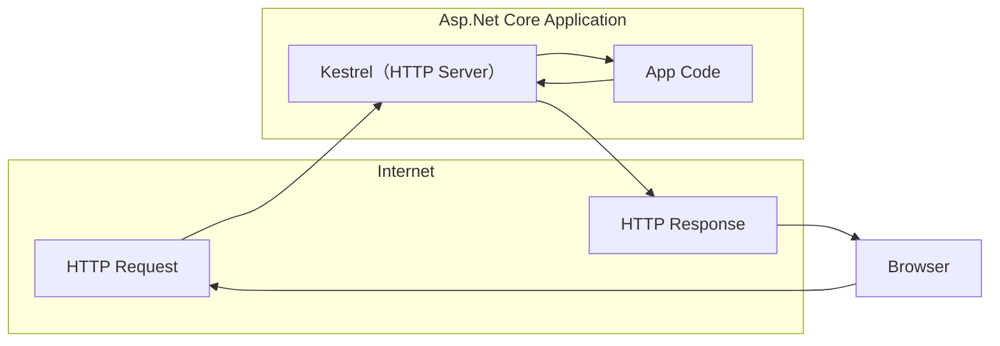

### 008. HTTP 响应

| 响应格式 | 类型 |
| -- | -- |
| HTTP/1.1 状态码(StatusCode) 状态描述(StatusDescription) | 起始行(Start Line) |
| Key: Value | 响应头(Response Headers) |
| | 空行(Empty Line) |
| Response Body | 响应体 |

#### 响应起始行 (Response Start Line)

包含HTTP版本、状态码和状态描述。

**HTTP版本**: HTTP 1/1 | HTTP 2 | HTTP 3

| 状态码 | 状态描述 |
| -- | -- |
| 101 | Switching Protocols |
| 200 | OK |
| 302 | Found |
| 400 | Bad Request |
| 401 | Unauthorized |
| 404 | Not Found |
| 500 | Internal Server Error |

### 009. HTTP 状态码

| 状态码标识 | 状态码描述 | 状态码 |
| -- | -- | -- |
| 1xx | Information | `101` Swithching Protocols |
| 2xx | Success | `200` OK |
| 3xx | Redirection | `302` Found <br/> `304` Not MOdified |
| 4xx | Client error | `400` Bad Request <br/> `401` Unauthorized <br/> `404` Not Found |
| 5xx | Server error | `500` Internal Server Error |

#### 设置响应码

```csharp
var builder = WebApplication.CreateBuilder(args);
var app = builder.Build();

app.Run(async (HttpContext context) =>
{
    // 设置响应码
    context.Response.StatusCode = 400;
    await context.Response.WriteAsync("Hello");
    await context.Response.WriteAsync(" World");
});

app.Run();
```

### 010. HTTP 响应头

| 响应头类型 | 响应值 |
| -- | -- |
| Date | 响应的日期时间。 <br/>Ex: Tue, 15 Nov 1994 08:12:31 GMT |
| Server | 服务器名称。<br/>Ex: Server=Kestrel |
| Content-Type | 响应体的 MIME 类型。<br/>Ex: text/plain, text/html, application/json, application/xml etc. |
| Content-Length | 响应体长度（字节）。<br/>Ex: 100 |
| Cache-Control | 表示浏览器中可以缓存的响应时间的秒数。<br/>Ex: max-age=60 |
| Set-Cookie | 包含要发送给浏览器的 Cookies。<br/>Ex: x=10 |
| Access-Control-Allow-Origin | 启用 CORS (Cross-Origin-Resource-Sharing, 跨源资源共享) 功能。<br/>Ex: Access-Control-Allow-Origin: http://www.example.com |

#### 设置响应头

```csharp
var builder = WebApplication.CreateBuilder(args);
var app = builder.Build();

app.Run(async (HttpContext context) =>
{
    // 设置响应头
    context.Response.Headers["MyKey"] = "MyValue";
    context.Response.Headers["Server"] = "My Server";
    context.Response.Headers["Content-Type"] = "text/html";
    await context.Response.WriteAsync("<h1>Hello</h1>");
    await context.Response.WriteAsync("<h2> World</h2>");
});

app.Run();
```

### 011. HTTP 请求

| 请求格式 | 类型 |
| -- | -- |
| Method Url HTTP/1.1 | 起始行(Start Line) |
| Key: Value<br/>Key: Value | 请求头(Request Headers) |
| | 空行(Empty Line) |
| Request Body | 请求体 |

```csharp
var builder = WebApplication.CreateBuilder(args);
var app = builder.Build();

app.Run(async (HttpContext context) =>
{
    // 获取请求路径
    var path = context.Request.Path;
    // 获取请求方法
    var method = context.Request.Method;
    context.Response.Headers["Content-Type"] = "text/html";
    await context.Response.WriteAsync($"<p>{method} {path}</p>");
});

app.Run();
```

### 012. 查询字符串

| 请求格式 | 类型 |
| -- | -- |
| GET /dashboard?id=1&name=2 HTTP/1.1 | 起始行(Start Line) |
| HOst: www.website.com<br/>Accept: text/html | 请求头(Request Headers) |
| | 空行(Empty Line) |
| ... | 请求体 |

```csharp
var builder = WebApplication.CreateBuilder(args);
var app = builder.Build();

app.Run(async (HttpContext context) =>
{
    context.Response.Headers["Content-Type"] = "text/html";
    if (context.Request.Method == "GET")
    {
        if (context.Request.Query.ContainsKey("id"))
        {
            var id = context.Request.Query["id"];
            await context.Response.WriteAsync($"<p>{id}</p>");
        }
    }
});

app.Run();
```

### 013. HTTP 请求头

| 请求头类型 | 请求值 |
| -- | -- |
| Accept | 表示客户端要接受的响应内容的MIME类型。<br/>Ex: text/html |
| Accept-Language | 表示客户端可接受的响应内容的自然语言。<br/>Ex: en-US |
| Content-Type | 响应体的 MIME 类型。<br/>Ex: text/plain, text/html, application/json, application/xml etc. |
| Content-Length | 响应体长度（字节）。<br/>Ex: 100 |
| Date | 响应的日期时间。 <br/>Ex: Tue, 15 Nov 1994 08:12:31 GMT |
| Host | 服务器域名。<br/>Eg: www.example.com |
| User-Agent | 浏览器（客户端）详细信息。<br/>Eg: Mozilla/5.0 Firefox/12.0 |
| Cookie | 包含要发送到服务器的cookie。<br.>Eg: x=100 |

```csharp
var builder = WebApplication.CreateBuilder(args);
var app = builder.Build();

app.Run(async (HttpContext context) =>
{
    context.Response.Headers["Content-Type"] = "text/html";
    if (context.Request.Headers.ContainsKey("User-Agent"))
    {
        var userAgent = context.Request.Headers["User-Agent"];
        await context.Response.WriteAsync($"<p>{userAgent}</p>");
    }
});

app.Run();
```

### 014. Postman

- 安装Postman
- 使用Postman请求
- 从请求头中获取数据

### 015. HTTP Get请求与Post请求对比

| 请求方法 | 描述 | 
| -- | -- |
| GET | 检索信息（页面、实体对象或静态文件）的请求。 |
| POST | 将实体对象发送到服务器;通常，它将插入到数据库中。 |
| PUT | 将实体对象发送到服务器;通常会更新数据库中的所有属性 （full-update）。 |
| PATCH | 将实体对象发送到服务器;通常会更新数据库中的少量属性 （partial-update）。 |
| DELETE | 删除数据库中实体的请求。 |

#### HTTP 请求

| 请求格式 | 类型 |
| -- | -- |
| GET Url HTTP/1.1 | 起始行(Start Line) |
| Key: Value<br/>Key: Value | 请求头(Request Headers) |
| | 空行(Empty Line) |
| 请求体为空 | 请求体 |

#### HTTP 响应

| 响应格式 | 类型 |
| -- | -- |
| POST Url HTTP/1.1 | 起始行(Start Line) |
| Key: Value<br/>Key: Value | 请求头(Request Headers) |
| | 空行(Empty Line) |
| 请求体 <br/> ... <br/> ... | 请求体 |

### 016. HTTP Get请求与Post请求对比

```csharp
using System.IO;

var builder = WebApplication.CreateBuilder(args);
var app = builder.Build();

app.Run(async (HttpContext context) =>
{
    context.Response.Headers["Content-Type"] = "text/html";
    var reader = new StreamReader(context.Request.Body);
    var body = await reader.ReadToEndAsync();
    await context.Response.WriteAsync($"<p>{body}</p>");

    var query = Microsoft.AspNetCore.WebUtilities.QueryHelpers.ParseQuery(body);

    if (query.ContainsKey("name"))
    {
        foreach (var name in query["name"])
        {
            await context.Response.WriteAsync($"<h5>{name}</h5>");
        }
    }

});

app.Run();
```

## 四、中间件

### 017. 中间件介绍

中间件是组装到应用程序管道中以处理请求和响应的组件。

> Middleware 是一个接一个地链接起来的，并按照添加它们时的顺序执行。

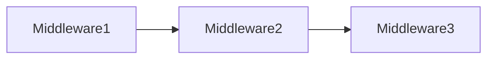

> 中间件可以是请求委托(匿名方法或lambda表达式)或类。

### 018. Run 方法

```shell
# 创建文件夹
mkdir MiddlewareExample
# 进入文件夹
cd MiddlewareExample
# 创建解决方案
dotnet new sln
# 创建Web项目
dotnet new web
# 将项目添加至解决方案中
dotnet sln add .
```

名为 `Run` 的扩展方法用于执行一个终止/短路中间件，该中间件不会将请求转发到下一个中间件。

### 019. 中间件链

```csharp
// middleware 1
app.Use(async (HttpContext context, RequestDelegate next) =>
{
    // befire logic
    await context.Response.WriteAsync("Hello");
    await next(context);
    // after logic
});

// middleware 2
app.Use(async (context, next) =>
{
    // before logic
    await context.Response.WriteAsync("Hello 2");
    await next(context);
    // after logic
});

// middleware 3
app.Run(async (HttpContext context) =>
{
    await context.Response.WriteAsync("Hello 3");
});
```

名为 `Use` 的扩展方法用于执行非终止/短路的中间件，该中间件 可能会/可能不会（通过调用next()方法来控制） 将请求转发到下一个中间件。

### 020. 自定义中间件类

中间件类用于将中间件逻辑从lambda表达式分离到单独/可重用的类中。

```csharp
class MiddlewareClassName : IMiddleware
{
  public async Task InvokeAsync(HttpContext context, RequestDelegate next)
  {
    //before logic
    await next(context);
    //after logic
  }
}
app.UseMiddleware<MiddlewareClassName>();
```

### 021. 自定义中间件扩展

中间件扩展方法用于通过单个方法调用来调用中间件。

```csharp
public static class CustomMiddlewareExtensions
{
    public static IApplicationBuilder UseMyCustomMiddleware(this IApplicationBuilder app)
    {
        app.UseMiddleware<MyCustomMiddleware>();
        return app;
    }
}

app.UseMyCustomMiddleware();
```

### 022. 自定义传统中间件类

```csharp
namespace MiddlewareExample.CustomMiddleware;

public class HelloCustomMiddleware
{
    private readonly RequestDelegate _next;
    public HelloCustomMiddleware(RequestDelegate next)
    {
        _next = next;
    }
    public async Task InvokeAsync(HttpContext context)
    {
        await context.Response.WriteAsync("Hello Custom Middleware - Starts\n");
        await _next(context);
        await context.Response.WriteAsync("Hello Custom Middleware - Ends\n");
    }
}

public static class HelloCustomMiddlewareExtensions
{
    public static IApplicationBuilder UseHelloCustomMiddleware(this IApplicationBuilder app)
    {
        app.UseMiddleware<HelloCustomMiddleware>();
        return app;
    }
}

app.UseHelloCustomMiddleware();
```

### 023. 中间件的正确顺序

```csharp
app.UseExceptionHandler("/Error");
app.UseHsts();
app.UseHttpsRedirection();
app.UseStaticFiles();
app.UseRouting();
app.UseCors();
app.UseAuthentication();
app.UseAuthorization();
app.UseSession();
app.MapControllers();

// 添加自定义中间件

app.Run();
```

### 024. UseWhen

```csharp
app.UseWhen(context => context.Request.Query.ContainsKey("username"), app =>
{
    app.Use(async (context, next) =>
    {
        await conte.Response.WriteAsync("Hello from middleware UseWhen");
        await next();
    })
});
```

名为 `UseWhen` 的扩展方法仅用于仅在指定条件为 true 时执行中间件的分支。

## 五、路由

### 025. 路由介绍

路由是通过检查HTTP Method 和 Url 来匹配传入的 HTTP 请求的过程，然后调用相应的终端节点(Endpoint)。

```shell
# 创建文件夹
mkdir RoutingExample
# 进入文件夹
cd RoutingExample
# 创建解决方案
dotnet new sln
# 创建Web项目
dotnet new web
# 将Web项目添加至解决方案中
dotnet sln add .
```

#### UseRouting

```csharp
app.UseRouting();
```

启用路由并根据Url路径和HTTP Method选择合适的端点。

#### UseEndPoints

```csharp
app.UseEndpoints(endpoints => 
{
    endpoints.Map();
    endpoints.MapGet();
    endpoints.MapPost();
});
```

根据 `UseRouting()` 选择的端点执行相应的端点。

### 026. Map、MapGet、MapPost 的使用

```csharp
var builder = WebApplication.CreateBuilder(args);
var app = builder.Build();

// 启用路由
app.UseRouting();

// 创建终端节点
app.UseEndpoints(endpoints =>
{
    endpoints.Map("map1", async (context) =>
    {
        await context.Response.WriteAsync("In map1");
    });

    endpoints.Map("map2", async (context) =>
    {
        await context.Response.WriteAsync("In map2");
    });

    endpoints.MapGet("map_get", async (context) =>
    {
        await context.Response.WriteAsync("In map get");
    });

    endpoints.MapPost("map_post", async (context) =>
    {
        await context.Response.WriteAsync("In map post");
    });
});

app.Run(async context =>
{
    await context.Response.WriteAsync($"Request received at {context.Request.Path}");
});

app.Run();
```

### 027. GetEndPoint 方法

`context.GetEndPoint()` 方法返回 `Microsoft.AspNetCore.Http.Endpoint` 类型的实例，该类型表示终结点。该实例包含两个重要属性：`DisplayName`、`RequestDelegate`。

```csharp
var builder = WebApplication.CreateBuilder(args);
var app = builder.Build();

app.Use(async (context, next) =>
{
    Microsoft.AspNetCore.Http.Endpoint? endpoint = context.GetEndpoint();
    await context.Response.WriteAsync($"UseRouting Before is null {endpoint == null}\n");
    await next(context);
});

// 启用路由
app.UseRouting();

app.Use(async (context, next) =>
{
    Microsoft.AspNetCore.Http.Endpoint? endpoint = context.GetEndpoint();
    await context.Response.WriteAsync($"UseRouting After is null {endpoint == null}, DisplayName: {endpoint?.DisplayName}\n");
    await next(context);
});

app.Map("map1", async (context) =>
{
    await context.Response.WriteAsync($"In map1");
});

app.Run();
```

在调用 `GetEndpoint()` 方法时，必须要在 `UseRouting()` 方法之后调用，否则获取不到信息。

### 028. 路由参数

路由中的 `{parameter}` 参数可以与任何值匹配。

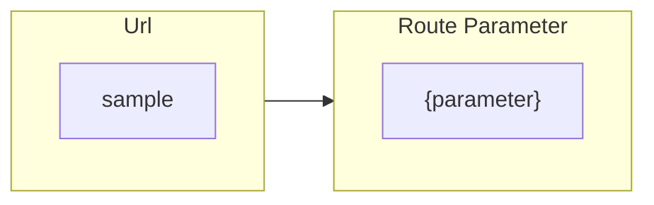

```csharp
app.UseEndpoints(endpoints =>
{
    endpoints.Map("files/{filename}.{extension}", async context =>
    {
        var filename = context.Request.RouteValues["filename"];
        var extension = context.Request.RouteValues["extension"];
        await context.Response.WriteAsync($"In files: FileName {filename}, Extension {extension}");
    });
});
```

通过 `{parameter}` 来定义路由中的参数，使用 `RouteValues` 获取路由中匹配的参数值(忽略大小写)。

### 029. 默认路由参数

路由中的 `{parameter=value}` 定义为具有默认值的参数，如果参数为空，则使用设置的默认值作为参数内容。

```csharp

app.UseEndpoints(endpoints =>
{
    endpoints.Map("employee/profile/{EmployeeName=MySelf}", async context =>
    {
        var employeeName = context.Request.RouteValues["employeename"];
        await context.Response.WriteAsync($"In employee: Name {employeeName}");
    });

    endpoints.Map("products/details/{id=1}", async context =>
    {
        var id = context.Request.RouteValues["ID"];
        await context.Response.WriteAsync($"In product: Id {id}");
    });
});
```

### 030. 可选路由参数

路由中的 `{parameter?}` 定义为可选参数，这意味着，它与空值也可以匹配。

```csharp
app.UseEndpoints(endpoints =>
{
    endpoints.Map("products/details/{id?}", async context =>
    {
        var id = context.Request.RouteValues["ID"];
        if (id != null)
        {
            await context.Response.WriteAsync($"In product: Id {id}");
        }
        else
        {
            await context.Response.WriteAsync($"In product: Id is not supplied");
        }
    });
});
```

### 031. 路由约束

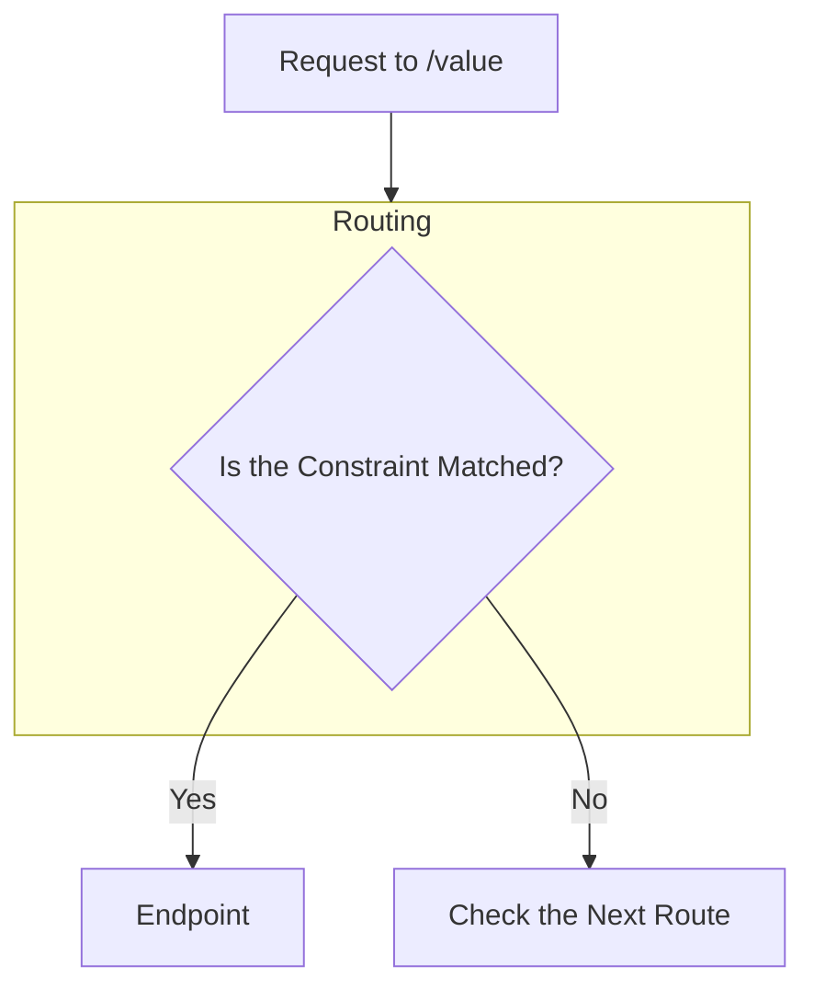

| 数据类型约束 | 描述 | 语法 | 示例值 |
| -- | -- | -- | -- |
| `int` | 匹配有效的小数数值 | `{price:decimal}` | -2,147,483,648 到 2,147,483,647 |   
| `bool` | 匹配有效的布尔类型值，**不区分大小写** | `{active:bool}` | true、false |
| `datetime` | 匹配有效的日期值，格式包括 "yyyy-MM-dd HH:mm:ss tt" 和 "MM/dd/yyyy hh:mm:ss tt" | `{date:datetime}` | 2024/12/12 12:12:12 |

```csharp
app.UseEndpoints(endpoints =>
{
    endpoints.Map("daily-digest-report/{reportdate:datetime}", async context =>
    {
        var reportdate = context.Request.RouteValues["reportdate"];
        await context.Response.WriteAsync($"In daily-digest-report: reportdate {reportdate}");
    });
});
```

### 032. 路由约束

| 数据类型约束 | 描述 | 语法 | 示例值 |
| -- | -- | -- | -- |
| `decimal` | 匹配有效的小数数值 | `{price:decimal}` | 49.99、-1、0.01 |   
| `long` | 匹配有效的长整型数值 | `{id:long}` | -9,223,372,036,854,775,808 到 9,223,372,036,854,775,807 |
| `guid` | 匹配有效的Guid值 | `{id:guid}` | 8DE341A3-70AC-1F34-63D5-A2347456C9F0 |

```csharp
app.UseEndpoints(endpoints =>
{
    endpoints.Map("cities/{id:guid}", async context =>
    {
        var id = context.Request.RouteValues["ID"];
        await context.Response.WriteAsync($"In Cities: Id {id}");
    });
});
```

### 033. 路由约束

| 长度约束 | 描述 | 语法 | 示例值 |
| -- | -- | -- | -- |
| `minlength(value)` | 与至少具有指定字符数的字符串匹配 | `{username:minlength(4)}` | John、Alice、William |   
| `maxlength(value)` | 与小于或等于指定字符数的字符串匹配 | `{username:maxlength(7)}` | John、Allen、William |
| `length(min,max)` | 与具有给定最小长度和最大长度之间的字符数的字符串匹配，**包括最大最小两个数字** | `{username:length(4,7)}` | John、Allen、William |
| `length(value)` | 与具有精确指定字符数的字符串匹配 | `{tin:length(9)}` | 123456789 |
| `min(value)` | 与大于或等于指定值的整型数匹配 | `{age:min(18)}` | 18、19、20 |
| `max(value)` | 与小于或等于指定值的整型数匹配 | `{age:max(100)}` | -1、1、18、100 |
| `range(min,max)` | 与指定的最小值和最大值之间的整数值匹配，**包括最大最小两个数字** | `{age:range(18,100)}` | 18、19、99、100 |
| `alpha` | 与仅包含字母的字符串匹配，**忽略大小写** | `username:alpha` | rick、morty |
| `regex` | 与指定正则表达式匹配的字符串匹配 | `{age:regex(^[0-9]{2}$)}`<br/>`{age:regex(^\d{3}-\d{3}$)}` | 10、11、98、99<br/>123-456 |


```csharp
app.UseEndpoints(endpoints =>
{
    endpoints.Map("employee/profile/{EmployeeName:minlength(3):maxlength(7)}", async context =>
    {
        var employeename = context.Request.RouteValues["employeename"];
        await context.Response.WriteAsync($"In Employee: {employeename}");
    });

    endpoints.Map("sales-report/{year:int:min(1900)}/{month:regex(^(apr|jul|oct|jan)$)}", async context =>
    {
        var year = context.Request.RouteValues["year"];
        var month = context.Request.RouteValues["month"];
        await context.Response.WriteAsync($"In sales-report: year {year}, month {month}");
    });
});
```

### 034. 自定义路由约束

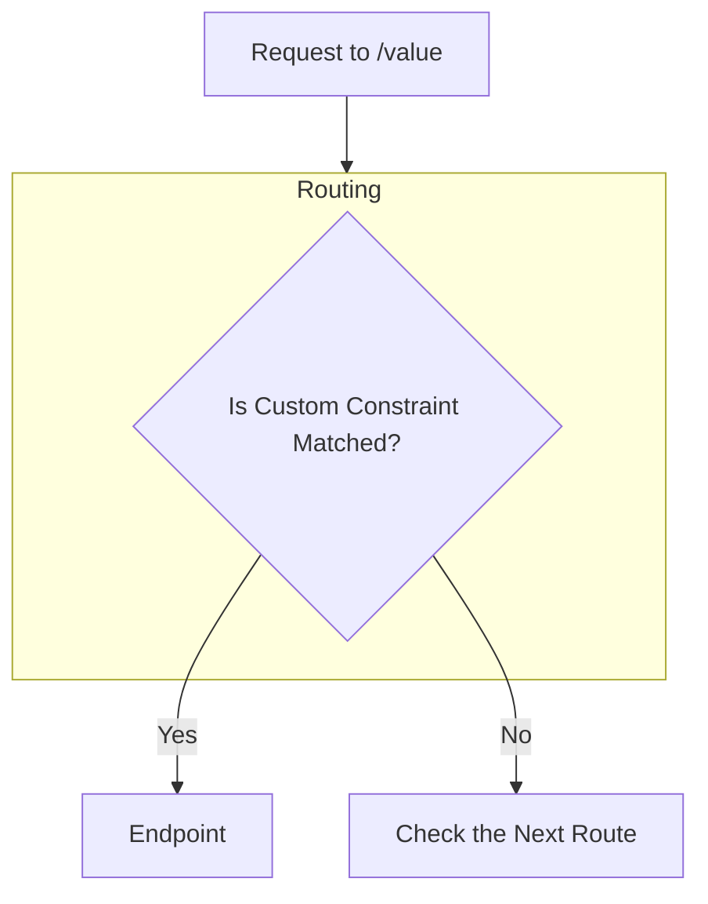

实现 `IRouteConstraint` 接口来实现自定义路由约束。

```csharp
public class MonthsCustomConstraint : IRouteConstraint
{
    public bool Match(HttpContext? httpContext, IRouter? route, string routeKey, RouteValueDictionary values,
        RouteDirection routeDirection)
    {
        // 检查值是否存在
        if (!values.ContainsKey(routeKey))
        {
            return false;
        }
        
        Regex regex = new(@"^(apr|jul|oct|jan)$");
        
        var monthValue = values[routeKey].ToString();
        
        return regex.IsMatch(monthValue);
    }
}
```

将自定义路由约束添加到路由中。

```csharp
builder.Services.AddRouting(options =>
{
    options.ConstraintMap.Add("months",typeof(MonthsCustomConstraint));
});
```

在路由中使用自定义约束。

```csharp
app.UseEndpoints(endpoints =>
{
    endpoints.Map("sales-report/{year:int:min(1900)}/{month:months}", async context =>
    {
        var year = context.Request.RouteValues["year"];
        var month = context.Request.RouteValues["month"];
        await context.Response.WriteAsync($"In sales-report: year {year}, month {month}");
    });
});
```

### 035. 端点选择顺序

| 优先级 | 描述 | 示例 |
| -- | -- | -- |
| 1 | 具有更多区段的URL模板 | "a/b/c/d" 高于 "a/b/c" |
| 2 | 带有文本文字的URL模板比路由参数具有更高的优先级 | "a/b" 高于 "a/{parameter}" |
| 3 | 带有路由约束参数的URL模板比没有约束的参数段具有更高的优先级 | "a/b:int" 高于 "a/b" |
| 4 | 捕获所有参数的优先级最低 | "a/{b}" 高于 "a/**" |

### 036. WebRoot 和 UseStaticFiles 方法

#### WebRoot

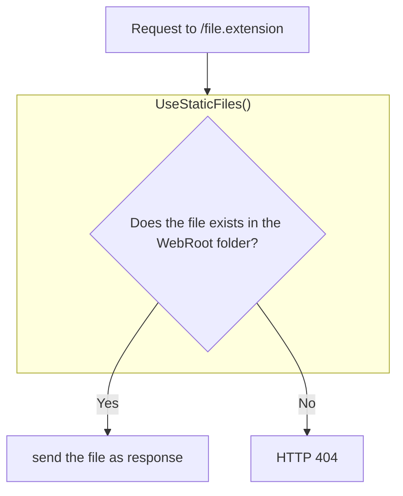

默认的 WebRoot 文件夹是 "wwwroot"，可以手动配置。

```csharp
var builder = WebApplication.CreateBuilder(new WebApplicationOptions
{
    WebRootPath = "myroot",
});
```

#### UseStaticFiles 方法

使用 `UseStaticFiles` 可以添加新的静态文件目录。

```csharp
app.UseStaticFiles(new StaticFileOptions
{
    FileProvider = new PhysicalFileProvider(Path.Combine(builder.Environment.ContentRootPath,"mywwwroot"))
});
```

## 六、控制器与 IActionResult

### 037. 创建控制器

控制器是一个类，用于对一组操作作进行分组。当收到请求并返回结果(响应)时，操作方法会执行某些操作。

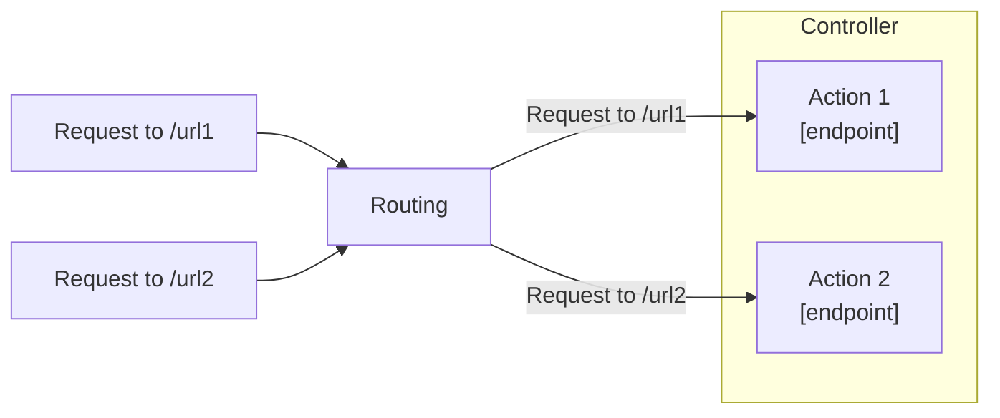

#### 创建Web项目

```shell
# 创建文件夹
mkdir ControllersExample
# 进入文件夹
cd ControllersExample
# 创建解决方案
dotnet new sln
# 创建Web项目
dotnet new web
# 将Web项目添加至解决方案中
dotnet sln add .
```

#### 创建控制器类

控制器类名称应以 `Controller` 为后缀。

```csharp
using Microsoft.AspNetCore.Mvc;

namespace ControllersExample.Controllers;

public class HomeController
{
    [Route("index")]
    public string Index()
    {
        return "Hello from index";
    }
}
```

#### 添加控制器路由

- `AddControllers` 方法将所有控制器添加到容器中。这样匹配到对应的路由时，就可以访问到它们。
- `MapControllers` 方法将所有操作方法添加为路由节点，这样就不需要使用 `UseEndpoint` 方法来手动将方法添加为端点了。

```csharp
var builder = WebApplication.CreateBuilder(args);

// 注册所有控制器服务
builder.Services.AddControllers();

var app = builder.Build();

// 启用控制器路由
app.MapControllers();

app.Run();
```

### 038. 多个 Action 方法

可以在一个控制器中定义多个Action方法。

```csharp
public class HomeController
{
    [Route("home")]
    [Route("/")]
    public string Index()
    {
        return "Hello from Index";
    }

    [Route("about")]
    public string About()
    {
        return "Hello from About";
    }

    [Route("contact-us/{mobile:regex(^\\d{{11}}$)}")]
    public string Contact()
    {
        return "Hello from Contact";
    }
}
```

### 039. 控制器的注意事项

#### 创建控制器

控制器应满足以下要求(任一即可)。
1. 控制器类名要以 `Controller` 作为后缀,例如 `HomeController`。
2. `[Controller]` 属性应用于类或基类上。

> 可选：
> - 是一个公共类。
> - 继承自 `Microsoft.AspNetCore.Mvc.Controller`。

#### 控制器的职责

| 职责 | 描述 |
| -- | -- |
| 读取请求 | 从请求中提取数据值，例如查询字符串参数、请求正文、请求 Cookie、请求标头等。 |
| 调用模型 | 调用业务逻辑方法。通常，以 “服务” 的形式提供。 |
| 验证参数 | 验证传入请求详细信息，例如：查询字符串(query string)参数、请求正文、请求Cookie、请求头等。 |
| 准备响应 | 选择向客户端发送什么样的响应 |


### 040. ContentResult

`ContentResult` 可以根据指定的MIME类型来表示任何类型的响应。MIME类型表示内容的类型，例如 `text/plain`、`text/html`、`application/json`、`application/xml`、`application/pdf`等。

使用方式可以在接口中直接实例化`ContentResult`类型：
```csharp
public ContentResult Index()
{
    return new ContentResult
    {
        Content = "<h1>Hello World!</h1>",
        ContentType = "text/html",
    };
}
```

或者将控制器继承自 `Microsoft.AspNetCore.Mvc.Controller` 类后，直接在接口中返回 `Content()` 方法。

```csharp
public class HomeController : Controller
{
    [Route("about")]
    public ContentResult About()
    {
        return Content("Hello from About", "text/plain"); ;
    }
}
```

### 041. JsonResult

`JsonResult` 可以用于表示JSON（JavaScript Object Notation）格式的对象。

使用方式同样可以直接返回`JsonResult`实例：
```csharp
[Route("person")]
public JsonResult Person()
{
    var person = new Person
    {
        Id = Guid.NewGuid(),
        Name = "James",
        Age = 25
    };
    return new JsonResult(person);
}
```

或者直接返回 `Json()` 方法。

```csharp
[Route("person")]
public JsonResult Person()
{
    var person = new Person
    {
        Id = Guid.NewGuid(),
        Name = "James",
        Age = 25
    };
    return Json(person);
}
```

### 042. FileResult

`FileResult`将文件内容作为响应发送出去。例如`pdf`、`txt`、`exe`、`zip`文件等。

#### VirtualFileResult（虚拟文件）

`VirtualFileResult` 类型返回位于WebRoot文件夹中的文件，默认为 `wwwroot`。

> 当文件位于WebRoot文件夹中时使用。

```csharp
[Route("file-download-virtual")]
public FileResult FileDownloadVirtual()
{
    return new VirtualFileResult("/sample.txt", "text/plain");
}
```

#### PhysicalFileResult（物理文件）

`PhysicalFileResult` 类型返回位于物理位置的文件。

> 当文件位于WebRoot文件夹之外的位置时使用。

```csharp
[Route("file-download-physical")]
public FileResult FileDownloadPhysical()
{
    return new PhysicalFileResult("d:/sample.txt", "text/plain");
}
```

#### FileContentResult（文件内容）

`FileContentResult` 类型返回文件的字节数组。

> 当文件来自其他数据源的文件或`byte[]`的一部分作为响应返回时使用。

```csharp
[Route("file-download-bytes")]
public FileResult FileDownloadBytes()
{
    var bytes = System.IO.File.ReadAllBytes("sample.txt");
    return new FileContentResult(bytes, "text/plain");
}
```

#### File

`File()`方法有多种重载，支持返回相对路径、文件字节数组以及文件流等。

```csharp
[Route("file-download")]
public FileResult FileDownload()
{
    return File("sample.txt", "text/plain");
}
```

### 043. IActionResult

`IActionResult` 是所有操作结果类的父接口。例如：`ContentResult`、`JsonResult`、`RedirectResult`、`StatusCodeResult`、`ViewResult` 等。

通过将结构的返回值类型改为 `IActionResult`，可以返回任一子类型。

```csharp
[Route("book")]
public IActionResult Index()
{
    if (!Request.Query.ContainsKey("bookid"))
    {
        Response.StatusCode = 400;  
        return Content("Book ID is required"); 
    }

    if (string.IsNullOrEmpty(Convert.ToString(Request.Query["bookid"])))
    {
        Response.StatusCode = 400;
        return Content("Book ID can't be null or empty");
    }
    
    var bookId = Convert.ToInt16(Request.Query["bookid"]);
    if (bookId<=0)
    {
        Response.StatusCode = 400;
        return Content("Book ID can't be less than or equal to zero");
    }

    if (bookId > 1000)
    {
        Response.StatusCode = 400;
        return Content("Book ID can't be greater than 1000");
    }

    if (!Convert.ToBoolean(Request.Query["isloggedin"]))
    {
        Response.StatusCode = 401;
        return Content("User must be authenticated");
    }
    
    return File("/sample.txt", "text/plain");
}
```

### 044. StatusCodeResult

`StatusCodeResult` 发送具有指定状态码的空响应。例如 `200`、`400`、`401`、`404`、`500`等。

用于想要发送特定HTTP状态码作为响应时使用。

```csharp
return StatusCode(401);
```

#### UnauthorizedResult

`UnauthorizedResult` 发送状态码为`401 Unauthorized` 的响应。

用于在用户未授权（未登录）时使用。

```csharp
return Unauthorized("User must be authenticated");
```

#### BadRequestResult

`BadRequestResult` 发送状态码为 `400 Bad Request` 的响应。

当请求的参数无效（参数验证失败）时使用。

```csharp
return BadRequest("Book ID is not supplied");
```

#### NotFoundResult

`NotFoundResult` 发送状态码为 `404 Not Found` 的响应。

当请求的信息在服务器上不存在时使用。

```csharp
return NotFound("Book ID can't be greater than 1000");
```

### 045. RedirectResult

`RedirectResult` 向浏览器发送状态码 `301` 或 `302` 的响应，以便重定向到特定操作或URL中。

```csharp
```
#### RedirectToActionResult

`RedirectToActionResult` 发送状态码为 `302 Found` 的响应，用于根据操作方法名和控制器名从当前操作方法重定向到另一个操作方法的响应。

第一个参数是要跳转的方法，第二个参数是方法所在的控制器，第三个参数是要传递的数据。

```csharp
[Route("store")]
public IActionResult Store()
{
    return RedirectToAction("Book","Store", new {});
}
```

可以通过 `RedirectToActionResult` 的第四个参数设置为`true`，将返回状态码 `301 Move Permanently` 的响应。

```csharp
[Route("store")]
public IActionResult Store()
{
    return new RedirectToActionResult("Book","Store", new {}, true);
}
```

或者使用 `RedirectToActionPermanent` 方法。

```csharp
return RedirectToActionPermanent("Book","Store", new {});
```

### 046. RedirectResult

#### LocalRedirectResult

`LocalRedirectResult` 用于根据特定的URL从当前操作方法重定向到另一个操作方法的响应。

```csharp
return LocalRedirect($"store/book/{1123}");
```

或者返回 `301 Move Permanently` 状态码。

```csharp
return LocalRedirectPermanent($"store/book/{2223}");
```

#### RedirectResult

`RedirectResult` 表示从当前操作方法重定向到任何其他URL（可以是当前Web应用程序或其他Web应用程序）的响应。

```csharp
return Redirect($"store/book/{1123}");
```

或者返回 `301 Move Permanently` 状态码。

```csharp
return RedirectPermanent($"store/book/{2223}");
```

## 七、模型绑定与验证

### 047. 模型绑定介绍

模型绑定是从HTTP请求中读取值并将其作为参数传递给操作方法。

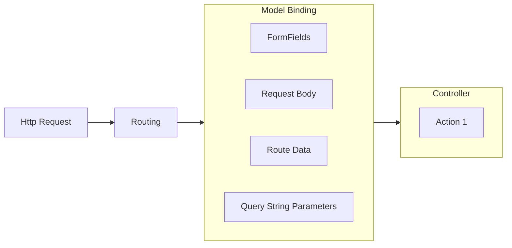

### 048. Query String 与 Route Data 的对比

使用QueryString的形式传入参数，例如：“/bookstore?bookid=123&isloggedin=false”。

```csharp
[Route("bookstore")]
public IActionResult Query(int? bookid, bool? isloggedin)
{
    if (!bookid.HasValue)
    {
        return BadRequest("Book ID is not supplied");
    }

    if (bookid <= 0)
    {
        return BadRequest("Book ID can't be less than or equal to zero");
    }

    if (bookid > 1000)
    {
        return NotFound("Book ID can't be greater than 1000");
    }

    if (!isloggedin.HasValue || !isloggedin.Value)
    {
        return Unauthorized("User must be authenticated");
    }

    return File("/sample.txt", "text/plain");
}
```

使用 Route Data 的形式传入，可以将参数直接写在路径中。例如：“/bookstore/1234/true”。

```csharp
[Route("bookstore/{bookid}/{isloggedin}")]
public IActionResult Query(int? bookid, bool? isloggedin)
{
    if (!bookid.HasValue)
    {
        return BadRequest("Book ID is not supplied");
    }

    if (bookid <= 0)
    {
        return BadRequest("Book ID can't be less than or equal to zero");
    }

    if (bookid > 1000)
    {
        return NotFound("Book ID can't be greater than 1000");
    }

    if (!isloggedin.HasValue || !isloggedin.Value)
    {
        return Unauthorized("User must be authenticated");
    }

    return File("/sample.txt", "text/plain");
}
```

### 049. FromQuery 和 FromRoute

#### [FromQuery]

从Query String中获取参数值。

```csharp
[Route("bookstore/{bookid}/{isloggedin}")]
public IActionResult Query([FromQuery] int? bookid, [FromQuery] bool? isloggedin)
{
    
}
```

#### [FromRoute]

从路由中获取参数值

```csharp
[Route("bookstore/{bookid}/{isloggedin}")]
public IActionResult Query([FromRoute] int? bookid, [FromRoute] bool? isloggedin)
{
    
}
```

### 050. 模型类

`Model` 是一个类，它用于从请求中接收或发送到响应的数据结构。也成为 **POCO**（Plain Old CLR Objects）

定义一个模型类，可以标记特性用以选择从查询字符串中获取数据，或者路由数据等。默认相同名称可以自动绑定。
```csharp
using Microsoft.AspNetCore.Mvc;

public class Book
{
    [FromQuery]
    public int? BookId { get; set; }
    public string? Author { get; set; }

    public override string ToString()
    {
        return $"Book: Id {BookId}, Author {Author}";
    }
}
```

在定义的方法中增加模型类参数，当接口请求时，会将请求参数自动绑定到该模型类上。

```csharp
[Route("bookstore/{bookid?}/{isloggedin?}")]
public IActionResult Query([FromRoute] bool? isloggedin, Book book)
{
    
}
```

### 051. form-urlencoded 和 form-data

#### form-urlencoded

`form-urlencoded` 是默认的请求方式。

- 请求头：

```
Content-Type: `application/x-www-form-urlencoded`
```

- 请求正文：
```
?param1=value1&param2=value2
```

#### form-data

- 请求头：

```
Content-Type: multipart/form-data
```

- 请求正文：

```
--------------------------d74496d66958873e

Content-Disposition: form-data; name="param1"

value1

--------------------------d74496d66958873e

Content-Disposition: form-data; name="param2"

value2
```

> - 当使用 `application/x-www-form-urlencoded` 时，只有从[FromQuery]和模型绑定参数才能接收数据。
> - 当使用 `multipart/form-data` 时，只有[FromRoute]和模型绑定参数才能接收数据。


### 052. 模型验证介绍

创建项目

```shell
# 创建文件夹
mkdir ModelValidationsExample
# 进入文件夹
cd ModelValidationsExample
# 创建解决方案
dotnet new sln
# 创建Web项目
dotnet new web
# 将项目添加至解决方案中
dotnet sln add .
```

可以在模型类中的属性上面增加验证特性，用以验证参数是否有效。

```csharp
using System.ComponentModel.DataAnnotations;

public class Person
{
    [Required]
    public string? Name { get; set; }
    public string? Email { get; set; }
    public string? Phone { get; set; }
    public string? Password { get; set; }
    public string? ConfirmPassword { get; set; }
    public double? Price { get; set; }

    public override string ToString()
    {
        return $"Person: {Name}, {Email}, {Phone}, {Password}, {ConfirmPassword}, {Price}";
    }
}
```

### 053. ModelState

`ModelState` 是验证模型属性是否验证通过的状态结果。

#### IsValid

当验证的结果没有任何错误时结果为`true`否则为`false`。

#### Values

包含每个模型属性值和相应的 `Errors` 属性，该属性包含模型属性的验证错误列表。

#### ErrorCount

返回错误数量。

#### 输出所有错误结果

```csharp
[Route("register")]
public IActionResult Register(Person person)
{
    if (ModelState.IsValid)
    {
        var errors = new List<string>();
        foreach (var value in ModelState.Values)
        {
            foreach (var error in value.Errors)
            {
                errors.Add(error.ErrorMessage);
            }
        }
        var errorMessage = string.Join(',', errors);
        return BadRequest(errorMessage);
    }
    
    return Content($"{person}");
}
```

使用LINQ优化双重循环。

```csharp
[Route("register")]
public IActionResult Register(Person person)
{
    if (ModelState.IsValid)
    {
        var errors = string.Join(',', ModelState.Values
            .SelectMany(x => x.Errors)
            .Select(x => x.ErrorMessage));
        return BadRequest(errors);
    }
    
    return Content($"{person}");
}
```

可以在特性中增加自定义错误消息。

```csharp
public class Person
{
    [Required(ErrorMessage = "Name can't be empty or null")]
    public string? Name { get; set; }
}
```

### 054. 模型验证

通过在模型的属性上方添加特性来验证模型中的值是否有效，可以给特性中的`ErrorMessage`填写自定义消息内容。

#### [Required(ErrorMessage = "")]

验证当前属性值不允许为空。

如果错误内容中需要增加属性名称使用`{0}`来占位，它会自动替换掉该占位符。

```csharp
[Required(ErrorMessage = "{0} can't be empty or null")]
public string Name { get; set; }
```

我们可以为属性起一个别名，这样错误消息的内容就会使用该别名。

```csharp
[Required(ErrorMessage = "{0} can't be empty or null")]
[Display(Name = "Person Name")]
public string Name { get; set; }
```

#### [StringLength(int maximumLength，int minimumLength = value， ErrorMessage = "")]

验证字符串中允许的最小长度和最大长度（字符数）。

```csharp
[StringLength(40, MinimumLength = 3, ErrorMessage = "{0} must be between {2} and {1} characters")]
public string? Name { get; set; }
```

字符串中的占位符：
- `{0}` - 属性名称。
- `{1}` - 最大长度。
- `{2}` - 最小长度。

#### [Range(int maximumLength， MinimumLength = value， ErrorMessage = "")]

验证数值的大小范围。

```csharp
[Range(0, 999.99, ErrorMessage = "{0} must be between {1} and {2}")]
public double? Price { get; set; }
```

字符串中的占位符：
- `{0}` - 属性名称。
- `{1}` - 最小数值。
- `{2}` - 最大数值。

### 055. 模型验证

#### [RegularExpression(string pattern, ErrorMessage = "")]

验证该值是否有效的匹配模式（正则表达式）。

```csharp
[RegularExpression("^[A-Za-z .]$", ErrorMessage = "{0} must only contain alphanumeric characters, space and dot (.)")]
public string? Name { get; set; }
```

#### [EmailAddress(ErrorMessage = "")]

验证该值是否是有效的电子邮箱地址。

```csharp
[EmailAddress(ErrorMessage = "{0} must be a valid email address")]
public string? Email { get; set; }
```

#### [Phone(ErrorMessage = "")]

验证该值是否是有效的电话号码。

```csharp
[Phone(ErrorMessage = "{0} must be a valid phone number")]
public string? Phone { get; set; }
```

#### [Compare(string otherProperty, ErrorMessage = "")]

验证该值与其他属性值是否一致。

```csharp
public string? Password { get; set; }

[Compare("Password", ErrorMessage = "{0} and {1} do not match")]
public string? ConfirmPassword { get; set; }
```

字符串中的占位符：
- `{0}` - 当前属性名称。
- `{1}` - 对比属性名称。

#### [Url(ErrorMessage = "")]

验证该值是否是有效的URL地址。

#### [ValidateNever]

不验证该属性（从模型验证中排除属性）。

```csharp
using Microsoft.AspNetCore.Mvc.ModelBinding.Validation;

public class Person 
{
    [ValidateNever]
    public double? Price { get; set; }
}
```

### 056. 自定义验证

创建一个自定义验证的类，继承自 `ValidationAttribute` 类并重写 `IsValid` 方法。
 
```csharp
using System.ComponentModel.DataAnnotations;

namespace ModelValidationsExample.CustomValidators;

public class MinimumYearValidatorAttribute : ValidationAttribute
{
    public int MinimumYear { get; set; } = 2000;
    public string DefaultErrorMessage { get; set; } = "Year should not be less than {0}.";
    
    public MinimumYearValidatorAttribute()
    {
        
    }

    public MinimumYearValidatorAttribute(int minimumYear)
    {
        MinimumYear = minimumYear;
    }
    
    
    protected override ValidationResult? IsValid(object? value, ValidationContext validationContext)
    {
        if (value != null)
        {
            var date = (DateTime)value;
            if (date.Year >= MinimumYear)
            {
                return new ValidationResult(string.Format(ErrorMessage?? DefaultErrorMessage, nameof(MinimumYear)));
            }
            else
            {
                return ValidationResult.Success;
            }
        }

        return null;
    }
}
```

使用方法同样在模型属性上天标记该特性即可。

```csharp
[MinimumYearValidator(2000, ErrorMessage = "Date of Birth should be newer than {0} year")]
public DateTime? DateOfBirth { get; set; }
```

#### ValidationAttribute

- 该类是所有验证特性的基类。（例如：RequiredAttribute、RegularExpressionAttribute、RangeAttribute、StringLengthAttribute、CompareAttribute 等）
- 它提供了 `ErrorMessage` 属性 以及 `Validate()`和`IsValid()` 方法等。

#### ValidationContext

- 充当自定义验证属性类的 “IsValid（）” 方法的参数。
- 提供 ObjectType、ObjectInstance 等属性。

### 057. 多个属性的自定义验证

通过反射来获取 `ValidationContext` 类中的 `ObjectType` 下指定的属性值。 

```csharp
using System.ComponentModel.DataAnnotations;

namespace ModelValidationsExample.CustomValidators;

public class DateRangeValidatorAttribute : ValidationAttribute
{
    public string OtherPropertyName { get; set; }

    public DateRangeValidatorAttribute(string otherPropertyName)
    {
        OtherPropertyName = otherPropertyName;
    }

    protected override ValidationResult? IsValid(object? value, ValidationContext validationContext)
    {
        if (value == null)
            return null;

        var toDate = (DateTime)value;

        var otherProperty = validationContext.ObjectType.GetProperty(OtherPropertyName);
        if (otherProperty != null)
        {
            var fromDate = (DateTime)otherProperty.GetValue(validationContext.ObjectInstance);
            if (fromDate > toDate)
            {
                return new ValidationResult(ErrorMessage, [OtherPropertyName, validationContext.MemberName]);
            } 
        }

        return null;
    }
}
```

### 058. IValidatableObject

通过继承 `IValidatableObject` 接口并实现 `Validate` 方法，可以实现自定义参数验证。

> 前提是模型类中的其他验证均已通过，才会进入 `Validate` 方法中进行验证。

```csharp
using System.ComponentModel.DataAnnotations;
using Microsoft.AspNetCore.Mvc.ModelBinding.Validation;
using ModelValidationsExample.CustomValidators;

namespace ModelValidationsExample.Models;

public class Person : IValidatableObject
{
    [Required(ErrorMessage = "{0} can't be empty or null")]
    [Display(Name = "Person Name")]
    [StringLength(40, MinimumLength = 3, ErrorMessage = "{0} must be between {2} and {1} characters")]
    [RegularExpression("^[A-Za-z .]$",
        ErrorMessage = "{0} must only contain alphanumeric characters, space and dot (.)")]
    public string? Name { get; set; }

    [EmailAddress(ErrorMessage = "{0} must be a valid email address")]
    public string? Email { get; set; }

    [Phone(ErrorMessage = "{0} must be a valid phone number")]
    public string? Phone { get; set; }

    [Required(ErrorMessage = "{0} can't be blank")]
    public string? Password { get; set; }

    [Required(ErrorMessage = "{0} can't be blank")]
    [Compare("Password", ErrorMessage = "{0} and {1} do not match")]
    public string? ConfirmPassword { get; set; }

    [Range(0, 999.99, ErrorMessage = "{0} must be between {1} and {2}")]
    [ValidateNever]
    public double? Price { get; set; }

    [MinimumYearValidator(2000, ErrorMessage = "Date of Birth should be newer than {0} year")]
    public DateTime? DateOfBirth { get; set; }


    public DateTime? FromDate { get; set; }

    [DateRangeValidator("FromDate", ErrorMessage = "{1} should be older than or equal to {0}")]
    public DateTime? ToDate { get; set; }

    public int? Age { get; set; }

    public override string ToString()
    {
        return $"Person: {Name}, {Email}, {Phone}, {Password}, {ConfirmPassword}, {Price}";
    }

    public IEnumerable<ValidationResult> Validate(ValidationContext validationContext)
    {
        if (!DateOfBirth.HasValue && !Age.HasValue)
        {
            yield return new ValidationResult("Either the Date of Birth or Age must be supplied",
                new[] { nameof(DateOfBirth), nameof(Age) });
        }
    }
}
```

### 059. Bind 和 BindNever

#### [Bind]

- 该特性用于在模型绑定中，仅指定的属性包含在模型绑定中。
- 防止过度暴露其他属性，尤其是创建场景。

仅绑定 `Name`、`Email` 属性，其他属性将忽略。
```csharp
[Route("register")]
public IActionResult Register([Bind(nameof(Person.Name), nameof(Person.Email))]Person person)
{
    ...
}
```

#### [BindNever]

- 该特性用于在模型绑定中，指定的属性不包含在模型绑定中。
- 当指定不绑定的属性很少时，会很方便。


模型绑定时忽略`Age`属性。
```csharp
using Microsoft.AspNetCore.Mvc.ModelBinding;

public class Person : IValidatableObject
{
    ...

    [BindNever]
    public int? Age { get; set; }

    ...
}
```

### 060. FromBody

在参数上标记 `[FromBody]` 特性从请求体（JSON、XML或其他）获取数据。

```csharp
[Route("register")]
public IActionResult Register([FromBody] Person person)
{
    ...
}
```

### 061. 输入格式化器

`InputFormatter` 用于将请求参数以对应格式进行转换。

内置以下两种格式化器：
- XmlSerializerInputFormatter
- JsonInputFormatter

可以将 `XmlSerializerInputFormatter` 注册到容器中，用以支持Xml格式的参数。

```csharp
builder.Services.AddControllers()
    .AddXmlSerializerFormatters();
```

### 062. 自定义模型绑定器

#### IModelBinder

- `IModelBinder` 是所有自定义模型绑定器的父接口。
- 该接口提供 `BindModelAsync` 方法，用于定义从请求中绑定（读取）数据并创建已在操作方法中作为参数接收的模型对象的逻辑。

#### ModelBindingContext

- 作为自定义模型绑定器接口中的 `BindModelAsync` 方法里的参数。
- 提供 `HttpContext`、`ModelState`、`ValueProvider`、`Result` 等属性。

#### 实际使用

创建自定义模型绑定器类，继承接口 `IModelBinder` 并实现 `BindModelAsync` 方法，用以实现自定义的模型绑定。

```csharp
using Microsoft.AspNetCore.Mvc.ModelBinding;
using ModelValidationsExample.Models;

namespace ModelValidationsExample.CustomModelBinders;

public class PersonModelBinder : IModelBinder
{
    public Task BindModelAsync(ModelBindingContext bindingContext)
    {
        var person = new Person();
        
        // 名称
        var name = bindingContext.ValueProvider.GetValue("Name");
        if (name.Length > 0)
        {
            person.Name = name.FirstValue;
        } 
        
        // 邮箱
        var email = bindingContext.ValueProvider.GetValue("Email");
        if (email.Length > 0)
        {
            person.Email = email.FirstValue;
        }
        
        bindingContext.Result = ModelBindingResult.Success(person);
        return Task.CompletedTask;
    }
}
```

在控制器方法中的参数上标记 `[ModelBinder]` 特性，并指定创建好的自定义模型绑定器。

```csharp
[Route("register")]
public IActionResult Register([FromBody] [ModelBinder(BinderType = typeof(PersonModelBinder))] Person person)
{
    if (ModelState.IsValid)
    {
        var errors = string.Join(',', ModelState.Values
            .SelectMany(x => x.Errors)
            .Select(x => x.ErrorMessage));
        return BadRequest(errors);
    }

    return Content($"{person}");
}
```

### 063. 自定义模型绑定器提供程序

#### IModelBinderProvider

- 它是所有自定义模型绑定器提供程序的父接口。
- 提供名为 `GetBinder()` 的方法，以返回自定义模型绑定器类的类型。

#### ModelBinderProviderContext

- 作为自定义模型绑定器提供程序类的 `GetBinder()` 方法的参数。
- 提供 Metadata、BindingInfo、Services 等属性。

#### 实际使用

创建自定义模型绑定器提供程序类，继承接口 `IModelBinderProvider` 并实现 `GetBinder` 方法，用以实现自定义模型绑定器提供程序。

```csharp
using Microsoft.AspNetCore.Mvc.ModelBinding;
using Microsoft.AspNetCore.Mvc.ModelBinding.Binders;
using ModelValidationsExample.Models;

namespace ModelValidationsExample.CustomModelBinders;

public class PersonBinderProvider : IModelBinderProvider
{
    public IModelBinder? GetBinder(ModelBinderProviderContext context)
    {
        if (context.Metadata.ModelType == typeof(Person))
        {
            return new BinderTypeModelBinder(typeof(PersonModelBinder));
        }

        return null;
    }
}
```

将自定义模型绑定器提供程序注册到容器中，即可实现自定匹配参数类的模型绑定器。

```csharp
builder.Services.AddControllers(options =>
    {
        options.ModelBinderProviders.Insert(0, new PersonBinderProvider());
    });
```

### 064. 集合绑定

可以在模型中定义集合属性，用于接收一组数据。

```csharp
public class Person
{
    ...

    public List<string> Tags { get; set; } = new List<string>();

    ...
}
```

使用 `form-data` 调用时，可以传入：

```
Tags[0]  #dotnet
Tags[1]  #python
```

### 065. FromHeader

可以使用 [FromHeader] 特性，用于从请求头中获取数据。

```csharp
[Route("register")]
public IActionResult Register([FromBody] Person person, [FromHeader(Name = "User-Agent")] string userAgent)
{
    ...
}
```

## 八、Razor 视图

### 066. MVC架构模式

MVC(Model-View-Controller)，它是一种架构模式，它将程序代码划分为三个主要组件：模型、视图、控制器。

MVC的调用过程如下：

1. 控制器(Controller) 调用 业务模型(Model)。
2. 控制器(Controller) 创建 视图模型(Model)。
3. 控制器(Controller) 调用 视图(View)。
4. 视图(View) 访问 视图模型(Model)。

#### MVC的职责

控制器：
- 接收HTTP请求数据。
- 调用业务模型来执行业务逻辑。

业务模型：
- 接收来自控制器的数据。
- 执行业务操作，例如从数据库中读写数据。
- 将数据库中的数据返回给控制器。

控制器：
- 创建视图模型(ViewModel)对象并将数据填充到其属性中。
- 选择一个视图并调用它，并将视图模型(ViewModel)对象传递给视图。

视图：
- 从控制器接收视图模型(ViewModel)的对象。
- 访问视图模型(ViewModel)的属性以在html中呈现数据。


#### MVC 架构模式的好处 / 目标

- 明确分离关注点
- 每个组件（模型、视图和控制器）都执行单一的职责。
- 识别和修复错误将很容易。
- 每个组件（模型、视图和控制器）都可以独立开发。
- 实际上，视图和控制器都依赖于模型。
- Model 既不依赖于视图也不依赖于控制器。
- 这是“清洁分离”的主要优势之一。
- 这种分离允许独立构建和测试模型。
- 对每个单独的组件进行单元测试更容易。

### 067. 视图

视图是一个网页(.cshtml)，负责将数据与静态代码(html)合并展示（亦被称为服务端渲染）。

- 控制器创建一个`ViewModel`对象，并在其属性中填充数据。
- 控制器选择一个适当的视图并调用，然后将数据传递给视图。
- 视图访问`ViewModel`对象。
- 视图包含带有Razor标记的html标签（可以编写C#代码，用于展示动态内容）。
- 视图不应包含大量C#代码，应尽量只与展示逻辑相关。
- 视图既不能直接调用业务模型，也不能直接调用控制器的方法。但它可以向控制器发起请求。

#### 创建项目

```shell
# 创建文件夹
mkdir ViewsExample
# 进入文件夹
cd ViewsExample
# 创建解决方案
dotnet new sln
# 创建Web项目
dotnet new web
# 将项目添加至解决方案中
dotnet sln add .
```

#### 向容器添加控制器与视图

```csharp
builder.Services.AddControllersWithViews();
```

#### 在控制器方法中调用视图

```csharp
public IActionResult Index()
{
    // 查找 Views/Home/Index.cshtml
    return View();

    // 查找 abc.cshtml
    return View("abc");
}
```

#### 创建视图

1. 创建 Views 文件夹。（所有的视图文件都放在该文件夹中）
2. 在 Views 文件夹中创建与控制器同名的文件夹。（用于表示某个控制器下的所有的视图，不带`Controller`后缀）
3. 在控制器文件夹中创建与方法同名的 `.cshtml` 文件，用于表示视图文件。

### 068. Razor代码块与表达式

#### Razor代码块

Razor代码块是一个C#代码块，其中可以包含一行或多行C#代码，这些代码可以是任何语句和函数。

```csharp
@using ViewsExample.Models
@{
    var title = "Asp.Net Core App";
    var person = new Person()
    {
        Name = "John"
    };
    var dateOfBirth = DateTime.Parse("2024-12-31");
}
```

#### Razor表达式

Razor表达式是一个C#表达式，用于返回 字段、属性，或方法调用的值。

```csharp
@using ViewsExample.Models
@title

// 或者

@(DateTime.Now.ToString("yyyy-MM-dd HH:mm:ss.ff"))
```

### 069. Razor逻辑判断

可以在Razor代码块中编写html代码。

```csharp
@if (person.DateOfBirth.HasValue)
{
    var age = Math.Round((DateTime.Now - person.DateOfBirth.Value).TotalDays / 365.25);
    <h3>@age years old</h3>
}
else
{
    <h3>Date of birth is unknown</h3>
}
```

### 070. Razor分支选择

```csharp
@switch (person.Gender)
{
    case Gender.Male:
        <p>November 19 is International Men's Day</p>
        break;
    case Gender.Female:
        <p>March 8 is International Women's Day</p>
            break;
}
```

### 071. Razor 循环foreach

```csharp
@foreach (var person in persons)
{
    <div>
        @person.Name
        <span>,</span>
        <span>@person.Gender</span>
        @if (person.DateOfBirth != null)
        {
            <span>@person.DateOfBirth.Value.ToString("yyyy-MM-dd HH:mm:ss.ff")</span>
        }
    </div>
}
```

### 072. Razor 循环for

```csharp
@for (var i = 0 ; i<persons.Count();i++)
{
    var person = persons.ElementAt(i);
    <div>
        @person.Name
        <span>,</span>
        <span>@person.Gender</span>
        @if (person.DateOfBirth != null)
        {
            <span>@person.DateOfBirth.Value.ToString("yyyy-MM-dd HH:mm:ss.ff")</span>
        }
    </div>
}
```

### 073. Razor 文本

可以将文本内容包在一个标签当中。

```csharp
@{
    <text>Hello, World!</text>
}
```

或者使用 `@:` 输出静态文本内容。

```csharp
@{
    @:Hi there!
}
```
### 074. Razor 本地函数

本地函数可以在当前视图中调用。

```csharp
@functions{
    double? GetAge(DateTime? dateOfBirth)
    {
        if (dateOfBirth is not null)
        {
            return (DateTime.Now - dateOfBirth.Value).TotalDays / 365.25;
        }

        return null;
    }
}
```

### 075. Html.Raw

`Html.Raw()` 方法用于将带有html内容的字符串以html标签输出。

```csharp
@{
    string alertMessage = $"<script>alert('{persons.Count()} people found')</script>";
}

@Html.Raw(alertMessage)
```

### 076. ViewData

`ViewData` 是一个字典数据，它在收到请求时自动创建，在向客户端发送响应之前删除。它主要用于从控制器向视图发送数据。

`ViewData` 是 `Microsoft.AspNetCore.Mvc.Controller` 类和 `Microsoft.AspNetCore.Mvc.Razor.RazorPage` 类的属性。

它是 `Microsoft.AspNet.Mvc.ViewFeatures.ViewDataDictionary` 类型。

```csharp
namespace Microsoft.AspNetCore.Mvc
{
 public abstract class Controller : ControllerBase
 {
   public ViewDataDictionary ViewData { get; set; }
 }
}
```

- 它派生自 IDictionary<KeyValuePair<string， object>> 类型。
- 这意味着，它充当键/值对的字典。
- Key 是字符串类型。
- value 是 object 类型。

使用 `ViewData` 存储数据。

```csharp
[Route("home")]
[Route("/")]
public IActionResult Index()
{
    ViewData["Title"] = "Home";
    ViewData["Persons"] = Enumerable.Range(1, 10).Select(x => new Person()
    {
        Name = "Robot T" + (3500 + x),
        DateOfBirth = DateTime.Now,
        Gender = Gender.Male
    });
    return View();
}
```

在视图中使用 `ViewData` 数据。

```csharp
var persons = (IEnumerable<Person>)ViewData["Persons"];


<title>@ViewData["Title"]</title>
```

### 077. ViewData


ViewData - 属性和方法
- `int Count { get; set; }` 获取元素数。
- `[string Key]` 获取或设置元素。
- `Add(string key, object value)` 添加新元素。
- `ContainsKey(string key)` 确定指定的键是否存在。
- `Clear()` 清除（删除）所有元素。

### 078. ViewBag

`ViewBag` 是控制器和视图的一个属性，用于轻松访问 `ViewData` 因为它是 `dynamic` 类型。

ViewBag 是 Microsoft.AspNetCore.Mvc.Controller 类和 Microsoft.AspNetCore.Mvc.Razor.RazorPageBase 类的属性。

```csharp
namespace Microsoft.AspNetCore.Mvc
{
 public abstract class Controller : ControllerBase
 {
   public dynamic ViewBag { get; set; }
 }
}
```

`dynamic` 类型类似于 `var` 关键字。但是，它会在运行时而不是在编译时检查数据类型。如果您尝试访问 ViewBag 中不存在的属性，它将返回 null。

```csharp
@foreach (var person in ViewBag.Persons)
{

}
```

也可以直接为 `ViewBag` 属性赋值。

```csharp
ViewBag.Persons = Enumerable.Range(1, 10).Select(x => new Person()
{
    Name = "Robot T" + (3500 + x),
    DateOfBirth = DateTime.Now,
    Gender = Gender.Male
});
```

#### ViewBag的优势

- ViewBag的语法比ViewData更容易访问属性。
- 读取值时，无需对值进行类型转换。

### 079. 强类型视图

强类型视图是绑定到指定模型类的视图。主要用于在视图中轻松访问模型对象或模型集合。

在控制器方法中返回一个模型类。
```csharp
[Route("home")]
[Route("/")]
public IActionResult Index()
{
    ViewData["Title"] = "Home";
    var persons = Enumerable.Range(1, 10).Select(x => new Person()
    {
        Name = "Robot T" + (3500 + x),
        DateOfBirth = DateTime.Now,
        Gender = Gender.Male
    });
    return View("Index", persons);
}
```

在视图中指定模型，然后通过`Model`来应用该模型数据。
```csharp
@using ViewsExample.Models
@model IEnumerable<Person>


<table class="table table-hover table-striped">
    <thead>
    <tr>
        <th>名称</th>
        <th>性别</th>
        <th>年龄</th>
    </tr>
    </thead>
    <tbody>
    @foreach (var person in Model)
    {
        <tr>
            <td>@person.Name</td>
            <td>@person.Gender</td>
            <td>
                @if (person.DateOfBirth != null)
                {
                    <span>@person.DateOfBirth.Value.ToString("yyyy-MM-dd HH:mm:ss.ff")</span>
                    <span>@GetAge(person.DateOfBirth) years old</span>
                }
            </td>
        </tr>
    }
    </tbody>
</table>
```

### 080. 强类型视图

#### 强类型视图的好处

- 在强类型视图中访问模型属性时，可以得到智能提示，因为`@model`指令中指定了模型类。
- 属性名称在编译时检查，如果强类型视图中出现拼写错误/不存在的属性时显示为错误。
- 在强类型视图中，每个视图只有一个模型。
- 易于识别视图中正在访问的模型。

#### View() 重载方法

- `return View()` - 返回和控制器方法同名的视图。
- `return View(object Model)` - 返回和控制器方法同名的视图，并接收一个模型对象。
- `return View(string ViewName)` - 返回指定名称的视图。
- `return View(string ViewName, object Model)` - 返回指定名称的视图，并接收一个模型对象。

### 081. 具有多个模型的强类型视图

强类型视图可以直接绑定到单个模型。但是该模型类可以引用其他模型类的对象。

可以通过创建一个包装类，，将我们所需的模型对象都包含进去，然后在视图中绑定该包装类，即可实现让强类型视图支持多个模型（本质还是只能绑定一个模型）。

### 082. _ViewImports.cshtml

`ViewImports.cshtml` 是 `Views` 文件夹及其子文件夹中的特殊文件，在执行视图之前自动调用该文件中的内容。

> 主要用于引用公用的命名空间，这样视图文件中需要额外引用了。


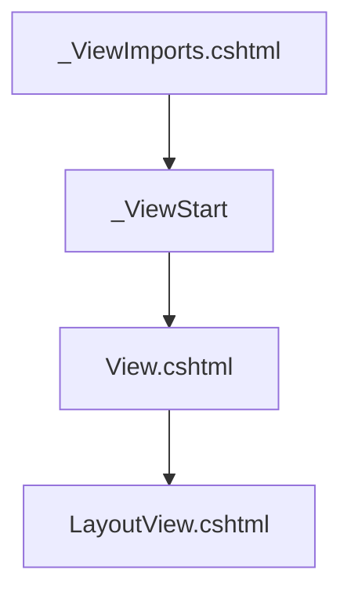

### 083. 共享视图

共享视图存放在 `Views` 文件夹中的 `Shared` 文件夹下。

## 九、布局视图

### 084. 创建布局视图

布局视图是一个网页(.cshtml)，负责展示逻辑模板（通常是包含页头、侧边栏、页脚等html模板）。

创建项目
```shell
# 创建文件夹
mkdir LayoutViewsExample
# 进入文件夹
cd LayoutViewsExample
# 创建解决方案
dotnet new sln
# 创建Web项目
dotnet new web
# 将项目添加至解决方案中
dotnet sln add .
```

编写 `Views\Shared\_Layout.cshtml` 文件内容。

```csharp
<!DOCTYPE html>
<html>
<head>
    <title>@ViewData["Title"]</title>
    <link href="~/bootstrap.min.css" rel="stylesheet"/>
</head>
<body>
<div class="container">

    <div class="navbar">
        <div class="navbar-brand">Asp.Net Core App</div>
        <ul>
            <li><a href="/">Home</a></li>
            <li><a href="/about">About</a></li>
            <li><a href="/contact">Contact</a></li>
            <li><a href="/products">Products</a></li>
            <li><a href="/search-products">Search Products</a></li>
            <li><a href="/order-product">Order Product</a></li>
        </ul>
    </div>

    @RenderBody()

</div>

</body>
</html>
```

### 085. 创建布局视图

- `@RenderBody()` 方法仅在布局视图中显示，以表示必须呈现视图中内容的确切位置。
- 视图的 `Layout` 属性指定布局视图的路径。
- 视图页面和布局视图 共享同一个 `ViewData` 对象。
- 因此，可以将数据从视图发送到布局视图中，因为视图首先执行。
- 在布局视图中引入的css、js文件也适用于视图，因为视图的内容将在运行时合并到布局视图中。

### 086. 用于多个视图的布局视图

创建`Home`控制器并指定路由，然后在 `Views\Home` 文件夹下创建 `Index`、`About`、`Contact` 视图。

```csharp
public class HomeController : Controller
{
    [Route("/")]
    public IActionResult Index()
    {
        return View();  
    }

    [Route("/about")]
    public IActionResult About()
    {
        return View();
    }

    [Route("/contact")]
    public IActionResult Contact()
    {
        return View();
    }
}
```

创建`Products`控制器并指定路由，然后在 `Views\Products` 文件夹下创建 `Products`、`SearchProducts`、`OrderProduct` 视图。

```csharp
public class ProductsController : Controller
{
    [Route("/products")]
    public IActionResult Products()
    {
        return View();
    }

    [Route("/search-products")]
    public IActionResult SearchProducts()
    {
        return View();
    }

    [Route("/order-product")]
    public IActionResult OrderProduct()
    {
        return View();
    }
}
```

### 087. 布局视图中的ViewData

由于在布局视图中的 `@RenderBody()` 方法会先执行，所以视图中的代码会先触发，当视图中的的ViewData发生变更时，布局视图是可以获取得到的，因为视图和布局视图中的ViewData是共享的。

```csharp
@{
    Layout = "~/Views/Shared/_Layout.cshtml";
    ViewData["Title"] = "Home";
}

<h1>@ViewData["Title"]</h1>
```

### 088. _ViewStart.cshtml

`_ViewStart.cshtml` 是 `Views` 文件夹及其子文件夹中的特殊文件，在执行视图之前 先调用 `_ViewImports.cshtml` 然后再调用 `_ViewStart.cshtml` 中的内容。

> 主要用于指定公用的布局页，这样视图文件中需要指定布局页面了。

### 089. 动态布局视图

我们可以在视图页面中对Layout属性赋值，它会覆盖 `_ViewStart.cshtml` 中的布局页设置。

我们可以根据某个业务逻辑来动态指定应该以哪个页面作为我们的布局视图。

```csharp
@{
    if (value == 1) 
    {
        Layout = "~/Views/Shared/_Layout1.cshtml";  
    }
    else if (value == 2)
    {
        Layout = "~/Views/Shared/_Layout2.cshtml";  
    }
}

```

### 090. 部分布局视图

`Section` 定义了在视图中的内容，在指定的布局视图位置中渲染。 

在 `_Layout.cshtml` 视图中的指定位置加入要渲染Section的代码。

```csharp
<div>
    @RenderSection("footer_section", false)
</div>
```

然后在 `Contact.cshtml` 视图中使用。

```csharp
@section footer_section {
    <p>Contact support: xxx</p>
}
```

> @RenderSection() 方法的第一个参数是 section 的名称，第二个参数是否必填。

### 091. 嵌套布局视图

在一个布局视图中引用了其他布局视图就称作嵌套布局视图。

## 十、分部视图

### 092. 创建分部视图

分部视图是一个 razor 文件 (.cshtml)，无法从控制器单独调用，但可以从同一Web应用程序中的任何视图中调用。

#### 创建项目

```shell
# 创建文件夹
mkdir PartialViewsExample
# 进入文件夹
cd PartialViewsExample
# 创建解决方案
dotnet new sln
# 创建Web项目
dotnet new web
# 将项目添加至解决方案中
dotnet sln add .
```

#### 创建分部视图

在 `Views\Shared` 文件夹下创建一个 `_ListPartialView.cshtml` 文件作为分部视图
```html
<h3>Cities</h3>
<ul class="list-group">
    <li class="list-group-item">Beijing</li>
    <li class="list-group-item">Shanghai</li>
    <li class="list-group-item">Guangzhou</li>
    <li class="list-group-item">Shenzhen</li>
</ul>
```

#### 调用分部视图

在视图页面中使用 `partial` 标签，并填写要调用的视图名称。

```html
<partial name="_ListPartialView"/>
```

或者使用 `TagHelper` 来调用分部视图。

在 `Views` 文件下创建一个 `_ViewImports.cshtml` 文件。

```csharp
@addTagHelper "*, Microsoft.AspNetCore.Mvc.TagHelpers"
```

然后在视图中进行调用。

```csharp
@Html.Partial("_ListPartialView")
```

或使用异步方法来加载，该方式将内容返回到父视图中。

```csharp
@await Html.PartialAsync("_ListPartialView")
```

亦或者使用代码块来加载分部视图，该方式将内容以流式传输到浏览器。

```csharp
@{
    await Html.RenderPartialAsync("_ListPartialView");
}
```

### 093. 在分部视图中使用ViewData

调用分部视图时，它会收到父视图的ViewData副本。因此，对分部视图中的ViewData的所有更改都不会影响到父视图中的ViewData。

如果不希望分部视图访问父视图的整个ViewData对象，可以向分部视图提供自定义的ViewData对象。

在父视图中为分部视图传递自定义ViewData对象。
```csharp
@{
    var myViewData = new ViewDataDictionary(ViewData);

    myViewData["ListTitle"] = "My View Data";
    myViewData["Cities"] = new[] { "Shanghai" };
}

<partial name="_ListPartialView" view-data="myViewData"/>
```

或使用 `RenderPartialAsync()`
```csharp
@{
    var myViewData = new ViewDataDictionary(ViewData);

    myViewData["ListTitle"] = "My View Data";
    myViewData["Cities"] = new[] { "Shanghai" };

    await Html.RenderPartialAsync("_ListPartialView", myViewData);
}
```

### 094. 强类型分部视图

强类型分部视图是绑定到指定模型类的分部视图。因此，它具有强类型视图的所有优势。

使用 `partial` 标签加载强类型分部视图。

```csharp
@{
    var listModel = new ListModel()
    {
        Title = "Languages",
        List = new [] { "zh-CN", "en-US" }
    };
}

<partial name="_StronglyListPartialView" model="listModel"/>
```

使用 `RenderPartialAsync` 加载强类型分部视图。

```csharp
@{
    var listModel = new ListModel()
    {
        Title = "Languages",
        List = new [] { "zh-CN", "en-US" }
    };

    await Html.RenderPartialAsync("_StronglyListPartialView", listModel);
}
```

### 095. PartialViewResult

`PartialViewResult` 可以表示内容的一部分。

通常，从浏览器发出异步请求，用于将分部视图的内容提取到浏览器中很有用。

定义返回分部视图接口。

```csharp
[Route("programming-languages")]
public IActionResult ProgrammingLanguages()
{
    var model = new ListModel
    {
        Title = "Programming Languages",
        List = new[] { "Java", "C#", "Python", "Go" },
    };
    return PartialView("_StronglyListPartialView", model);
}
```

前端请求分布式视图接口并加载到页面中。

```csharp
<div id="programming-languages"></div>

<button id="load" class="btn btn-primary my-2 my-sm-0" type="submit">Load Programming Languages</button>

@section footer_section

{
    <script>
        document.querySelector("#load").addEventListener('click', async function () {
            var response = await fetch('/programming-languages');
            var languages = await response.text();
            document.querySelector("#programming-languages").innerHTML = languages;
        });
    </script>
}
```

> 返回分部视图的接口的响应内容是渲染后的html代码。


## 十一、视图组件

### 096. 创建视图组件

`View Component` 是提供数据的类（派生自 `Microsoft.AspNetCore.ViewComponents`），用于呈现数据和分部视图的组合。

- 视图组件只呈现一部分，而不是整个响应。
- 具有控制器和视图相同的 关注点分离 与 可测试性 的优势。
- 视图组件应以 `ViewComponent` 为后缀，或标记为 `[ViewComponent]`。
- 可以继承 `Microsoft.AspNetCore.Mvc.ViewComponent` 类。

#### 创建项目

```shell
# 创建文件夹
mkdir ViewComponentsExample
# 进入文件夹
cd ViewComponentsExample
# 创建解决方案
dotnet new sln
# 创建Web项目
dotnet new web
# 将项目添加至解决方案中
dotnet sln add .
```

#### 添加视图组件

在 `ViewComponents` 文件夹下创建`GridViewComponent`类，并继承 `ViewComponent` 或者标记特性 `[ViewComponent]`。

因为是 “约定大于配置”，所以要定义一个 `InvokeAsync` 方法并返回视图。

视图默认的路径是在 `Views\Shared\Components` 中找到该视图组件。

```csharp
namespace ViewComponentsExample.ViewComponents;

public class GridViewComponent : ViewComponent
{
   public Task<IViewComponentResult> InvokeAsync()
   {
       // 调用分部视图
       // Views\Shared\Components\Grid\Default.cshtml
       return View();
   }
}
```

### 097. 创建视图组件

在 `Views\Shared\Components\Grid\` 路径下创建一个 `Default.cshtml` 的视图文件。

```html
<h1>Grid View Component invoked</h1>
```

然后，在其他视图中进行调用该视图组件。

```csharp
@await Component.InvokeAsync("Grid")
```

也可以返回指定名称的视图。它会去 `Views\Shared\Components\Grid\` 下查找 `Sample.cshtml` 视图文件。

```csharp
public async Task<IViewComponentResult> InvokeAsync()
{
    return View("Sample");
}
```

#### 调用视图组件

首先，在 `_ViewImports.cshtml` 中添加 `addTagHelper`，将视图组件引入进来。

```csharp
@addTagHelper "*, ViewComponentsExample"
```

然后，在视图中使用标签调用该视图组件。

```html
<vc:grid></vc:grid>
```

> `vc` 是 `ViewComponent` 的缩写，`grid` 是视图组件的名称。

### 098. 在视图组件中使用ViewData

`ViewComponent` 类 可以将 `ViewData` 对象共享给 `ViewComponent` 视图。

在`InvokeAsync`方法中，为`ViewData`设置值。

```csharp
public async Task<IViewComponentResult> InvokeAsync()
{
    var model = new PersonGridModel()
    {
        GridTitle = "Person Grid",
        Persons = Enumerable.Range(1, 10).Select(x => new Person
        {
            Name = $"ROBOT {58720+x}",
            JobTitle = x % Random.Shared.Next(2,10) == 0 ? "Manager" : "Employee"
        }).ToList(),
    };
    ViewData["Grid"] = model;
    return View("Sample");
}
```

然后在视图组件中使用。

```csharp
@{
    var grid = (PersonGridModel)ViewData["Grid"];
}
<h3>@grid.GridTitle</h3>

<table class="table table-hover">
    <thead>
    <tr>
        <th scope="col">Name</th>
        <th scope="col">Job Title</th>
    </tr>
    </thead>
    <tbody>
    @foreach (var person in grid.Persons)
    {
        <tr>
            <td>@person.Name</td>
            <td>@person.JobTitle</td>
        </tr>
    }
    </tbody>
</table>
```

> 在视图组件中使用 `ViewData` 与 普通视图中使用 `ViewData` 没有任何区别。

### 099. 强类型视图组件

强类型视图组件与指定的模型类绑定，因此，它具有强类型视图的所有好处。

在 `ViewComponent` 类中的 `InvokeAsync` 方法里返回模型数据。

```csharp
public async Task<IViewComponentResult> InvokeAsync()
{
    var model = new PersonGridModel()
    {
        GridTitle = "Person Grid",
        Persons = Enumerable.Range(1, 10).Select(x => new Person
        {
            Name = $"ROBOT {93498 + x}",
            JobTitle = x % Random.Shared.Next(2, 10) == 0 ? "Manager" : "Employee"
        }).ToList(),
    };
    return View("Sample", model);
}
```

在视图组件中使用模型类。

```csharp
@model PersonGridModel
<h3>@Model.GridTitle</h3>

<table class="table table-hover">
    <thead>
    <tr>
        <th scope="col">Name</th>
        <th scope="col">Job Title</th>
    </tr>
    </thead>
    <tbody>
    @foreach (var person in Model.Persons)
    {
        <tr>
            <td>@person.Name</td>
            <td>@person.JobTitle</td>
        </tr>
    }
    </tbody>
</table>
```

### 100. 带参数的视图组件

可以向视图组件传递参数，由视图组件类下`InvokeAsync()`方法接收参数。视图组件的所有参数都是必填的。

在 `InvokeAsync()` 方法中定义接收的参数。
```csharp
public async Task<IViewComponentResult> InvokeAsync(PersonGridModel? model)
{
    return View("Sample", model);
}
```

然后在视图中调用视图组件并传入参数。

```csharp
@await Component.InvokeAsync("Grid", new PersonGridModel
{
    GridTitle = "Friends",
    Persons = new List<Person>
    {
        new Person()
        {
            Name = "Amy",
            JobTitle = "Employee"
        },
        new Person()
        {
            Name = "John",
            JobTitle = "Manager"
        }
    }
})
```

或者使用标签来传递参数，其中传入值的名称是参数的名称。

```csharp
@{
    var grid = new PersonGridModel()
    {
        GridTitle = "SCP",
        Persons = new List<Person>
        {
            new Person
            {
                Name = "SCP-173",
                JobTitle = "None"
            }
        }
    };
}
<vc:grid model="@grid"/>
```

### 101. ViewComponentResult

`ViewComponentResult` 可以表示视图的内容。

通常，从浏览器发出异步请求，用于将视图组件的内容提取到浏览器中很有用。


定义 `ViewComponent` 类以及接收参数，并返回到视图中。

```csharp

public class GridViewComponent : ViewComponent
{
    public async Task<IViewComponentResult> InvokeAsync(PersonGridModel? grid)
    {
        return View("Sample", grid);
    }
}
```

然后，在接口中定义返回 `ViewComponentResult` 的接口，用以调用指定的 `ViewComponent` 并传递参数。

```csharp
[Route("friends-list")]
public IActionResult FriendsList()
{
    var model = new PersonGridModel()
    {
        GridTitle = "Friends List",
        Persons = new List<Person>()
        {
            new Person()
            {
                Name = "Mia",
                JobTitle = "Developer",
            },
            new Person()
            {
                Name = "Emma",
                JobTitle = "UI",
            },
            new Person()
            {
                Name = "Avva",
                JobTitle = "QA"
            }
        }
    };
    return ViewComponent("Grid",  new
    {
        grid = model
    });
}
```

最后前端调用返回视图组件的接口并将请求的部分结果放置到`html`中即可。

```js
document.querySelector("#load-friends").addEventListener('click', async function () {
    var response = await fetch('/friends-list', {
        method: 'GET',
    })

    var text = await response.text()
    document.querySelector('#friends-list').innerHTML = text
})
```

## 十二、依赖注入

### 102. 服务

Service(服务)是一个包含业务逻辑的类，主要用于处理特定的业务计算、数据验证等操作。它具有以下特点：

- 作为表示层(或应用层)和数据层之间的抽象中间层
- 将业务逻辑从表示层和数据层中分离出来
- 便于对业务逻辑进行单元测试
- 通常由控制器调用来执行具体的业务操作

通过使用Service层可以:
- 提高代码的可维护性和可测试性
- 实现关注点分离
- 降低各层之间的耦合度
- 使系统架构更加清晰

#### 创建项目

```shell
# 创建文件夹
mkdir DIExample
# 进入文件夹
cd DIExample
# 创建解决方案
dotnet new sln
# 创建Web项目
dotnet new web -n DIExample
# 将项目添加至解决方案中
dotnet sln add DIExample
# 创建服务项目
dotnet new classlib -n Services
# 将服务项目添加至解决方案中
dotnet sln add Services
```

#### 添加服务类

```csharp
public class CitiesService
{
    private List<string> _cities;

    public CitiesService()
    {
        _cities = new List<string>()
        {
            "Beijing",
            "Shanghai",
            "Guangzhou",
            "Shenzhen",
        };
    }

    public List<string> GetCities()
    {
        return _cities;
    }
}
```

### 103. 服务

使用服务类需要在构造函数中手动进行实例化。

```csharp
private readonly CitiesService _citiesService;

public HomeController()
{
    _citiesService = new CitiesService();
}
```

> 手动维护服务类的生命周期。

### 104. 依赖倒置原则

依赖关系问题
- 上级模块依赖于下级模块。
- 高级模块的开发者需要等待下级模块开发者的代码完成。
- 在较低级别模块中所做的任何修改都会影响较高级别模块中的更改。
- 很难在不影响另一个模块的情况下测试单个模块。

依赖倒置原则(DIP, Dependency Inversion Principle)，是一种设计原则，是解决依赖问题的方法。

- 更高级别的模块，不应该依赖于低级模块（依赖项）。
- 两者都应该依赖于抽象（接口或抽象类）。
- 抽象不应该依赖于细节（客户端和依赖关系）。
- 细节（客户端和依赖项）应该取决于抽象。

#### 添加类库

```csharp
dotnet new classlib -n ServiceContracts
dotnet sln add ServiceContracts
```

#### 添加接口

```csharp
public interface ICitiesService
{
    List<string> GetCities();
}
```

#### 添加实现

```csharp
public class CitiesService : ICitiesService
{
    public List<string> GetCities()
    {
        return new List<string>() { "Beijing", "Shanghai", "Guangzhou", "Shenzhen" };
    }
}
```

### 105. 控制反转

控制反转(IOC, Inversion of Control)，是一种设计模式（常见问题的可重用解决方案），它建议使用“IoC 容器”来实现依赖关系反转原则 （DIP）。

- 它通过将控制权转移到IoC容器来反转控制权。
- 它通过其他设计模式来实现，比如事件、`Service Locator`、依赖注入等。

所有的依赖项都应添加到 `IServiceCollection` 中，然后通过 `IServiceCollection` 来获取依赖项。

```csharp
builder.Services.Add(
    new ServiceDescriptor(
        typeof(ICitiesService),
        typeof(CitiesService),
        ServiceLifetime.Transient  // 服务生命周期, Transient, Scoped, Singleton
    )
);
```

### 106. 依赖注入

依赖关系注入(DI, Dependency Injection)，是一种设计模式，它允许将依赖关系从类中分离出来，并将其传递到类中。

- 它允许将低级组件的具体实现对象注入到高级组件中。
- 可以通过类的构造函数或方法中接收依赖项作为参数。

```csharp
public class HomeController : Controller
{
    private readonly ICitiesService _citiesService;

    public HomeController(ICitiesService citiesService)
    {
        _citiesService = citiesService; 
    }
}
```

> 通过构造函数将依赖项注入到类中。


### 107. 方法注入 FromService

除了通过构造函数将依赖项注入到类中，还可以通过方法注入 `FromService` 将依赖项注入到方法中。

```csharp   
[Route("/")]
public IActionResult Index([FromServices] ICitiesService citiesService)
{
    return View(citiesService.GetCities());
}
```

### 108. 服务的生命周期

服务的生命周期是用于表示如何由 `IoC / DI` 容器管理服务实例的创建和销毁。

- 瞬时服务(Transient)：每次请求时都会创建一个新的服务实例。
- 作用域服务(Scoped)：在请求的生命周期内，服务实例是唯一的。
- 单例服务(Singleton)：在应用程序的生命周期内，服务实例是唯一的。

#### Transient

每次注入对象时，都会创建一个新的服务实例。实例会在请求结束时销毁。

#### Scoped

在一此请求的作用域范围内，只创建一个服务实例。实例会在请求结束时销毁。

#### Singleton

在应用程序的生命周期内，只创建一个服务实例。实例会在应用程序结束时销毁。


### 109. 服务的生命周期

从构造函数中注入多个服务。
```csharp
private readonly ICitiesService _citiesService1;
private readonly ICitiesService _citiesService2;
private readonly ICitiesService _citiesService3;

public HomeController(
    ICitiesService citiesService1,
    ICitiesService citiesService2,
    ICitiesService citiesService3)
{
    _citiesService1 = citiesService1;
    _citiesService2 = citiesService2;
    _citiesService3 = citiesService3; 
}
```

获取服务的实例Id

```csharp
[Route("/")]
public IActionResult Index()
{
    ViewBag.Instances = new Guid[] { _citiesService1.InstanceId, _citiesService2.InstanceId, _citiesService3.InstanceId };
    
    return View(citiesService.GetCities());
}
```

在视图页面展示实例Id

```csharp
<ul>
    @foreach (var instanceId in ViewBag.Instances)
    {
        <li>@instanceId</li>
    }
</ul>
```

如果服务是瞬时服务，则每个实例Id是不同的。

```csharp
builder.Services.Add(
    new ServiceDescriptor(
        typeof(ICitiesService), 
        typeof(CitiesService), 
        ServiceLifetime.Transient
    )
);
```

如果服务是作用域服务，则在一次请求周期内的每个实例Id是相同的。
```csharp
builder.Services.Add(
    new ServiceDescriptor(
        typeof(ICitiesService), 
        typeof(CitiesService), 
        ServiceLifetime.Scoped
    )
);
```

如果服务是单例服务，则每个实例Id是相同的。

```csharp
builder.Services.Add(
    new ServiceDescriptor(
        typeof(ICitiesService), 
        typeof(CitiesService), 
        ServiceLifetime.Singleton
    )
);
```

### 110. 服务作用域

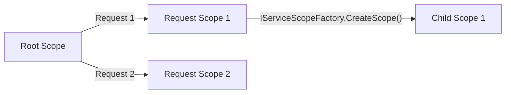

声明一个可被释放的类，它是个实现了 `IDisposable` 接口的类，用于表示一个服务作用域。

```csharp
public class CitiesService : IDisposable
{
    public void Dispose()
    {
        // 释放资源
    }
}
```

使用 `IServiceScopeFactory` 创建一个服务作用域。当服务作用域被释放时，服务实例也会被释放。

```csharp
[Route("/")]
public IActionResult Index([FromServices] ICitiesService citiesService)
{
    ViewBag.Instances = new List<Guid>
    {
        _citiesService1.InstanceId,
        _citiesService2.InstanceId,
        _citiesService3.InstanceId
    };

    using (var scope = _serviceScopeFactory.CreateScope())
    {
        var scopeCitiesService = scope.ServiceProvider.GetService<ICitiesService>();
        ViewBag.Instances.Add(scopeCitiesService.InstanceId);
    }

    return View(citiesService.GetCities());
}
```

> 在服务作用域中获取到的服务实例，与在根作用域中获取到的服务实例是不同的。因为服务作用域是独立的，它有自己的生命周期。

### 111. 服务注册的其他方式

注册成瞬时服务
```csharp
builder.Services.AddTransient<ICitiesService, CitiesService>();
```

注册成作用域服务
```csharp
builder.Services.AddScoped<ICitiesService, CitiesService>();
```

注册成单例服务
```csharp
builder.Services.AddSingleton<ICitiesService, CitiesService>();
```

### 112. 视图注入

在视图中使用 `@inject` 指令来注入服务。

```csharp
@model IEnumerable<string>
@inject ICitiesService CitiesService
@{
    ViewBag.Title = "Home";
}

<h1>Injection ICitiesService</h1>
<ul>
    @foreach (var city in CitiesService.GetCities())
    {
        <li>@city</li>
    }
</ul>
```

### 113. DI的最佳实践

#### 服务中的全局状态

避免使用**静态类**为 所有用户/所有请求 全局存储一些数据。

可以将**单例(Singleton)**服务用于 少量数据或简单场景。在这种情况下首选 `ConcurrentDictionary` 而不是 `Dictionary`，前者可以更好地处理多线程的并发访问。

或者，可以使用 分布式缓存(Redis) 来存储数据，用于任何大量数据或复杂场景。

#### 服务中的请求状态

不要使用**作用域(Scoped)**服务在同一个请求中的服务之间共享数据，因为它们不是线程安全的。可以使用 `HttpContext.Items` 来存储请求状态。

#### 服务定位器模式

避免使用**服务定位器模式(Service Locator Pattern)**，因为它会导致依赖关系不明确，难以测试和维护。

例如，不要在收到请求时创建的默认作用域范围内调用 `GetService()` 方法，但可以使用 `IServiceScopeFactory` 来创建一个作用域，然后通过 `IServiceProvider` 来获取服务实例。

#### 调用Dispose方法

不要为通过DI注入的服务手动调用`Dispose()`方法。因为`IoC`容器会自动处理服务实例的释放，它会在其作用域范围的末尾自动调用`Dispose()`方法。

#### 捕获依赖项

不要在**单例(Singleton)**服务中注入**作用域(Scoped)**服务或**瞬时(Transient)**服务，因为，在这种情况下，瞬时服务或作用域服务会在单例服务中充当单例服务。

#### 存储服务实例的引用

不要存储服务实例的引用，这可能会导致内存泄漏，并且可能会访问已释放的实例。

#### 最佳实践

- Transient
    - Transient
    - Scoped
    - Singleton

- Scoped
    - Transient
    - Scoped
    - Singleton

- Singleton
    - Singleton

> 单例服务中尽量注入进来的也是单例服务。

### 114. Autofac

- Autofac 是 .NET 中一个流行的 IoC 容器，它提供了更强大的功能和更好的性能。

#### 原生容器与Autofac对比

- `Microsoft.Extensions.DependencyInjection`
    - ASP.NET Core 内置的 IoC 容器。
    - 生命周期: Transient, Scoped, Singleton
    - 服务元数据: 不支持
    - 装饰器: 不支持

- `Autofac`
    - `Microsoft.Extensions.DependencyInjection` 的替代品。
    - 生命周期: InstancePerDependency, InstancePerLifetimeScope, InstancePerRequest, SingleInstance, InstancePerMatchingLifetimeScope
    - 服务元数据: 支持
    - 装饰器: 支持

#### 安装Autofac

```shell
dotnet add package Autofac.Extensions.DependencyInjection
```

#### 配置Autofac

使用 `AutofacServiceProviderFactory` 来配置 Autofac，用于替换内置容器。

```csharp
builder.Host.UseServiceProviderFactory(new AutofacServiceProviderFactory());
```

注册服务类

```csharp
builder.Host.ConfigureContainer<ContainerBuilder>(containerBuilder =>
{
    containerBuilder.RegisterType<CitiesService>().As<ICitiesService>()
        // 瞬时服务
        .InstancePerDependency();
        // 作用域服务
        .InstancePerLifetimeScope();
        // 单例服务
        .SingleInstance();
});
```

使用 `ILifetimeScope` 创建子域。

```csharp
public class HomeController : Controller
{
    private readonly ICitiesService _citiesService1;
    private readonly ICitiesService _citiesService2;
    private readonly ICitiesService _citiesService3;
    private readonly ILifetimeScope _lifetimeScope;

    public HomeController(
        ICitiesService citiesService1,
        ICitiesService citiesService2,
        ICitiesService citiesService3,
        ILifetimeScope lifetimeScope)
    {
        _citiesService1 = citiesService1;
        _citiesService2 = citiesService2;
        _citiesService3 = citiesService3;
        _lifetimeScope = lifetimeScope;
    }

    [Route("/")]
    public IActionResult Index([FromServices] ICitiesService citiesService)
    {
        ViewBag.Instances = new List<Guid>
        {
            _citiesService1.InstanceId,
            _citiesService2.InstanceId,
            _citiesService3.InstanceId
        };

        using (var scope = _lifetimeScope.BeginLifetimeScope())
        {
            var scopeCitiesService = scope.Resolve<ICitiesService>();
            ViewBag.Instances.Add(scopeCitiesService.InstanceId);
        }

        return View(citiesService.GetCities());
    }
}
```

## 十三、环境

### 115. 环境介绍

环境是用于表示部署和执行应用程序的系统。

#### 开发环境 (Development)

开发环境是开发人员进行代码更改并将代码提交到源代码管理的环境。

#### 预生产环境 (Staging)

预生产环境是应用程序在服务器上运行的环境,其他开发人员和质量控制人员可以访问该应用程序。

#### 生产环境 (Production) 

生产环境是真实最终用户访问应用程序的环境。简而言之,这是应用程序对外"上线"的环境。

### 116. 环境设置

在 `launchSettings.json` 中设置环境。

#### 创建项目

```shell
# 创建文件夹
mkdir EnvironmentsExample
# 进入文件夹
cd EnvironmentsExample
# 创建解决方案
dotnet new sln
# 创建Web项目
dotnet new web
# 将项目添加至解决方案中
dotnet sln add .
```

在 `launchSettings.json` 中的 `ASPNETCORE_ENVIRONMENT` 节点中设置环境变量值。

```json
{
  "$schema": "https://json.schemastore.org/launchsettings.json",
  "profiles": {
    "http": {
      "commandName": "Project",
      "dotnetRunMessages": true,
      "launchBrowser": true,
      "applicationUrl": "http://localhost:5019",
      "environmentVariables": {
        "ASPNETCORE_ENVIRONMENT": "Development"
      }
    },
    "https": {
      "commandName": "Project",
      "dotnetRunMessages": true,
      "launchBrowser": true,
      "applicationUrl": "https://localhost:7100;http://localhost:5019",
      "environmentVariables": {
        "ASPNETCORE_ENVIRONMENT": "Development"
      }
    }
  }
}
```

#### IWebHostEnvironment

- `EnvironmentName` 获取或设置环境的名称。默认情况下，从 `DOTNET_ENVIRONMENT` 或 `ASPNETCORE_ENVIRONMENT` 读取值。
- `ContentRootPath` 获取或设置应用程序文件夹的绝对路径。
- `IsDevelopment()` 如果当前环境名称为 `Development`，则返回 `true`。
- `IsStaging()` 如果当前环境名称为 `Staging`，则返回 `true`。
- `IsProduction()` 如果当前环境名称为 `Production`，则返回 `true`。
- `IsEnvironment(string environmentName)` 如果当前环境名称与指定环境名称匹配，则返回 `true`。

#### 显示开发者异常页

如果是开发环境或预生产环境则显示开发者异常页。

```csharp
if (app.Environment.IsDevelopment() || app.Environment.IsStaging())
{
    app.UseDeveloperExceptionPage();
}
```

### 117. 控制器中使用环境

使用 `IWebHostEnvironment` 访问环境。

```csharp
using Microsoft.AspNetCore.Mvc;

namespace EnvironmentsExample.Controllers;

public class HomeController : Controller
{
    private readonly IWebHostEnvironment _webHostEnvironment;

    public HomeController(IWebHostEnvironment webHostEnvironment)
    {
        _webHostEnvironment = webHostEnvironment;
    }

    [Route("/")]
    public IActionResult Index()
    {
       ViewBag.EnvironmentName = _webHostEnvironment.EnvironmentName;
        return View();
    }
}
```

### 118. 环境标签帮助类

在 `_ViewImports.cshtml` 中添加 `TagHelper`。

```csharp
@addTagHelper "*, Microsoft.AspNetCore.Mvc.TagHelpers"
```

然后在视图中使用 `environment` 标签。

- `include` 属性是只有当环境名称为匹配的值时才显示内容。
- `exclude` 属性是与当前环境名称不匹配的值时才显示内容。

```html
<environment include="Development">
    <h1>Development Environment</h1>
</environment>

<environment exclude="Development">
    <h1>Other Environment</h1>
</environment>
```

### 119. 进程级环境

环境变量仅在同一进程中存储和访问。

#### 在进程中设置环境变量

在 `PowerShell` 中使用如下命令，设置环境变量：

```shell
$Env:ASPNETCORE_ENVIRONMENT="Production"
dotnet run --no-launch-profile
```

在 `cmd` 命令行中，使用以下命令设置环境变量：

```shell
set ASPNETCORE_ENVIRONMENT && dotnet run --no-launch-profile
```

#### <environment> 标签助手

当前环境名称与 `include` 中任意一个指定的环境名称匹配时，才会显示内容。

```html
<environment include="Development,Staging">
    <h1>Development, Staging</h1>
</environment>
```

当前环境名称与 `exclude` 中任何指定的环境名称都不匹配时，才会显示内容。

```html
<environment exclude="Development,Staging">
    <h1>Production</h1>
</environment>
```

## 十四、配置

### 120. 配置介绍

`Configuration` 是公共配置的常量键/值对的数据，可以从同一应用中的任何位置读取。

> 例如: 数据库连接字符串、客户端ID、API密钥、域名、电子邮件等。


创建项目

```shell
# 创建文件夹
mkdir ConfigurationExample
# 进入文件夹
cd ConfigurationExample
# 创建解决方案
dotnet new sln
# 创建Web项目
dotnet new web
# 将项目添加至解决方案中
dotnet sln add .
```

从配置文件中读取配置信息。

```csharp
app.Configuration["myKEY"]
```

读取配置信息并转换数据类型。
```csharp
app.Configuration.GetValue<string>("MYkey")
app.Configuration.GetValue<int>("x")
```

当读取的配置不存在时，返会一个默认值。

```csharp
app.Configuration.GetValue("y", 10)
```

> 读取的配置文件的KEY是忽略大小写的。

### 121. 控制器中读取配置

通过构造函数注入进来 `IConfiguration` 用以读取配置信息。

```csharp
using Microsoft.AspNetCore.Mvc;

namespace ConfigurationExample.Controllers;

public class HomeController : Controller
{
    private readonly IConfiguration _configuration;

    public HomeController(IConfiguration configuration)
    {
        _configuration = configuration;
    }

    [Route("/")]
    public IActionResult Index()
    {
        ViewBag.MyKey = _configuration["MyKey"];
        ViewBag.x = _configuration.GetValue<int>("x");
        ViewBag.apiKey = _configuration.GetValue<string>("apiKey", "the default API Key");
        return View();
    }
}
```

### 122. 分层配置

在 `appsettings.json` 中增加多层配置信息。

```json
{
  "API": {
    "ClientID": "Client ID from appsettings.json",
    "ClientSecret": "Client Secret from appsettings.json"
  }
}
```

然后读取配置信息，多层可以使用 `:` 指定哪一级的节点。

```csharp
using Microsoft.AspNetCore.Mvc;

namespace ConfigurationExample.Controllers;

public class HomeController : Controller
{
    private readonly IConfiguration _configuration;

    public HomeController(IConfiguration configuration)
    {
        _configuration = configuration;
    }

    [Route("/")]
    public IActionResult Index()
    {
        ViewBag.ClientID = _configuration["API:ClientID"];
        ViewBag.ClientSecret = _configuration.GetValue<string>("API:ClientSecret","the default client secret");
        return View();
    }
}
```

或者使用 `GetSection` 指定节点。

```csharp
var api = _configuration.GetSection("API");
ViewBag.ClientID = api["ClientID"];
ViewBag.ClientSecret = api["ClientSecret"];
```

### 123. 选项模式

`Options` 使用自定义类来指定要加载到属性中的配置。

定义自定义选项(配置)类。

```csharp
public class ApiOptions
{
    public string? ClientID { get; set; }
    public string? ClientSecret { get; set; }
}
```

读取配置中的指定节点并映射成自定义的类。

```csharp
var apiOptions = _configuration.GetSection("API").Get<ApiOptions>();
ViewBag.ClientID = apiOptions.ClientID;
ViewBag.ClientSecret = apiOptions.ClientSecret;
```

或者使用 `Bind()` 方式来读取。

```csharp
var bindApiOptions = new ApiOptions();
_configuration.GetSection("API").Bind(bindApiOptions);        
```

### 124. 配置为服务

使用 `Configure` 将自定义配置类注册到容器中。

```csharp
builder.Services.Configure<ApiOptions>(builder.Configuration.GetSection("API"));
```

将配置类作为服务注入进来。

```csharp
private readonly ApiOptions _apiOptions;

public HomeController(IOptions<ApiOptions> options)
{
    _apiOptions = options.Value;
}
```

### 125. 特定环境的配置

配置源的优先顺序如下：

1. appsettings.json
2. appsettings.Environment.json
    1. appsettings.Development.json
    2. appsettings.Staging.json
    3. appsettings.Production.json
3. User Secrets (Secret Manager)
4. 环境变量
5. 命令行参数

### 126. 凭据管理器

`Secrets Manager` 是将用户密钥（敏感数据）存储在开发人员计算机上的单独位置。

在 `PowerShell` 中启用 `Secrets Manager`。

```bash
dotnet user-secrets init
dotnet user-secrets set "KEY" "VALUE"
dotnet user-secrets list
```

> 凭据管理器只有环境变量为 `Development` 才起效。


### 127. 环境变量配置

可以将配置值设置为进程内的环境变量。

在 `PowerShell` 中设置环境变量值。

```bash
$Env:ParentKey__ChildKey="value"
dotnet run --no-launch-profile
```

这是在配置中设置敏感值最安全的方式之一。

`__` 两个下划线，用于将父级节点和子级节点分隔开。

### 128. 自定义JSON配置

创建自定义配置文件。

```json
{
  "API": {
    "ClientID": "client id from CustomConfig.json",
    "ClientSecret": "client secret from CustomConfig.json"
  }
}
```

加载自定义配置文件。

```csharp
builder.Host.ConfigureAppConfiguration((hostingContext, config) =>
{
    config.AddJsonFile("CustomConfig.json", optional: true, reloadOnChange: true);
});
```

或者

```csharp
builder.Configuration.AddJsonFile("CustomConfig.json", optional: true, reloadOnChange: true);
```

### 129. HTTP客户端

`HttpClient` 是一个类，用于向特性HTTP资源(URL)发送HTTP请求并接收来自该资源的HTTP响应。

#### IHttpClientFactory

`IHttpClientFactory` 是一个接口，它提供了一个名为 `CreateClient()` 方法，该方法创建 `HttpClient` 类的新实例，并在使用后立即自动释放实例(关闭连接)。

#### 创建项目

```shell
# 创建文件夹
mkdir StocksApp
# 进入文件夹
cd StocksApp
# 创建解决方案
dotnet new sln
# 创建Web项目
dotnet new web
# 将项目添加至解决方案中
dotnet sln add .
```

#### 添加服务

注入 `IHttpClientFactory`，并通过 `HttpClient` 实例发起HTTP请求。

```csharp
namespace StocksApp.Services;

public class MyService
{
    private readonly IHttpClientFactory _httpClientFactory;

    public MyService(IHttpClientFactory httpClientFactory)
    {
        _httpClientFactory = httpClientFactory;
    }

    public async Task Run()
    {
        using var httpClient = _httpClientFactory.CreateClient();
        var httpRequestMessage = new HttpRequestMessage
        {
            Method = HttpMethod.Get,
            RequestUri = new Uri("http://localhost:5000"),
            Headers = { },
        };
        await httpClient.SendAsync(httpRequestMessage);
    }
}
```

### 130. HTTP客户端

读取响应流内容。

```csharp
public async Task Run()
{
    using var httpClient = _httpClientFactory.CreateClient();
    
    var httpRequestMessage = new HttpRequestMessage
    {
        Method = HttpMethod.Get,
        RequestUri = new Uri("https://jsonplaceholder.typicode.com/posts"),
        Headers = { },
    };
    
    var httpResponseMessage = await httpClient.SendAsync(httpRequestMessage);
    
    var stream = await httpResponseMessage.Content.ReadAsStreamAsync();
    using var streamReader = new StreamReader(stream);
    var response = await streamReader.ReadToEndAsync();
    Console.WriteLine(response);
}
```

### 131. HTTP客户端

定义并注册配置类。

```csharp
public class TradingOptions
{
    public string Url { get; set; }
}

builder.Services.Configure<TradingOptions>(builder.Configuration.GetSection("TradingOptions"));
```

将返回的数据转换为模型类。

```csharp
public class PostService : IPostService
{
    private readonly IHttpClientFactory _httpClientFactory;
    private readonly TradingOptions _options;

    public PostService(IHttpClientFactory httpClientFactory,IOptions<TradingOptions> options)
    {
        _httpClientFactory = httpClientFactory;
        _options = options.Value;
    }

    public async Task<IEnumerable<Post>> GetPosts()
    {
        using var httpClient = _httpClientFactory.CreateClient();

        var httpRequestMessage = new HttpRequestMessage
        {
            Method = HttpMethod.Get,
            RequestUri = new Uri(_options.Url),
            Headers = { },
        };

        var httpResponseMessage = await httpClient.SendAsync(httpRequestMessage);

        var stream = await httpResponseMessage.Content.ReadAsStreamAsync();
        using var streamReader = new StreamReader(stream);
        var response = await streamReader.ReadToEndAsync();
        var data = JsonSerializer.Deserialize<IEnumerable<Post>>(response);
        return data;
    }
}
```

将数据返回给视图。

```csharp
[Route("/")]
public async Task<IActionResult> Index()
{
    return View(await _postService.GetPosts());
}
```

视图加载模型数据。

```csharp
@using StocksApp.Models
@model IEnumerable<Post>
@{
    ViewBag.Title = "Home";
}

<h1>@ViewBag.Title</h1>

<table class="table table-striped">
    <thead>
    <tr>
        <th>ID</th>
        <th>Title</th>
        <th>Body</th>
    </tr>
    </thead>
    <tbody>
    @foreach (var post in Model)
    {
        <tr>
            <td>@post.id</td>
            <td>@post.title</td>
            <td>@post.body</td>
        </tr>
    }
    </tbody>
</table>
```

## 十五、单元测试

### 132. 联系人管理项目预览

创建项目

```shell
# 创建文件夹
mkdir CRUDExample
# 进入文件夹
cd CRUDExample
# 创建解决方案
dotnet new sln
# 创建Web项目
dotnet new web -n CRUDExample
# 将项目添加至解决方案中
dotnet sln add .\CRUDExample
```

### 133. xUnit介绍

`xUnit` 是免费开源单元测试工具。

- 简单且易于扩展。
- 最好与 `Moq` 模拟框架一起使用。

#### 添加单元测试类库

```bash
# 创建 xUnit 项目
dotnet new xunit -n CRUDTests
# 将项目添加至解决方案中
dotnet sln add .\CRUDTests
```

#### 添加计算器类

```csharp
public class Calculator
{
    public int Add(int a, int b)
    {
        return a + b;
    }
}
```

#### 单元测试

单元测试分为三个步骤:

1. `Arrange` - 安排，初始化测试所需要的设置。
2. `Act` - 行动，调用方法得到实际的结果。
3. `Assert` - 断言，验证实际执行的结果和期待的结果是否一致。

```csharp
public class UnitTest1
{
    [Fact]
    public void Test1()
    {
        // Arrange
        var calculator = new Calculator();

        int x = 1;
        int y = 2;

        var expected = 3;

        // Act
        var actual = calculator.Add(x, y);

        // Assert
        Assert.Equal(expected, actual);
    }
}
```

### 134. 单元测试 - 实体与DTO

#### 添加实体类库

```bash
# 创建类库
dotnet new classlib -n Entities
# 将类库添加至解决方案中
dotnet sln add .\Entities
```

#### 定义实体类

在 `Entities` 类库中定义实体类。

```csharp
public class Country
{
    public Guid Id { get; set; }
    public string Name { get; set; }
}
```

#### 添加服务定义类库

```bash
# 创建类库
dotnet new classlib -n ServiceContracts
# 将类库添加至解决方案中
dotnet sln add .\ServiceContracts
```

#### 定义DTO类

在 `ServiceContracts` 类库中定义DTO类，并引用 `Entities` 类库。

```csharp
public class CountryAddRequest
{
    public string CountryName { get; set; }

    public Country ToCountry() => new Country
    {
        Name = this.CountryName
    };
}
```

### 135. 单元测试 - TDD

#### 添加测试类

```csharp
public class CountriesServiceTest
{
    private readonly ICountriesService _countriesService;

    public CountriesServiceTest(ICountriesService countriesService)
    {
        _countriesService = countriesService;
    }
}
```

#### 添加服务类库

```bash
# 创建类库
dotnet new classlib -n Services
# 将类库添加至解决方案中
dotnet sln add .\Services
```

#### 添加服务并实现接口

```csharp
public class CountriesService : ICountriesService
{
    public CountryResponse AddCountry(CountryAddRequest? countryAddRequest)
    {
        throw new NotImplementedException();
    }
}
```

### 136. 单元测试 - 添加测试方法

添加需要进行测试的方法。

```csharp
public class CountriesServiceTest
{
    private readonly ICountriesService _countriesService;

    public CountriesServiceTest()
    {
        _countriesService = new CountriesService();
    }

    // 当 CountryAddRequest 为空，则应该抛异常
    [Fact]
    public void AddCountry_NullCountry()
    {
        // Arrange
        CountryAddRequest? addRequest = null;

        // Assert
        Assert.Throws<ArgumentNullException>(() =>
        {
            // Act
            _countriesService.AddCountry(addRequest);
        });
    }

    // 当 CountryName 重复，则应该抛异常
    [Fact]
    public void AddCountry_DuplicateCountryName()
    {
        // Arrange
        CountryAddRequest? addRequest = new CountryAddRequest
        {
            CountryName = "China"
        };

        // Assert
        Assert.Throws<ArgumentException>(() =>
        {
            // Act
            _countriesService.AddCountry(addRequest);
            _countriesService.AddCountry(addRequest);
        });
    }

    // 当添加成功后Id应该有值
    [Fact]
    public void AddCountry_ProperCountryDetail()
    {
        // Arrange
        CountryAddRequest? addRequest = new CountryAddRequest
        {
            CountryName = "China"
        };

        // Act
        var actual = _countriesService.AddCountry(addRequest);

        // Assert
        Assert.True(actual.CountryId != Guid.Empty);
    }
}
```

### 137. 单元测试 - 实现服务方法

实现方法并添加验证

```csharp
public class CountriesService : ICountriesService
{
    private readonly List<Country> _countries;

    public CountriesService()
    {
        _countries = new();
    }
    
    public CountryResponse AddCountry(CountryAddRequest? countryAddRequest)
    {
        if (countryAddRequest?.CountryName == null)
            throw new ArgumentNullException(nameof(countryAddRequest));
        
        if(_countries.Any(x => x.Name == countryAddRequest.CountryName))
            throw new ArgumentException($"Country {countryAddRequest.CountryName} already exists");
        
        var country = countryAddRequest.ToCountry();
        country.Id = Guid.NewGuid();
        _countries.Add(country);
        
        return country.ToCountryResponse();
    }
}
```

### 138. 单元测试 - GetAllCountries

添加GetAllCountries测试

```csharp
// 当数据为空
[Fact]
public void GetAllCountries_EmptyList()
{
    // Act
    var actual = _countriesService.GetAllCountries();

    // Assert
    Assert.Empty(actual);
}

[Fact]
public void GetAllCountries_AddFewCountries()
{
    // Arrange
    var countries = new List<CountryAddRequest>
    {
        new CountryAddRequest
        {
            CountryName = "China"
        },
        new CountryAddRequest
        {
            CountryName = "Russia"
        }
    };
    
    // Act
    var addedCountries = new List<CountryResponse>();
    foreach (var country in countries)
    {
        addedCountries.Add(_countriesService.AddCountry(country)); ;
    }
    
    var actual = _countriesService.GetAllCountries();
    
    // Assert
    foreach (var expected in addedCountries)
    {
        Assert.Contains(expected, actual);
    }
}
```

### 139. 单元测试 - GetAllCountries实现

```csharp
public List<CountryResponse> GetAllCountries()
{
    return _countries.Select(x => x.ToCountryResponse()).ToList();
}
```

### 140. 单元测试 - GetCountryByCountryId

添加测试方法

```csharp
[Fact]
public void GetCountryByCountryId_NullCountry()
{
    // Arrange
    Guid? countryId = null;

    // Act
    var actual = _countriesService.GetCountryByCountryId(countryId);

    //Assert
    Assert.Null(actual);
}

[Fact]
public void GetCountryByCountryId_ValidCountry()
{
    // Arrange
    var request = new CountryAddRequest
    {
        CountryName = "France"
    };
    var addedCountry = _countriesService.AddCountry(request);

    // Act
    var actual = _countriesService.GetCountryByCountryId(addedCountry.CountryId);
    
    // Assert
    Assert.Equal(addedCountry, actual);
}
```

### 141. 单元测试 - GetCountryByCountryId实现

```csharp
public CountryResponse? GetCountryByCountryId(Guid? countryId)
{
    return _countries?.FirstOrDefault(x => x.Id == countryId)?.ToCountryResponse();
}
```

### 142. 单元测试 - AddPerson添加模型

添加模型类

```csharp
public class Person
{
    public Guid PersonId { get; set; }
    public string? PersonName { get; set; }
    public string? Email { get; set; }
    public DateTime? DateOfBirth { get; set; }
    public string? Gender { get; set; }
    public Guid? CountryId { get; set; }
    public string Address { get; set; } 
    public bool ReceiveNewsletter { get; set; }
}
```

### 143. 单元测试 - AddPerson添加模型

```csharp

public class PersonResponse
{
    public Guid PersonId { get; set; }
    public string? PersonName { get; set; }
    public string? Email { get; set; }
    public DateTime? DateOfBirth { get; set; }
    public string? Gender { get; set; }
    public Guid? CountryId { get; set; }
    public string Address { get; set; }
    public bool ReceiveNewsletter { get; set; }

    public override bool Equals(object? obj)
    {
        if (obj is not PersonResponse personResponse)
            return false;

        return personResponse.PersonId == PersonId
               && personResponse.PersonName == PersonName
               && personResponse.Email == Email
               && personResponse.DateOfBirth == DateOfBirth
               && personResponse.Gender == Gender
               && personResponse.CountryId == CountryId
               && personResponse.Address == Address
               && personResponse.ReceiveNewsletter == ReceiveNewsletter;
    }

    public override int GetHashCode()
    {
        return base.GetHashCode();
    }
}

public static class PersonResponseExtensions
{
    public static PersonResponse ToPersonResponse(this Person person) => new PersonResponse
    {
        PersonId = person.PersonId,
        PersonName = person.PersonName,
        Email = person.Email,
        DateOfBirth = person.DateOfBirth,
        Gender = person.Gender,
        CountryId = person.CountryId,
        Address = person.Address,
        ReceiveNewsletter = person.ReceiveNewsletter
    };
}
```

### 144. 单元测试 - AddPerson测试

添加测试

```csharp
public class PersonsServiceTest
{
    private readonly IPersonsService _personsService;

    public PersonsServiceTest()
    {
        _personsService = new PersonsService();
    }

    [Fact]
    public void AddPerson_NullPerson()
    {
        // Arrange
        PersonAddRequest? personAddRequest = null;

        // Assert
        Assert.Throws<ArgumentNullException>(() =>
        {
            // Act
            var actual = _personsService.AddPerson(personAddRequest);
        });
    }

    [Fact]
    public void AddPerson_PersonNameIsNull()
    {
        // Arrange
        PersonAddRequest? personAddRequest = new PersonAddRequest
        {
            PersonName = null
        };

        // Assert
        Assert.Throws<ArgumentNullException>(() =>
        {
            // Act
            var actual = _personsService.AddPerson(personAddRequest);
        });
    }

    [Fact]
    public void AddPerson_ProperPersonDetails()
    {
        // Arrange
        PersonAddRequest? personAddRequest = new PersonAddRequest
        {
            PersonName = "hudson",
            DateOfBirth = DateTime.Now,
            Email = "hudson@gmail.com",
            Address = "Hudson Road",
            CountryId = Guid.NewGuid(),
            Gender = GenderOptions.Male,
            ReceiveNewsletter = true,
        };

        // Act
        var addedPerson = _personsService.AddPerson(personAddRequest);
        var allPersons = _personsService.GetAllPersons();

        // Assert
        Assert.True(addedPerson.PersonId != Guid.Empty);
        Assert.Contains(addedPerson, allPersons);
    }
}
```

### 145. 单元测试 - AddPerson实现

添加实现

```csharp
public class PersonsService : IPersonsService
{
    private readonly List<Person> _persons = new();
    private readonly ICountriesService _countriesService = new CountriesService();

    public PersonResponse? AddPerson(PersonAddRequest? personAddRequest)
    {
        if (personAddRequest == null)
            throw new ArgumentNullException(nameof(personAddRequest));

        if (string.IsNullOrWhiteSpace(personAddRequest.PersonName))
            throw new ArgumentException($"{nameof(personAddRequest.PersonName)} cannot be empty");

        var person = personAddRequest.ToPerson();

        person.PersonId = Guid.NewGuid();
        _persons.Add(person);

        return convertPersonResponse(person);
    }

    public List<PersonResponse> GetAllPersons()
    {
        throw new NotImplementedException();
    }

    private PersonResponse? convertPersonResponse(Person person)
    {
        var personResponse = person.ToPersonResponse();
        personResponse.Country = _countriesService.GetCountryByCountryId(person.CountryId)?.CountryName;
        return personResponse;          
    }
}
```

### 146. 单元测试 - AddPerson验证

为模型增加验证特性

```csharp
public class PersonAddRequest
{
    [Required(ErrorMessage = "Person name cannot be empty")]
    public string? PersonName { get; set; }
    [Required(ErrorMessage = "Email cannot be empty")]
    [EmailAddress(ErrorMessage = "Invalid email address")]
    public string? Email { get; set; }
}
```

验证模型对象

```csharp
public class ValidationHelper
{
    internal static void ModelValidation(object model)
    {
        ValidationContext validationContext = new ValidationContext(model);
        var validationResults = new List<ValidationResult>();
        bool isValid = Validator.TryValidateObject(model, validationContext, validationResults, true);
        if (!isValid)
        {
            throw new ArgumentException(validationResults?.FirstOrDefault()?.ErrorMessage);
        }
    }
}
```

### 147. 单元测试 - GetPersonByPersonId

添加单元测试

```csharp
[Fact]
public void GetPersonByPersonId_NullPersonId()
{
    // Arrange
    Guid? personId = null;

    // Act
    var personResponse = _personsService.GetPersonByPersonId(personId);

    // Assert
    Assert.Null(personResponse);
}

[Fact]
public void GetPersonByPersonId_WithPersonId()
{
    // Arrange
    var addedCountry = _countriesService.AddCountry(new CountryAddRequest
    {
        CountryName = "United States",
    });

    var addedPerson = _personsService.AddPerson(new PersonAddRequest
    {
        PersonName = "Elyn",
        Email = "Elyn@gmail.com",
        CountryId = addedCountry.CountryId,
        DateOfBirth = DateTime.Now,
        Gender = GenderOptions.Female,
        ReceiveNewsletter = true,
    });

    // Act
    var actual = _personsService.GetPersonByPersonId(addedPerson.PersonId);

    // Assert
    Assert.Equal(actual, addedPerson);
}
```

### 148. 单元测试 - GetPersonByPersonId实现

```csharp
public PersonResponse? GetPersonByPersonId(Guid? personId)
{
    if (personId == null)
        return null;
    return _persons?.FirstOrDefault(p => p.PersonId == personId)?.ToPersonResponse();
}
```

### 149. 单元测试 - GetAllPersons

添加测试

```csharp
[Fact]
public void GetAllPersons_EmptyList()
{
    // Arrange

    // Act
    var actual = _personsService.GetAllPersons();


    // Assert
    Assert.Empty(actual);
}

[Fact]
public void GetAllPersons_AddFewPersons()
{
    // Arrange
    var usa = _countriesService.AddCountry(new CountryAddRequest
    {
        CountryName = "USA",
    });
    var canada = _countriesService.AddCountry(new CountryAddRequest
    {
        CountryName = "Canada",
    });

    var addedPersons = new List<PersonResponse>();
    var smith = _personsService.AddPerson(new PersonAddRequest
    {
        PersonName = "Smith",
        Email = "Smith@gmail.com",
        CountryId = usa.CountryId,
        DateOfBirth = DateTime.Now,
        Gender = GenderOptions.Male,
        ReceiveNewsletter = true,
    });
    addedPersons.Add(smith);

    var mary = _personsService.AddPerson(new PersonAddRequest
    {
        PersonName = "Mary",
        Email = "Mary@gmail.com",
        CountryId = canada.CountryId,
        DateOfBirth = DateTime.Now,
        Gender = GenderOptions.Female,
        ReceiveNewsletter = true,
    });
    addedPersons.Add(mary);

    // Act
    var actual = _personsService.GetAllPersons();

    // Assert
    foreach (var person in addedPersons)
    {
        Assert.Contains(person, actual);
    }
}
```

### 150. 单元测试 - GetAllPersons实现

```csharp
public List<PersonResponse> GetAllPersons()
{
    return _persons.Select(convertPersonResponse).ToList();
}


private PersonResponse? convertPersonResponse(Person person)
{
    var personResponse = person.ToPersonResponse();
    personResponse.Country = _countriesService.GetCountryByCountryId(person.CountryId)?.CountryName;
    return personResponse;
}
```

### 151. TestOutputHelper

我们可以在测试类中注入 `ITestOutputHelper` 用以在测试过程中输出一些必要的数据。

```csharp
public class PersonsServiceTest
{
    private readonly ITestOutputHelper _testOutputHelper;
    private readonly IPersonsService _personsService;
    private readonly ICountriesService _countriesService;

    public PersonsServiceTest(ITestOutputHelper testOutputHelper)
    {
        _testOutputHelper = testOutputHelper;
        _personsService = new PersonsService();
        _countriesService = new CountriesService();
    }
    
    [Fact]
    public void GetAllPersons_AddFewPersons()
    {
        ...

        _testOutputHelper.WriteLine($"Expected:");
        foreach (var person in addedPersons)
        {
            _testOutputHelper.WriteLine(person.ToString());
        }
        
        // Act
        var actual = _personsService.GetAllPersons();

        _testOutputHelper.WriteLine("Actual:");
        foreach (var person in actual)
        {
            _testOutputHelper.WriteLine(person.ToString());
        }

        ...
    }
}
```

### 152. 单元测试 - GetFilteredPersons

```csharp
[Fact]
public void GetFilteredPersons_EmptySearchText()
{
    // Arrange
    var usa = _countriesService.AddCountry(new CountryAddRequest
    {
        CountryName = "USA",
    });
    var canada = _countriesService.AddCountry(new CountryAddRequest
    {
        CountryName = "Canada",
    });

    var addedPersons = new List<PersonResponse>();
    var smith = _personsService.AddPerson(new PersonAddRequest
    {
        PersonName = "Smith",
        Email = "Smith@gmail.com",
        CountryId = usa.CountryId,
        DateOfBirth = DateTime.Now,
        Gender = GenderOptions.Male,
        ReceiveNewsletter = true,
    });
    addedPersons.Add(smith);

    var mary = _personsService.AddPerson(new PersonAddRequest
    {
        PersonName = "Mary",
        Email = "Mary@gmail.com",
        CountryId = canada.CountryId,
        DateOfBirth = DateTime.Now,
        Gender = GenderOptions.Female,
        ReceiveNewsletter = true,
    });
    addedPersons.Add(mary);

    _testOutputHelper.WriteLine($"Expected:");
    foreach (var person in addedPersons)
    {
        _testOutputHelper.WriteLine(person.ToString());
    }

    // Act
    var actual = _personsService.GetFilteredPersons(nameof(Person.PersonName), "");

    _testOutputHelper.WriteLine("Actual:");
    foreach (var person in actual)
    {
        _testOutputHelper.WriteLine(person.ToString());
    }

    // Assert
    foreach (var person in addedPersons)
    {
        Assert.Contains(person, actual);
    }
}

[Fact]
public void GetFilteredPersons_SearchByPersonName()
{
    // Arrange
    var usa = _countriesService.AddCountry(new CountryAddRequest
    {
        CountryName = "USA",
    });
    var canada = _countriesService.AddCountry(new CountryAddRequest
    {
        CountryName = "Canada",
    });

    var addedPersons = new List<PersonResponse>();
    var smith = _personsService.AddPerson(new PersonAddRequest
    {
        PersonName = "Smith",
        Email = "Smith@gmail.com",
        CountryId = usa.CountryId,
        DateOfBirth = DateTime.Now,
        Gender = GenderOptions.Male,
        ReceiveNewsletter = true,
    });
    addedPersons.Add(smith);

    var mary = _personsService.AddPerson(new PersonAddRequest
    {
        PersonName = "Mary",
        Email = "Mary@gmail.com",
        CountryId = canada.CountryId,
        DateOfBirth = DateTime.Now,
        Gender = GenderOptions.Female,
        ReceiveNewsletter = true,
    });
    addedPersons.Add(mary);

    _testOutputHelper.WriteLine($"Expected:");
    foreach (var person in addedPersons)
    {
        _testOutputHelper.WriteLine(person.ToString());
    }

    // Act
    var actual = _personsService.GetFilteredPersons(nameof(Person.PersonName), "ma");

    _testOutputHelper.WriteLine("Actual:");
    foreach (var person in actual)
    {
        _testOutputHelper.WriteLine(person.ToString());
    }

    // Assert
    foreach (var person in addedPersons)
    {
        if (person.PersonName.Contains("ma", StringComparison.OrdinalIgnoreCase))
        {
            Assert.Contains(person, actual);
        }
    }
}
```

### 153. 单元测试 - GetFilteredPersons实现

```csharp
public IEnumerable<PersonResponse> GetFilteredPersons(string field, string? search)
{
    var persons = GetAllPersons();

    if (string.IsNullOrEmpty(field) || string.IsNullOrEmpty(search))
        return persons;

    switch (field)
    {
        case nameof(Person.PersonName):
            return persons.Where(p => p.PersonName.Contains(search));
        case nameof(Person.Email):
            return persons.Where(p => p.Email.Contains(search));
        case nameof(Person.Gender):
            return persons.Where(p => p.Gender == search);
        case nameof(Person.Address):
            return persons.Where(p => p.Address.Contains(search));
        default:
            return persons;
    }
}
```

### 153. 单元测试 - GetSortedPersons

```csharp
[Fact]
public void GetSortedPersons()
{
    // Arrange
    var usa = _countriesService.AddCountry(new CountryAddRequest
    {
        CountryName = "USA",
    });
    var canada = _countriesService.AddCountry(new CountryAddRequest
    {
        CountryName = "Canada",
    });

    var addedPersons = new List<PersonResponse>();
    var smith = _personsService.AddPerson(new PersonAddRequest
    {
        PersonName = "Smith",
        Email = "Smith@gmail.com",
        CountryId = usa.CountryId,
        DateOfBirth = DateTime.Now,
        Gender = GenderOptions.Male,
        ReceiveNewsletter = true,
    });
    addedPersons.Add(smith);

    var mary = _personsService.AddPerson(new PersonAddRequest
    {
        PersonName = "Mary",
        Email = "Mary@gmail.com",
        CountryId = canada.CountryId,
        DateOfBirth = DateTime.Now,
        Gender = GenderOptions.Female,
        ReceiveNewsletter = true,
    });
    addedPersons.Add(mary);
    addedPersons = addedPersons.OrderByDescending(p => p.PersonName).ToList();

    _testOutputHelper.WriteLine($"Expected:");
    foreach (var person in addedPersons)
    {
        _testOutputHelper.WriteLine(person.ToString());
    }

    // Act
    var actual = _personsService.GetSortedPersons(nameof(Person.PersonName), SortOptions.Desc).ToList();

    _testOutputHelper.WriteLine("Actual:");
    foreach (var person in actual)
    {
        _testOutputHelper.WriteLine(person.ToString());
    }

    // Assert
    for(var i = 0; i <addedPersons.Count ; i++)
    {
        Assert.Equal(addedPersons[i], actual[i]);
    }
}
```

### 154. 单元测试 - GetSortedPersons实现

```csharp
public List<PersonResponse> GetSortedPersons(List<PersonResponse> persons, string? field, SortOptions sortOptions)
{
    if (string.IsNullOrWhiteSpace(field))
        return persons;

    var sortedPersons = (field, sortOptions) switch
    {
        (nameof(PersonResponse.PersonName), SortOptions.Asc) => persons.OrderBy(p => p.PersonName).ToList(),
        (nameof(PersonResponse.PersonName), SortOptions.Desc) => persons.OrderByDescending(p => p.PersonName)
            .ToList(),
        (nameof(PersonResponse.Email), SortOptions.Asc) => persons.OrderBy(p => p.Email).ToList(),
        (nameof(PersonResponse.Email), SortOptions.Desc) => persons.OrderByDescending(p => p.Email).ToList(),
        (nameof(PersonResponse.Gender), SortOptions.Asc) => persons.OrderBy(p => p.Gender).ToList(),
        (nameof(PersonResponse.Gender), SortOptions.Desc) => persons.OrderByDescending(p => p.Gender).ToList(),
        (nameof(PersonResponse.Country), SortOptions.Asc) => persons.OrderBy(p => p.Country).ToList(),
        (nameof(PersonResponse.Country), SortOptions.Desc) => persons.OrderByDescending(p => p.Country).ToList(),
        _ => persons
    };

    return sortedPersons;
}
```

### 155. 单元测试 - UpdatePerson创建模型

添加更新模型

```csharp
public class PersonUpdateRequest
{
    public Guid PersonId { get; set; }
    [Required(ErrorMessage = "Person name cannot be empty")]
    public string? PersonName { get; set; }
    [Required(ErrorMessage = "Email cannot be empty")]
    [EmailAddress(ErrorMessage = "Invalid email address")]
    public string? Email { get; set; }
    public DateTime? DateOfBirth { get; set; }
    public GenderOptions? Gender { get; set; }
    public Guid? CountryId { get; set; }
    public string Address { get; set; } 
    public bool ReceiveNewsletter { get; set; }
    
    public Person ToPerson()
    {
        return new Person
        {
            PersonName = PersonName,
            Email = Email,
            DateOfBirth = DateOfBirth,
            Gender = Gender.ToString(),
            CountryId = CountryId,
            Address = Address,
            ReceiveNewsletter = ReceiveNewsletter
        };
    }
}
```

### 156. 单元测试 - UpdatePerson

添加测试方法

```csharp
[Fact]
public void UpdatePerson_NullPerson()
{
    // Arrange
    PersonUpdateRequest personUpdateRequest = null;

    // Assert
    Assert.Throws<ArgumentNullException>(() =>
    {
        // Act
        var actual = _personsService.UpdatePerson(personUpdateRequest);
    });
}

[Fact]
public void UpdatePerson_InvalidPersonId()
{
    // Arrange
    PersonUpdateRequest personUpdateRequest = new PersonUpdateRequest
    {
        PersonId = Guid.Empty,
    };

    // Assert
    Assert.Throws<ArgumentException>(() =>
    {
        // Act
        var actual = _personsService.UpdatePerson(personUpdateRequest);
    });
}

[Fact]
public void UpdatePerson_PersonNameIsNull()
{
    // Arrange
    var uk = _countriesService.AddCountry(new CountryAddRequest
    {
        CountryName = "uk"
    });

    var addedPerson = _personsService.AddPerson(new PersonAddRequest
    {
        PersonName = "John",
        CountryId = uk.CountryId,
        DateOfBirth = DateTime.Now,
    });

    var updatedPerson = addedPerson.ToPersonUpdateRequest();
    updatedPerson.PersonName = null;

    // Assert
    Assert.Throws<ArgumentException>(() =>
    {
        // Act
        _personsService.UpdatePerson(updatedPerson);
    });
}

[Fact]
public void UpdatePerson_PersonFullDetailsUpdation()
{
    // Arrange
    var uk = _countriesService.AddCountry(new CountryAddRequest
    {
        CountryName = "uk"
    });

    var addedPerson = _personsService.AddPerson(new PersonAddRequest
    {
        PersonName = "John",
        CountryId = uk.CountryId,
        DateOfBirth = DateTime.Now,
    });

    var updatedPerson = addedPerson.ToPersonUpdateRequest();
    updatedPerson.PersonName = "William";
    updatedPerson.Email = "William@gmail.com";

    // Act
    var actual = _personsService.UpdatePerson(updatedPerson);

    var person = _personsService.GetPersonByPersonId(updatedPerson.PersonId);

    // Assert
    Assert.Equal(actual, person);
}
```

### 157. 单元测试 - UpdatePerson实现

```csharp
public PersonResponse? UpdatePerson(PersonUpdateRequest? personUpdateRequest)
{
    if(personUpdateRequest == null)
        throw new ArgumentNullException(nameof(personUpdateRequest));
    
    ValidationHelper.ModelValidation(personUpdateRequest);

    var person = _persons.FirstOrDefault(x => x.PersonId == personUpdateRequest.PersonId);
    if (person ==null)
        throw new ArgumentException("Given person id is invalid");
    
    person.PersonName = personUpdateRequest.PersonName;
    person.Email = personUpdateRequest.Email;
    
    return person.ToPersonResponse();
}
```

### 158. 单元测试 - DeletePerson

```csharp
[Fact]
public void DeletePerson_ValidPersonId()
{
    // Arrange
    var usa = _countriesService.AddCountry(new CountryAddRequest
    {
        CountryName = "usa"
    });

    var person = _personsService.AddPerson(new PersonAddRequest
    {
        PersonName = "ellen",
        Email = "ellen@gmail.com",
        CountryId = usa.CountryId,
        DateOfBirth = DateTime.Now,
        Gender = GenderOptions.Female,
    });
    
    // Act
    var isDeleted = _personsService.DeletePerson(person.PersonId);
    
    // Assert
    Assert.True(isDeleted);
}
[Fact]
public void DeletePerson_InvalidPersonId()
{
    // Arrange
    
    // Act
    var isDeleted = _personsService.DeletePerson(Guid.NewGuid());
    
    // Assert
    Assert.False(isDeleted);
}
```

### 159. 单元测试 - DeletePerson实现

```csharp
public bool DeletePerson(Guid? personId)
{
    if (personId == null)
        throw new ArgumentNullException(nameof(personId));

    var person = _persons.FirstOrDefault(x => x.PersonId == personId);
    if (person == null)
        return false;

    _persons.RemoveAll(x => x.PersonId == personId);
    return true;
}
```
 
## 十六、增删改查

### 160. UI

1. 添加 `Views\Shared\_Layout.cshtml` 默认布局页。
2. 添加 `Views\_ViewImports.cshtml` 导入页。
3. 添加 `Views\_ViewStart.cshtml` 开始页。
4. 添加 `PersonsController` 控制器。
6. 添加 `Persons\Index.cshtml` 视图页。

### 161. 模拟数据

模拟初始化的数据。可以通过 [Mockaroo](https://mockaroo.com) 网站生成的测试数据。

### 162. 列表视图

注册服务到容器中。

```csharp
builder.Services.AddScoped<ICountriesService, CountriesService>();
builder.Services.AddScoped<IPersonsService, PersonsService>();
```

在控制器中注入服务，并在接口中调用获取人员信息以及将数据传递给视图。
```csharp
private readonly IPersonsService _personsService;

public PersonsController(IPersonsService personsService)
{
    _personsService = personsService;
}

[Route("/")]
[Route("persons/index")]
public IActionResult Index()
{
    var persons = _personsService.GetAllPersons();
    return View(persons);
}
```

视图界面加载数据。
```csharp
@model IEnumerable<PersonResponse>
@{
    ViewBag.Title = "Home";
}

<h1>@ViewBag.Title</h1>

<table class="table">
    <thead>
    <tr>
        <td>Person Name</td>
        <td>Email</td>
        <td>Date of Birth</td>
        <td>Gender</td>
        <td>Age</td>
        <td>Country</td>
        <td>Address</td>
        <td>Receive NewsLetters</td>
    </tr>
    </thead>
    <tbody>
    @foreach (PersonResponse person in Model)
    {
        <tr>
            <td>@person.PersonName</td>
            <td>@person.Email</td>
            <td>@person.DateOfBirth?.ToString("yyyy-MM-dd")</td>
            <td>@person.Gender</td>
            <td>@person.Age</td>
            <td>@person.Country</td>
            <td>@person.Address</td>
            <td>@person.ReceiveNewsletter</td>
        </tr>
    }
    </tbody>
</table>
```

### 163. 列表视图搜索

接口中定义接收搜索的参数，以及可筛选的条件列表。

```csharp
[Route("/")]
[Route("persons/index")]
public IActionResult Index(string? field = null, string? value = null)
{
    ViewBag.SearchFields = new Dictionary<string, object>
    {
        { "", "All" },
        { nameof(PersonResponse.PersonName), "Person Name" },
        { nameof(PersonResponse.Email), "Email" },
        { nameof(PersonResponse.DateOfBirth), "Date Of Birth" },
        { nameof(PersonResponse.Age), "Age" },
        { nameof(PersonResponse.Country), "Country" },
        { nameof(PersonResponse.Address), "Address" },
        { nameof(PersonResponse.ReceiveNewsletter), "Receive Newsletter" },
    };

    var persons = _personsService.GetAllPersons();
    return View(persons);
}
```

在列表视图中增加筛选下拉框和文本框来检索内容。

```csharp

<form action="~/persons/index" method="get">
<h1>@ViewBag.Title</h1>

<div class="row g-2 text-center">
    <div class="col-6 col-md-4">
        <select class="form-select" name="field">
            @foreach (var item in ViewBag.SearchFields)
            {
                <option value="@item.Key">@item.Value</option>
            }
        </select>
    </div>
    <div class="col-sm-6 col-md-8">
        <input class="form-control" name="value"/>
    </div>
</div>

<table class="table">
    <thead>
    <tr>
        <td>Person Name</td>
        <td>Email</td>
        <td>Date of Birth</td>
        <td>Gender</td>
        <td>Age</td>
        <td>Country</td>
        <td>Address</td>
        <td>Receive NewsLetters</td>
    </tr>
    </thead>
    <tbody>
    @foreach (PersonResponse person in Model)
    {
        <tr>
            <td>@person.PersonName</td>
            <td>@person.Email</td>
            <td>@person.DateOfBirth?.ToString("yyyy-MM-dd")</td>
            <td>@person.Gender</td>
            <td>@person.Age</td>
            <td>@person.Country</td>
            <td>@person.Address</td>
            <td>@person.ReceiveNewsletter</td>
        </tr>
    }
    </tbody>
</table>
</form>
```

### 164. 列表视图搜索功能完善

根据传入的字段和值来筛选数据。

```csharp
[Route("/")]
[Route("persons/index")]
public IActionResult Index(string? field = null, string? value = null)
{
    ViewBag.SearchFields = new Dictionary<string, object>
    {
        { "", "All" },
        { nameof(PersonResponse.PersonName), "Person Name" },
        { nameof(PersonResponse.Email), "Email" },
        { nameof(PersonResponse.DateOfBirth), "Date Of Birth" },
        { nameof(PersonResponse.Age), "Age" },
        { nameof(PersonResponse.Country), "Country" },
        { nameof(PersonResponse.Address), "Address" },
    };
    ViewBag.CurrentField = field;
    ViewBag.CurrentValue = value;

    var persons = _personsService.GetFilteredPersons(field, value);
    return View(persons);
}
```

判断传入的字段值是否等于某一项，如果相等则选中该项。

```csharp
<select class="form-select" name="field">
    @foreach (var item in ViewBag.SearchFields)
    {
        if (ViewBag.CurrentField == item.Key)
        {
            <option value="@item.Key" selected>@item.Value</option>
        }
        else
        {
            <option value="@item.Key">@item.Value</option>
        }
    }
</select>
```

### 165. 列表视图排序

将检索后的信息进行排序。

```csharp
[Route("/")]
[Route("persons/index")]
public IActionResult Index(
    string? field = null,
    string? value = null,
    string sortBy = nameof(PersonResponse.PersonName),
    SortOptions? sortOrder = SortOptions.Asc)
{
    ViewBag.SearchFields = new Dictionary<string, object>
    {
        { "", "All" },
        { nameof(PersonResponse.PersonName), "Person Name" },
        { nameof(PersonResponse.Email), "Email" },
        { nameof(PersonResponse.DateOfBirth), "Date Of Birth" },
        { nameof(PersonResponse.Age), "Age" },
        { nameof(PersonResponse.Country), "Country" },
        { nameof(PersonResponse.Address), "Address" },
    };
    ViewBag.CurrentField = field;
    ViewBag.CurrentValue = value;

    var persons = _personsService.GetFilteredPersons(field, value);
    persons = _personsService.GetSortedPersons(persons, sortBy, sortOrder);
    ViewBag.CurrentSortBy = sortBy;
    ViewBag.CurrentSortOrder = sortOrder;
    
    return View(persons);
}
```

显示当前排序的字段，并实现排序的切换。

```csharp
<table class="table">
    <thead>
    <tr>
        <td>
            @if (ViewBag.CurrentSortBy == nameof(PersonResponse.PersonName))
            {
                var reverseSort = @ViewBag.CurrentSortOrder == SortOptions.Asc ? SortOptions.Desc : SortOptions.Asc;
                
                <a href="~/persons/index?field=@ViewBag.CurrentField&value=@ViewBag.CurrentValue&sortBy=@ViewBag.CurrentSortBy&sortOrder=@(reverseSort)">
                    Person Name
                    @if (reverseSort == SortOptions.Desc)
                    {
                        <i class="fa-solid fa-sort-up"></i>
                    }
                    else
                    {
                        <i class="fa-solid fa-sort-down"></i>
                    }
                </a>
            }
            else
            {
                <a href="~/persons/index?field=@ViewBag.CurrentField&value=@ViewBag.CurrentValue&sortBy=@ViewBag.CurrentSortBy&sortOrder=@(SortOptions.Asc)">Person Name</a>
            }
        </td>
        <td>Email</td>
        <td>Date of Birth</td>
        <td>Gender</td>
        <td>Age</td>
        <td>Country</td>
        <td>Address</td>
        <td>Receive NewsLetters</td>
    </tr>
    </thead>
    <tbody>
    @foreach (PersonResponse person in Model)
    {
        <tr>
            <td>@person.PersonName</td>
            <td>@person.Email</td>
            <td>@person.DateOfBirth?.ToString("yyyy-MM-dd")</td>
            <td>@person.Gender</td>
            <td>@person.Age</td>
            <td>@person.Country</td>
            <td>@person.Address</td>
            <td>@person.ReceiveNewsletter</td>
        </tr>
    }
    </tbody>
</table>
```

### 166. 列表视图排序功能完善

定义一个分部视图将表格中的排序逻辑分开。

```csharp
<td>
@if (ViewBag.CurrentSortBy == ViewBag.ColumnName)
{
    var reverseSort = @ViewBag.CurrentSortOrder == SortOptions.Asc ? SortOptions.Desc : SortOptions.Asc;

    <a href="~/persons/index?field=@ViewBag.CurrentField&value=@ViewBag.CurrentValue&sortBy=@ViewBag.ColumnName&sortOrder=@(reverseSort)">
        @ViewBag.DisplayName
        @if (reverseSort == SortOptions.Desc)
        {
            <i class="fa-solid fa-sort-up"></i>
        }
        else
        {
            <i class="fa-solid fa-sort-down"></i>
        }
    </a>
}
else
{
    <a href="~/persons/index?field=@ViewBag.CurrentField&value=@ViewBag.CurrentValue&sortBy=@ViewBag.ColumnName&sortOrder=@(SortOptions.Asc)">
        @ViewBag.DisplayName
    </a>
}
</td>
```

在表格中调用该分部视图。

```csharp
<table class="table">
    <thead>
    <tr>
        @await Html.PartialAsync("_GridColumnHeader", new ViewDataDictionary(ViewData)
        {
            { "ColumnName", nameof(PersonResponse.PersonName) },
            { "DisplayName", "Person Name" }
        })
        @await Html.PartialAsync("_GridColumnHeader", new ViewDataDictionary(ViewData)
        {
            { "ColumnName", nameof(PersonResponse.Email) },
            { "DisplayName", "Email" }
        })
        @await Html.PartialAsync("_GridColumnHeader", new ViewDataDictionary(ViewData)
        {
            { "ColumnName", nameof(PersonResponse.DateOfBirth) },
            { "DisplayName", "Date of Birth" }
        })
        @await Html.PartialAsync("_GridColumnHeader", new ViewDataDictionary(ViewData)
        {
            { "ColumnName", nameof(PersonResponse.Gender) },
            { "DisplayName", "Gender" }
        })
        @await Html.PartialAsync("_GridColumnHeader", new ViewDataDictionary(ViewData)
        {
            { "ColumnName", nameof(PersonResponse.Age) },
            { "DisplayName", "Age" }
        })
        @await Html.PartialAsync("_GridColumnHeader", new ViewDataDictionary(ViewData)
        {
            { "ColumnName", nameof(PersonResponse.Country) },
            { "DisplayName", "Country" }
        })
        @await Html.PartialAsync("_GridColumnHeader", new ViewDataDictionary(ViewData)
        {
            { "ColumnName", nameof(PersonResponse.Address) },
            { "DisplayName", "Address" }
        })
    </tr>
    </thead>
    <tbody>
    @foreach (PersonResponse person in Model)
    {
        <tr>
            <td>@person.PersonName</td>
            <td>@person.Email</td>
            <td>@person.DateOfBirth?.ToString("yyyy-MM-dd")</td>
            <td>@person.Gender</td>
            <td>@person.Age</td>
            <td>@person.Country</td>
            <td>@person.Address</td>
        </tr>
    }
    </tbody>
</table>
```

### 167. 创建视图

添加创建人员路由，并返回城市列表。

```csharp
[Route("/persons/create")]
[HttpGet]
public IActionResult Create()
{
    ViewBag.Countries = _countriesService.GetAllCountries();
    return View();
}
```

添加创建人员视图页面

```csharp
@{
    ViewBag.Title = "Create Person";
}

<a href="~/persons/index" class="link-hover">Back to Persons List</a>
<h2>Create Person</h2>

<form>
    <div class="mb-3 row">
        <label for="PersonName" class="col-sm-2 col-form-label">Person Name</label>
        <div class="col-sm-10">
            <input type="text" class="form-control" id="PersonName" name="PersonName">
        </div>
    </div>
    <div class="mb-3 row">
        <label for="Email" class="col-sm-2 col-form-label">Email</label>
        <div class="col-sm-10">
            <input type="text" class="form-control" id="Email" name="Email">
        </div>
    </div>
    <div class="mb-3 row">
        <label for="DateOfBirth" class="col-sm-2 col-form-label">Date of Birth</label>
        <div class="col-sm-10">
            <input type="date" class="form-control" id="DateOfBirth" name="DateOfBirth">
        </div>
    </div>
    <div class="mb-3 row">
        <label class="col-sm-2 col-form-label">Gender</label>
        <div class="col-sm-10">
            <div class="form-check">
                <input class="form-check-input" type="radio" name="Gender" id="GenderMale" checked>
                <label class="form-check-label" for="GenderMale">
                    Male
                </label>
            </div>
            <div class="form-check">
                <input class="form-check-input" type="radio" name="Gender" id="GenderFemale">
                <label class="form-check-label" for="GenderFemale">
                    Female
                </label>
            </div>
        </div>
    </div>
    <div class="mb-3 row">
        <label for="DateOfBirth" class="col-sm-2 col-form-label">Country</label>
        <div class="col-sm-10">
            <select class="form-select" aria-label="Default select example">
                <option selected>-</option>
                @foreach (var country in ViewBag.Countries)
                {
                    <option value="@country.CountryId">@country.CountryName</option>
                }
            </select>
        </div>
    </div>
    <div class="mb-3 row">
        <label for="Address" class="col-sm-2 col-form-label">Address</label>
        <div class="col-sm-10">
            <textarea class="form-control" id="Address" name="Address" rows="3"></textarea>
        </div>
    </div>
    <div class="d-grid gap-2">
        <button class="btn btn-primary" type="button">Save</button>
    </div>
</form>
```

### 168. 创建视图功能完善

添加人员并验证请求参数。

```csharp
[Route("/persons/create")]
[HttpPost]
public IActionResult Create(PersonAddRequest personAddRequest)
{
    if (!ModelState.IsValid)
    {
        ViewBag.Countries = _countriesService.GetAllCountries();
        ViewBag.Errors  = ModelState.Values.SelectMany(v => v.Errors).Select(e=>e.ErrorMessage).ToList();
        return View();
    }
    
    _personsService.AddPerson(personAddRequest);
    return RedirectToAction("Index","Persons");
}
```

修改表单并提交。

```csharp
<form action="~/persons/create" method="post">
    <div class="mb-3 row">
        <label for="PersonName" class="col-sm-2 col-form-label">Person Name</label>
        <div class="col-sm-10">
            <input type="text" class="form-control" id="PersonName" name="PersonName">
        </div>
    </div>
    <div class="mb-3 row">
        <label for="Email" class="col-sm-2 col-form-label">Email</label>
        <div class="col-sm-10">
            <input type="text" class="form-control" id="Email" name="Email">
        </div>
    </div>
    <div class="mb-3 row">
        <label for="DateOfBirth" class="col-sm-2 col-form-label">Date of Birth</label>
        <div class="col-sm-10">
            <input type="date" class="form-control" id="DateOfBirth" name="DateOfBirth">
        </div>
    </div>
    <div class="mb-3 row">
        <label class="col-sm-2 col-form-label">Gender</label>
        <div class="col-sm-10">
            <div class="form-check">
                <input class="form-check-input" type="radio" name="Gender" id="GenderMale" checked value="Male">
                <label class="form-check-label" for="GenderMale">
                    Male
                </label>
            </div>
            <div class="form-check">
                <input class="form-check-input" type="radio" name="Gender" id="GenderFemale" value="Female">
                <label class="form-check-label" for="GenderFemale">
                    Female
                </label>
            </div>
        </div>
    </div>
    <div class="mb-3 row">
        <label for="CountryId" class="col-sm-2 col-form-label">Country</label>
        <div class="col-sm-10">
            <select class="form-select" id="CountryId" name="CountryId">
                <option selected>-</option>
                @foreach (var country in ViewBag.Countries)
                {
                    <option value="@country.CountryId">@country.CountryName</option>
                }
            </select>
        </div>
    </div>
    <div class="mb-3 row">
        <label for="Address" class="col-sm-2 col-form-label">Address</label>
        <div class="col-sm-10">
            <textarea class="form-control" id="Address" name="Address" rows="3"></textarea>
        </div>
    </div>
    <div class="mb-3 row">
        <label class="col-sm-2 col-form-label"></label>
        <div class="col-sm-10">
            <div class="form-check">
                <input class="form-check-input" type="checkbox" name="ReceiveNewsletters" id="ReceiveNewsletters" checked value="true">
                <label class="form-check-label" for="ReceiveNewsletters">
                    Receive Newsletters
                </label>
            </div>
        </div>
    </div>
    <div class="d-grid gap-2">
        <button class="btn btn-primary" type="submit">Save</button>
    </div>
</form>
```

### 169. 路由特性

#### 路由标记

`[controller]`、`[action]` 可用于为所有动作方法应用通用模式路由。

- `[controller]` - 用于匹配控制器名称。
- `[action]` - 用于匹配动作方法名称。

```csharp
[Route("[controller]/[action]")]
```

在控制器上标记路由特性，可作为动作方法的路由前缀。

请求路由为：`/my/profile`
```csharp
[Route("my")]
public class HomeController : Controller
{
    [Route("profile")]
    public IActionResult Profile()
    {

    }
}
```

在动作方法上面标记的路由如果前面带`/`，那么请求的路由将变为：`/index`。

```csharp
[Route("my")]
public class HomeController : Controller
{
    [Route("/index")]
    public IActionResult Index()
    {

    }
}
```

## 十七、Tag Helpers

### 170. Tag Helpers 介绍

`Tag Helpers` 是可以作为html标签或html属性调用的类。它们生成html标签或将值添加至现有html标签的属性中。

如下 `asp-for` 标签：

```html
<input asp-for="ModelProperty">
```

将会生成如下标签：

```html
<input type="text" name="ModelProperty" id="ModelProperty" value="ModelValue">
```

#### 应用在 `<a>`, `<form>` 标签下的 Tag Helpers

- `asp-controller`
- `asp-action`
- `asp-route-x`
- `asp-route`
- `asp-area`

#### 应用在 `<input>`, `<textarea>`, `<label>` 标签下的 Tag Helpers

- `asp-for`

#### 应用在 `<select>` 标签下的 Tag Helpers

- `asp-for`
- `asp-items`

#### 应用在 `` 标签下的 Tag Helpers

- `asp-append-version`

#### 应用在 `<span>` 标签下的 Tag Helpers

- `asp-validation-for`

#### 应用在 `<script>` 标签下的 Tag Helpers

- `asp-fallback-src`
- `asp-fallback-test`

#### 应用在 `<div>` 标签下的 Tag Helpers

- `asp-validation-summary`

#### 绑定

表单标签(如 `<input>`、`<label>`、`<textarea>`、`<select>` 可以与特定的模型属性绑定)，它将模型属性名称用于 `<input>` 标签的 `id` 和 `name` 属性上。

#### URL生成

`<a>` 和 `<form>` 标签中的路由地址将会重新生成，它将url生成为 `controller/action` 模式。

### 171. `<form>` 标签的 Tag Helpers

在 `_ViewImports.cshtml` 文件中引入 `TagHelpers` 视图才会进行支持。

```csharp
@addTagHelper "*, Microsoft.AspNetCore.Mvc.TagHelpers"
```

在html标签中使用 `asp-controller` 和 `asp-action` Tag Helpers。

```html
<form asp-controller="ControllerName" asp-action="ActionName"></form>
```

它会被转换成具体的路由地址。

```csharp
<form action="~/ControllerName/ActionName"></form>
```

修改后的视图内容如下：

```html
<form asp-controller="Persons" asp-action="Index" method="get">
    
    ...    
    
    <a asp-controller="Persons" asp-action="Create">Create Person</a>
    
    ...

</form>
```

### 172. `<input>` 标签下的 Tag Helpers

在input标签中可以使用的Tag Helpers 为：`asp-for`。

```html
<input asp-for="ModelProperty" />
```

它将会被转换为如下标签：

```html
<input type="text" name="ModelProperty" id="ModelProperty" value="ModelValue" data-val-rule="ErrorMessage"/>
```

> - `asp-for` 会为 `<input>`、`<textarea>`、`<select>` 等标签生成 `type`、`name`、`id`、`data-validation` 等属性。
> - 需要为视图指定模型类，这样 `asp-for` 就可以智能提示需要选择的属性了。

修改后的视图内容如下：

```html
@model PersonAddRequest
@{
    ViewBag.Title = "Create Person";
}

<a asp-controller="Persons" asp-action="Index" class="link-hover">Back to Persons List</a>
<h2>Create Person</h2>

<form asp-controller="Persons" asp-action="Create" method="post">
    <div class="mb-3 row">
        <label asp-for="PersonName" class="col-sm-2 col-form-label">Person Name</label>
        <div class="col-sm-10">
            
            <input asp-for="PersonName" type="text" class="form-control">
        </div>
    </div>
    <div class="mb-3 row">
        <label asp-for="Email" class="col-sm-2 col-form-label">Email</label>
        <div class="col-sm-10">
            <input asp-for="Email" class="fo--rm-control">
        </div>
    </div>
    <div class="mb-3 row">
        <label asp-for="DateOfBirth" class="col-sm-2 col-form-label">Date of Birth</label>
        <div class="col-sm-10">
            <input asp-for="DateOfBirth" class="form-control">
        </div>
    </div>
    <div class="mb-3 row">
        <label class="col-sm-2 col-form-label">Gender</label>
        <div class="col-sm-10">
            @foreach (var gender in Enum.GetNames(typeof(GenderOptions)))
            {
                <div class="form-check">
                    <input asp-for="Gender" class="form-check-input" type="radio" value="@gender">
                    <label class="form-check-label" for="@gender">
                        @gender
                    </label>
                </div>   
            }
        </div>
    </div>
    <div class="mb-3 row">
        <label asp-for="CountryId" class="col-sm-2 col-form-label">Country</label>
        <div class="col-sm-10">
            <select asp-for="CountryId" class="form-select">
                <option selected>-</option>
                @foreach (var country in ViewBag.Countries)
                {
                    <option value="@country.CountryId">@country.CountryName</option>
                }
            </select>
        </div>
    </div>
    <div class="mb-3 row">
        <label asp-for="Address" class="col-sm-2 col-form-label">Address</label>
        <div class="col-sm-10">
            <textarea asp-for="Address" class="form-control" rows="3"></textarea>
        </div>
    </div>
    <div class="mb-3 row">
        <label class="col-sm-2 col-form-label"></label>
        <div class="col-sm-10">
            <div class="form-check">
                <input asp-for="ReceiveNewsletter" class="form-check-input" type="checkbox" checked value="true">
                <label asp-for="ReceiveNewsletter" class="form-check-label">
                    Receive Newsletters
                </label>
            </div>
        </div>
    </div>
    <div class="d-grid gap-2">
        <button class="btn btn-primary" type="submit">Save</button>
    </div>
</form>
```

### 173. `<input>` 标签下的 Tag Helpers 完善

可以为 `<select>` 设置 `asp-items` 属性，用于自动渲染所有的选项值，这样就可以无需使用for循环来添加了。

而 `asp-items` 属性值的要求是使用 `SelectListItem` 类。

```csharp
ViewBag.Countries = _countriesService.GetAllCountries()
    .Select(x => new SelectListItem
    {
        Text = x.CountryName,
        Value = x.CountryId.ToString()
    });
```

在视图中就可以指定 `asp-items` 了。

```html
<select asp-for="CountryId" asp-items="@ViewBag.Countries" class="form-select">
    <option selected>Please Select</option>
</select>
```

### 174. 客户端验证

标注在模型属性的验证特性。

```csharp
[Required]
public DataType PropertyName { get; set; }
```

使用 `asp-for` Tag Helpers 之后，它将会在html标签上增加 `data-*` 属性。

```html
<input data-val="true" data-required="ErrorMessage" />
```

导入 `jQuery Validation` 脚本。

```
https://cdnjs.cloudflare.com/ajax/libs/jquery/3.6.0/jquery.min.js
https://cdnjs.cloudflare.com/ajax/libs/jquery-validate/1.19.3/jquery.validate.min.js
https://cdnjs.cloudflare.com/ajax/libs/jquery-validation-unobtrusive/3.2.12/jquery.validate.unobtrusive.min.js
```

使用 `asp-validation-for` Tag Helpers 之后，当提交表单时指定属性的校验失败，将在此标签中显示错误内容。

```html
<span asp-validation-for="CountryId" class="invalid-feedback"></span>
```

使用 `asp-validation-summary` Tag Helpers 后，当提交表单时出现校验失败，都会在此标签中显示其内容。

```html
<div asp-validation-summary="All"></div>
```

### 175. `<script>` 标签下的 Tag Helpers

#### asp-fallback-src

```html
<script src="CDNUrl" asp-fallback-src="~/LocalUrl" asp-fallback-test="object"> </script>
```

生成后的标签如下：

```html
<script src="CDNUrl"> </script>
<script> object || document.write("<script src='/LocalUrl'></script>"); </script>
```

1. 标签将会先向 `src` 属性中指定的 `CDRUrl` 发出请求。
2. `asp-fallback-test` 会检查脚本是否存在指定的值，如果指定的值为 `null` 或 `undefined`（意味着加载 `CDNUrl` 处的脚本文件失败了），则它会通过 `asp-fallback-src` 中指定的 `LocalUrl` 发出请求。

### 176. `` 标签下的 Tag Helpers

#### asp-append-version

```html

```

生成后的标签如下：

```html

```

- 生成图像文件的 `SHA256` 哈希值，作为附加到文件路径的查询字符串参数。
- 每次在服务器上更改文件时，都会重新生成一个新的哈希值。如果多次请求同一个文件，则不会重新生成文件哈希。

### 177. 编辑视图

添加编辑视图 `Edit.cshtml`。

```html
@model PersonUpdateRequest
@{
    ViewBag.Title = "Edit Person";
}

<a asp-controller="Persons" asp-action="Index" class="link-hover">Back to Persons List</a>
<h2>Edit Person</h2>

<form asp-controller="Persons" asp-action="Edit" method="post" class="needs-validation" novalidate>
    <input hidden asp-for="PersonId"/>
    <div class="mb-3 row">
        <label asp-for="PersonName" class="col-sm-2 col-form-label">Person Name</label>
        <div class="col-sm-10 has-validation">
            <input asp-for="PersonName" type="text" class="form-control">
            <div asp-validation-for="PersonName" class="invalid-feedback"></div>
        </div>
    </div>
    <div class="mb-3 row">
        <label asp-for="Email" class="col-sm-2 col-form-label">Email</label>
        <div class="col-sm-10 has-validation">
            <input asp-for="Email" class="form-control">
            <span asp-validation-for="Email" class="invalid-feedback"></span>
        </div>
    </div>
    <div class="mb-3 row">
        <label asp-for="DateOfBirth" class="col-sm-2 col-form-label">Date of Birth</label>
        <div class="col-sm-10 has-validation">
            <input asp-for="DateOfBirth" class="form-control">
        </div>
    </div>
    <div class="mb-3 row">
        <label class="col-sm-2 col-form-label">Gender</label>
        <div class="col-sm-10">
            @foreach (var gender in Enum.GetNames(typeof(GenderOptions)))
            {
                <div class="form-check">
                    @if (gender == Model.Gender.ToString())
                    {
                        <input asp-for="Gender" class="form-check-input" type="radio" value="@gender" checked>
                    }
                    else
                    {
                        <input asp-for="Gender" class="form-check-input" type="radio" value="@gender"/>
                    }
                    <label class="form-check-label" for="@gender">
                        @gender
                    </label>
                </div>
            }
        </div>
    </div>
    <div class="mb-3 row">
        <label asp-for="CountryId" class="col-sm-2 col-form-label">Country</label>
        <div class="col-sm-10">
            <select asp-for="CountryId" asp-items="@ViewBag.Countries" class="form-select">
                <option selected>Please Select</option>
            </select>
            <span asp-validation-for="CountryId" class="invalid-feedback"></span>
        </div>
    </div>
    <div class="mb-3 row">
        <label asp-for="Address" class="col-sm-2 col-form-label">Address</label>
        <div class="col-sm-10">
            <textarea asp-for="Address" class="form-control" rows="3"></textarea>
        </div>
    </div>
    <div class="mb-3 row">
        <label class="col-sm-2 col-form-label"></label>
        <div class="col-sm-10">
            <div class="form-check">
                <input asp-for="ReceiveNewsletter" class="form-check-input" type="checkbox" checked value="true">
                <label asp-for="ReceiveNewsletter" class="form-check-label">
                    Receive Newsletters
                </label>
            </div>
        </div>
    </div>
    <div class="d-grid gap-2">
        <div asp-validation-summary="All"></div>
        @if (ViewBag.Errors != null)
        {
            <ul>
                @foreach (var error in ViewBag.Errors)
                {
                    <li>@error</li>
                }
            </ul>
        }
    </div>
    <div class="d-grid gap-2">
        <button class="btn btn-primary" type="submit">Save</button>
    </div>
</form>

@section scripts
{
    <script
        src="https://cdnjs.cloudflare.com/ajax/libs/jquery/3.6.0/jquery.min.js"
        asp-fallback-test="window.jQuery"
        asp-fallback-src="~/jquery.min.js"></script>
    <script
        src="https://cdnjs.cloudflare.com/ajax/libs/jquery-validate/1.19.3/jquery.validate.min.js"
        asp-fallback-test="window.jQuery.validator"
        asp-fallback-src="jquery.validate.min.js"></script>
    <script
        src="https://cdnjs.cloudflare.com/ajax/libs/jquery-validation-unobtrusive/3.2.12/jquery.validate.unobtrusive.min.js"
        asp-fallback-test="window.jQuery.validator.unobtrusive"
        asp-fallback-src="jquery.validate.unobtrusive.min.js"></script>

    <script type="text/javascript">
        // Example starter JavaScript for disabling form submissions if there are invalid fields
        (() => {
            'use strict'

            // Fetch all the forms we want to apply custom Bootstrap validation styles to
            const forms = document.querySelectorAll('.needs-validation')

            // Loop over them and prevent submission
            Array.from(forms).forEach(form => {
                form.addEventListener('submit', event => {
                    if (!form.checkValidity()) {
                        event.preventDefault()
                        event.stopPropagation()
                    }

                    form.classList.add('was-validated')
                }, false)
            })
        })()
    </script>
}
```

添加编辑方法。

```csharp
[Route("edit/{personId}")]
    [HttpGet]
    public IActionResult Edit(Guid personId)
    {
        var response = _personsService.GetPersonByPersonId(personId);
        if (response == null)
        {
            return RedirectToAction("Index");
        }

        ViewBag.Countries = _countriesService.GetAllCountries()
            .Select(x => new SelectListItem
            {
                Text = x.CountryName,
                Value = x.CountryId.ToString()
            });

        var personUpdateRequest = response.ToPersonUpdateRequest();
        return View(personUpdateRequest);
    }

    [Route("edit/{personId}")]
    [HttpPost]
    public IActionResult Edit(PersonUpdateRequest personUpdateRequest)
    {
        if (!ModelState.IsValid)
        {
            ViewBag.Countries = _countriesService.GetAllCountries();
            ViewBag.Errors = ModelState.Values.SelectMany(v => v.Errors).Select(e => e.ErrorMessage).ToList();
            return View();
        }

        var person = _personsService.GetPersonByPersonId(personUpdateRequest.PersonId);
        if (person == null)
        {
            return RedirectToAction("Index");
        }

        var updatePerson = _personsService.UpdatePerson(personUpdateRequest);
        return RedirectToAction("Index", "Persons");
    }
```

### 178. 删除视图

添加删除视图 `Delete.cshtml`。

```html
@model PersonResponse
@{
    ViewBag.Title = "Delete Person";
}

<a asp-controller="Persons" asp-action="Index" class="link-hover">Back to Persons List</a>
<h2>Delete Person</h2>
<h3>Are you sure to delete this person?</h3>

<form asp-controller="Persons" asp-action="Delete" method="post" class="needs-validation" novalidate>
    <input hidden asp-for="PersonId"/>
    <div class="mb-3 row">
        <label asp-for="PersonName" class="col-sm-2 col-form-label">Person Name</label>
        <div class="col-sm-10 has-validation">
            <input asp-for="PersonName" type="text" class="form-control" disabled>
            <div asp-validation-for="PersonName" class="invalid-feedback"></div>
        </div>
    </div>
    <div class="mb-3 row">
        <label asp-for="Email" class="col-sm-2 col-form-label">Email</label>
        <div class="col-sm-10 has-validation">
            <input asp-for="Email" class="form-control" disabled>
            <span asp-validation-for="Email" class="invalid-feedback"></span>
        </div>
    </div>
    <div class="d-grid gap-2">
        <button class="btn btn-primary" type="submit">Delete</button>
    </div>
</form>
```

添加删除方法。

```csharp
[Route("delete/{personId}")]
[HttpGet]
public IActionResult Delete(Guid? personId)
{
    var response = _personsService.GetPersonByPersonId(personId);
    if (response == null)
    {
        return RedirectToAction("Index");
    }
    
    return View(response);
}

[Route("delete/{personId}")]
[HttpPost]
public IActionResult Delete(PersonUpdateRequest personUpdateRequest)
{
    var person = _personsService.GetPersonByPersonId(personUpdateRequest.PersonId);
    if (person == null)
    {
        return RedirectToAction("Index");
    }

    _personsService.DeletePerson(personUpdateRequest.PersonId);
    return RedirectToAction("Index", "Persons");
}
```

## 十八、EntityFrameworkCore

### 179. EntityFrameworkCore 介绍

`EntityFrameworkCore` 是轻量级、可扩展的跨平台框架，用于访问 .NET 应用程序中的数据库。

它是 `Asp.Net Core` 应用最常用的数据库框架。

#### EFCore 模型

```csharp
public class Model
{
    public DataType PropertyName1 { get; set; }
    public DataType PropertyName2 { get; set; }
}
```
C# 中的 模型类以及属性对应到数据库中的表和字段。

```
Table
    ColumnName1
    ColumnName2
```

#### EntityFrameworkCore 的优点与缺点

- 更少的代码量
    - 增删改查以及调用存储过程等等操作使用的代码量比 `ADO.NET` 少很多。
- 性能
    - EFCore的执行速度比 `ADO.NET` 慢。因此，`ADO.NET` 或它的替代品（例如Dapper）被推荐于更大和高流量的应用中。
- 强类型
    - EFCore会将表中的字段，映射到模型类的属性中。
    - 开发人员不需要转换值的数据类型，由EFCore本身来完成。

### 180. EntityFrmaeworkCore 方法

#### DbFirst 方法

DbFirst 是一种从数据库中生成模型类的方法。然后可以使用这些模型类来访问数据库。

- 适用于已有数据库。
- 适用于大型应用程序和高数据密集型应用程序。
- 可以手动更改数据库、存储过程、索引、触发器等T-SQL创建的内容。

#### CodeFirst 方法

CodeFirst 方法是一种从模型类中生成数据库的方法。然后可以使用这些模型类来访问数据库。

- 适用于较新的数据库。
- 对数据库手动更改的内容可能会丢失，因为是由代码生成的数据库。
- 存储过程将作为代码的一部分编写。
- 仅适用于较小的应用程序或原型级应用程序，但不适用于大型或高数据密集型应用程序。

### 181. DbContext 和 DbSet

#### DbContext 数据库

`DbContext` 的实例负责保存一组 `DbSet` 并表示与 Database 的连接。

#### DbSet 数据集

`DbSet` 表示数据库中的表，它是一个实体类型的集合。它可以用于查询和保存实体对象。

#### 添加 DbContext 服务

```csharp
builder.Services.AddDbContext<ApplicationDbContext>(options =>
    options.UseSqlServer(builder.Configuration.GetConnectionString("DefaultConnection")))   ;
```

### 182. 连接字符串

在 `appsettings.json` 中添加连接字符串。

```json
{  
  "ConnectionStrings": {
    "DefaultConnection": "Data Source=.;Initial Catalog=PersonsDatabase;Integrated Security=True;Connect Timeout=30;Encrypt=False;TrustServerCertificate=False;ApplicationIntent=ReadWrite"
  }
}
```

在 `Program.cs` 中添加以下代码。

```csharp
builder.Services.AddDbContext<ApplicationDbContext>(options =>
    options.UseSqlServer(builder.Configuration.GetConnectionString("DefaultConnection")))   ;
```

### 183. 种子数据

在 `DbContext` 中的 `OnModelCreating` 方法里添加以下代码。

```csharp
modelBuilder.Entity<Country>().HasData(new Country
{
    Id = Guid.NewGuid(),
    Name = "Sample"
});
```

当数据库被创建时，将自动添加种子数据。

### 184. 数据库迁移

`迁移` 是根据模型类的更改，创建或更新数据库的过程。

全局安装迁移工具 `dotnet-ef`。

```bash
dotnet tool install --global dotnet-ef
```

在 `Entities` 类库中安装迁移工具包 `Microsoft.EntityFrameworkCore.Tools`。

```bash
dotnet add package Microsoft.EntityFrameworkCore.Tools
```

或在 **Package Manager Console(PMC)** 中执行以下命令：

```bash
Install-Package Microsoft.EntityFrameworkCore.Tools
```

在 `CRUDExample` 项目中安装迁移工具包 `Microsoft.EntityFrameworkCore.Design`。

```bash
dotnet add package Microsoft.EntityFrameworkCore.Design
```

或在 **Package Manager Console(PMC)** 中执行以下命令：

```bash
Install-Package Microsoft.EntityFrameworkCore.Design
```

在 `PersonDbContext` 类中添加构造函数。

```csharp
public class PersonsDbContext : DbContext
{
    public PersonsDbContext(DbContextOptions<PersonsDbContext> options) : base(options)
    {
        
    }
}
```

执行迁移命令，它会自动根据模型类的变更来创建迁移文件。

```bash
dotnet ef migrations add Initial
```

或在 **Package Manager Console(PMC)** 中执行以下命令：

```bash
Add-Migration Initial
```

将迁移文件应用到数据库中。

```bash
dotnet ef database update
```

或在 **Package Manager Console(PMC)** 中执行以下命令：

```bash
Update-Database -Verbose
```

执行迁移，将迁移文件中的更改应用到数据库中，它会创建数据库或更新表架构。

### 185. 增删改查操作

#### 查询

使用 SQL 语句进行查询：

```sql
SELECT Column1, Column2
FROM TableName
WHERE Column1 = value
ORDER BY Column1 ASC/DESC
```

使用 LINQ 进行查询：

```csharp
_dbContext.DbSetName
    .Where(x => x.Column1 == value)
    .OrderBy(x => x.Column1)
    .Select(x => x);
```

#### 删除

使用 SQL 语句进行删除：

```sql
DELETE FROM TableName
WHERE Column1 = value;
```

使用 LINQ 进行删除：

```csharp
_dbContext.DbSetName
   .Where(x => x.Column1 == value)
   .Remove();

_dbContext.SaveChanges();
```

#### 更新

使用 SQL 语句进行更新：

```sql
UPDATE TableName
SET Column1 = value1, Column2 = value2
WHERE Column1 = value;
```

使用 LINQ 进行更新：

```csharp
entity.Column1 = value1;
```

保存变更：

```csharp
_dbContext.SaveChanges();
```


#### 新增

使用 SQL 语句进行新增：

```sql
INSERT INTO TableName (Column1, Column2)
VALUES (value1, value2);
```

使用 LINQ 进行新增：

```csharp
_dbContext.DbSetName
  .Add(new EntityName { Column1 = value1, Column2 = value2 });
```

### 186. EFCore 查询过程

#### EFCore 中查询处理的过程

1. 编写LINQ语句。
2. 执行具体的数据库Provider。
3. 执行SQL语句。
4. 从数据库中获取数据。
5. 将数据映射到实体对象。
6. 返回实体对象。