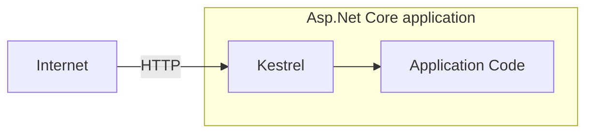
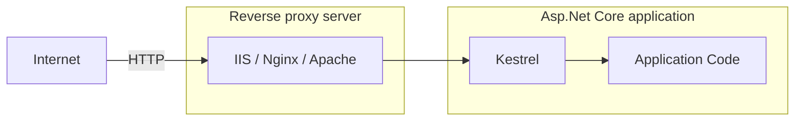
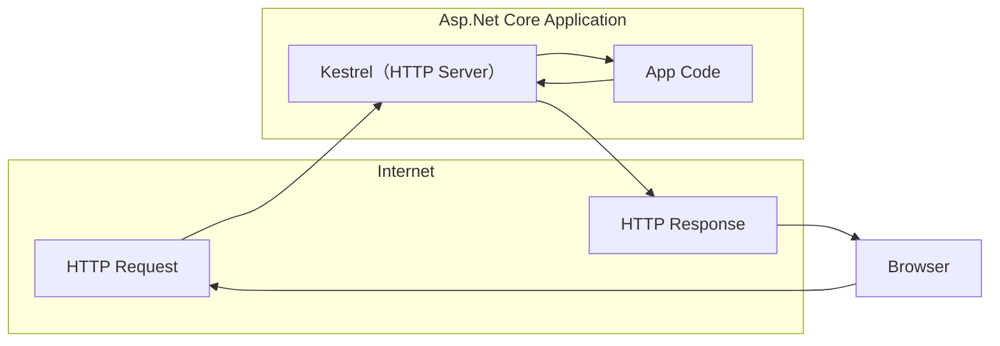
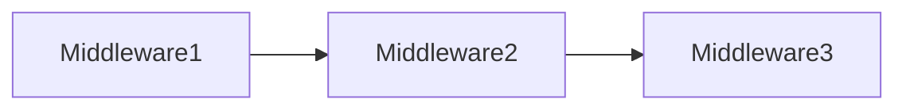

# learn-dotnet-ultimate

## Asp.Net Core 9 (.NET 9) | True Ultimate Guide

ASP .NET Core 6 to 9 | Asp.Net Core Projects | Bootcamp | Advanced | Interview Questions | Web API | MVC

### 内容概览

- [x] 01. 介绍 (Introduction)
- [x] 02. 入门 (Getting Started)
- [x] 03. HTTP
- [x] 04. 中间件 (Middleware)
- [ ] 05. 路由 (Routing)
- [ ] 06. 控制器与 IActionResult (Controllers & IActionResult)
- [ ] 07. 模型绑定与验证 (ModelBinding and Validations)
- [ ] 08. Razor 视图 (Razor Views)
- [ ] 09. 布局视图 (Layout Views)
- [ ] 10. 分部视图 (Partial Views)
- [ ] 11. 视图组件 (View Components)
- [ ] 12. 依赖注入 (Dependency Injection)
- [ ] 13. 环境 (Environments)
- [ ] 14. 配置 (Configuration)
- [ ] 15. 单元测试 (xUnit)
- [ ] 16. 增删改查 (CRUD Operations)
- [ ] 17. Tag Helpers
- [ ] 18. EntityFrameworkCore
- [ ] 19. 高级单元测试 (Advanced Unit Testing [Moq & Repository Pattern])
- [ ] 20. 日志 (Logging and Serilog)
- [ ] 21. 过滤器 (Filters)
- [ ] 22. 错误处理 (Error Handling)
- [ ] 23. SOLID原则 (SOLID Principles)
- [ ] 24. 整洁架构 (Clean Architecture)
- [ ] 25. 身份认证 (Identity, Authorization, Security)
- [ ] 26. Asp.Net Core Web API
- [ ] 27. Swagger / Open API
- [ ] 28. ~~Angular and CORS~~
- [ ] 29. 身份认证 (JWT & Web API Authorization)
- [ ] 30. 最小API Minimal API (new feature)
- [ ] 31. 新特性 New Feature of ASP.NET Core 8
- [ ] 32. 扩展 Extra: C# Essentials
- [ ] 33. ~~Practial Test~~
- [ ] 34. The End

## 一、介绍

### 001. Asp.Net Core 介绍

#### 什么是 ASP.NET Core？

ASP.NET Core 是一个跨平台、高性能的开源框架，用于构建支持云的现代Web应用程序的服务。

#### 跨平台 (Cross-platform)

ASP.NET Core 应用程序可以托管在 Windows、Linux和Mac上。

#### 可以托管的服务器类型。

支持 Kestrel、IIS、Nginx、Docker、Apache等。

#### 开源

由 GitHub 上超过 1000+ 的贡献者贡献 [aspnetcore](https://github.com/dotnet/aspnetcore)

#### 支持 Cloud

对 Microsoft Azure 的现成支持

#### 模块

- ASP.NET Core MVC - 用于创建大中型到复杂的Web应用程序。
- ASP.NET Core Web API - 用于为所有类型的客户端应用程序创建RESTFul服务。
- ASP.NET Core Razor Pages - 用于创建简单且以页面为中心的网络应用程序。
- ASP.NET Core Blazor - 用于在客户端和服务端使用C#代码创建Web应用程序。

> 先决条件：
> 1. C# - 类、接口、继承、异步、扩展方法、lambda表达式等。
> 2. HTML、CSS、JavaScript、jQuery等。

### 002. Asp.Net Web Forms、Asp.Net Mvc、Asp.Net Core 对比

| 框架 | 发布时间 | 性能 | 平台 | 云环境 | 开源 | 开发模型 |
| -- | -- | -- | -- | -- | -- | -- |
| Asp.Net Web Forms | 发布于2002年 | 由于服务器事件和视图状态而导致的性能问题。 | 仅限 Windows | 不适合 | 不开源 | 事件驱动的开发模型 |
| Asp.Net Mvc | 发布于2009年 | 由于 asp.net 的某些依赖性 (.net framework) 而导致的性能问题。 | 仅限 Windows | 略微适合 | 开源 | 模型-视图-控制器(MVC)模式 |
| Asp.Net Core | 发布于2016年 | 更快的性能。 | 跨平台 | 很适合 | 开源 | 模型-视图-控制器(MVC)模式 |

## 二、入门

### 003. 设置环境

- [Visual Studio](https://visualstudio.microsoft.com)

### 004. 创建第一个ASP.NET Core应用程序

```shell
# 创建文件夹
mkdir MyFirstApp

# 进入文件夹
cd ./MyFirstApp

# 创建解决方案
dotnet new sln

# 创建web项目
dotnet new web

# 将项目添加到解决方案中
dotnet sln add .
```

### 005. Kestrel 和 其他服务器

| 类型 | 服务器 |
| -- | -- |
| 应用服务器 | Kestrel |
| 反向代理服务器 | IIS、Nginx、Apache |

#### HTTP 与 Kestrel 的请求流程



#### HTTP 与 其他服务器的请求流程



#### 反向代理服务器的优势(Benefits)

- 负载均衡(Load Balancing)
- 缓存(Caching)
- URL重写(URL Rewriting)
- 解压缩请求(Decompressing the requests)
- 认证(Authentication)
- 解析SSL证书(Decryption of SSL Certificates)

### 006. launchSettings.json

应用程序的启动配置文件是在位于 `Properties` 文件夹内的 `launchSettings.json` 文件中。

- `iisSettings` - 该节点用于设置`IIS`相关的启动配置。
- `profiles` - 是自定义的启动相关配置。
    - `commandName` - 启动应用程序时要执行命令的类型，选项包括：
        - `Project` - 使用 **Kestrel** 启动项目。
        - `IISExpress` - 使用 **IISExpress** 启动项目。
    - `dotnetRunMessages` - 是否在命令行或终端窗口中显示详细的 **.NET CLI** 的运行时消息。如果设置为`false`则仅输出必要消息。
    - `launchBrowser` - 启动时是否打开默认浏览器。
    - `applicationUrl` - 应用的启动地址。
    - `environmentVariables` - 设置环境变量
        - `ASPNETCORE_ENVIRONMENT` - 指定 ASPNET.Core 应用程序的运行环境。它定义了三个标准的环境名称：
            - `Development` - 开发环境，通常用于本地开发，启用了更多的调试工具和详细错误信息。
            - `Staging` - 预发布环境，用于部署前的最后测试阶段，通常会模拟生产环境但会输出详细的日志和监控。
            - `Production` - 用于实际的生产环境，强调性能、安全性和稳定性。

## 三、HTTP

### 007. HTTP 介绍

HTTP(Hyper Text Transfer Protocol, 超文本传输协议)，是一种应用程序协议，它定义了一组规则，用于将请求从浏览器发送到服务器，并将响应从服务器发送到浏览器。

> 最初由 **Tim Berners Lee** 开发，后来由 IETE(Internet Engineering Task Force, 互联网工程任务组) 和 W3C(World Wide Web Consortium, 万维网联盟) 标准化。
> - SSL (Security Socket Layer, 安全套接层)
> - HTTPS (Hyper Text Transfer Protocol Security, 超文本传输安全协议)



### 008. HTTP 响应

| 响应格式 | 类型 |
| -- | -- |
| HTTP/1.1 状态码(StatusCode) 状态描述(StatusDescription) | 起始行(Start Line) |
| Key: Value | 响应头(Response Headers) |
| | 空行(Empty Line) |
| Response Body | 响应体 |

#### 响应起始行 (Response Start Line)

包含HTTP版本、状态码和状态描述。

**HTTP版本**: HTTP 1/1 | HTTP 2 | HTTP 3

| 状态码 | 状态描述 |
| -- | -- |
| 101 | Switching Protocols |
| 200 | OK |
| 302 | Found |
| 400 | Bad Request |
| 401 | Unauthorized |
| 404 | Not Found |
| 500 | Internal Server Error |

### 009. HTTP 状态码

| 状态码标识 | 状态码描述 | 状态码 |
| -- | -- | -- |
| 1xx | Information | `101` Swithching Protocols |
| 2xx | Success | `200` OK |
| 3xx | Redirection | `302` Found <br/> `304` Not MOdified |
| 4xx | Client error | `400` Bad Request <br/> `401` Unauthorized <br/> `404` Not Found |
| 5xx | Server error | `500` Internal Server Error |

#### 设置响应码

```csharp
var builder = WebApplication.CreateBuilder(args);
var app = builder.Build();

app.Run(async (HttpContext context) =>
{
    // 设置响应码
    context.Response.StatusCode = 400;
    await context.Response.WriteAsync("Hello");
    await context.Response.WriteAsync(" World");
});

app.Run();
```

### 010. HTTP 响应头

| 响应头类型 | 响应值 |
| -- | -- |
| Date | 响应的日期时间。 <br/>Ex: Tue, 15 Nov 1994 08:12:31 GMT |
| Server | 服务器名称。<br/>Ex: Server=Kestrel |
| Content-Type | 响应体的 MIME 类型。<br/>Ex: text/plain, text/html, application/json, application/xml etc. |
| Content-Length | 响应体长度（字节）。<br/>Ex: 100 |
| Cache-Control | 表示浏览器中可以缓存的响应时间的秒数。<br/>Ex: max-age=60 |
| Set-Cookie | 包含要发送给浏览器的 Cookies。<br/>Ex: x=10 |
| Access-Control-Allow-Origin | 启用 CORS (Cross-Origin-Resource-Sharing, 跨源资源共享) 功能。<br/>Ex: Access-Control-Allow-Origin: http://www.example.com |

#### 设置响应头

```csharp
var builder = WebApplication.CreateBuilder(args);
var app = builder.Build();

app.Run(async (HttpContext context) =>
{
    // 设置响应头
    context.Response.Headers["MyKey"] = "MyValue";
    context.Response.Headers["Server"] = "My Server";
    context.Response.Headers["Content-Type"] = "text/html";
    await context.Response.WriteAsync("<h1>Hello</h1>");
    await context.Response.WriteAsync("<h2> World</h2>");
});

app.Run();
```

### 011. HTTP 请求

| 请求格式 | 类型 |
| -- | -- |
| Method Url HTTP/1.1 | 起始行(Start Line) |
| Key: Value<br/>Key: Value | 请求头(Request Headers) |
| | 空行(Empty Line) |
| Request Body | 请求体 |

```csharp
var builder = WebApplication.CreateBuilder(args);
var app = builder.Build();

app.Run(async (HttpContext context) =>
{
    // 获取请求路径
    var path = context.Request.Path;
    // 获取请求方法
    var method = context.Request.Method;
    context.Response.Headers["Content-Type"] = "text/html";
    await context.Response.WriteAsync($"<p>{method} {path}</p>");
});

app.Run();
```

### 012. 查询字符串

| 请求格式 | 类型 |
| -- | -- |
| GET /dashboard?id=1&name=2 HTTP/1.1 | 起始行(Start Line) |
| HOst: www.website.com<br/>Accept: text/html | 请求头(Request Headers) |
| | 空行(Empty Line) |
| ... | 请求体 |

```csharp
var builder = WebApplication.CreateBuilder(args);
var app = builder.Build();

app.Run(async (HttpContext context) =>
{
    context.Response.Headers["Content-Type"] = "text/html";
    if (context.Request.Method == "GET")
    {
        if (context.Request.Query.ContainsKey("id"))
        {
            var id = context.Request.Query["id"];
            await context.Response.WriteAsync($"<p>{id}</p>");
        }
    }
});

app.Run();
```

### 013. HTTP 请求头

| 请求头类型 | 请求值 |
| -- | -- |
| Accept | 表示客户端要接受的响应内容的MIME类型。<br/>Ex: text/html |
| Accept-Language | 表示客户端可接受的响应内容的自然语言。<br/>Ex: en-US |
| Content-Type | 响应体的 MIME 类型。<br/>Ex: text/plain, text/html, application/json, application/xml etc. |
| Content-Length | 响应体长度（字节）。<br/>Ex: 100 |
| Date | 响应的日期时间。 <br/>Ex: Tue, 15 Nov 1994 08:12:31 GMT |
| Host | 服务器域名。<br/>Eg: www.example.com |
| User-Agent | 浏览器（客户端）详细信息。<br/>Eg: Mozilla/5.0 Firefox/12.0 |
| Cookie | 包含要发送到服务器的cookie。<br.>Eg: x=100 |

```csharp
var builder = WebApplication.CreateBuilder(args);
var app = builder.Build();

app.Run(async (HttpContext context) =>
{
    context.Response.Headers["Content-Type"] = "text/html";
    if (context.Request.Headers.ContainsKey("User-Agent"))
    {
        var userAgent = context.Request.Headers["User-Agent"];
        await context.Response.WriteAsync($"<p>{userAgent}</p>");
    }
});

app.Run();
```

### 014. Postman

- 安装Postman
- 使用Postman请求
- 从请求头中获取数据

### 015. HTTP Get请求与Post请求对比

| 请求方法 | 描述 | 
| -- | -- |
| GET | 检索信息（页面、实体对象或静态文件）的请求。 |
| POST | 将实体对象发送到服务器;通常，它将插入到数据库中。 |
| PUT | 将实体对象发送到服务器;通常会更新数据库中的所有属性 （full-update）。 |
| PATCH | 将实体对象发送到服务器;通常会更新数据库中的少量属性 （partial-update）。 |
| DELETE | 删除数据库中实体的请求。 |

#### HTTP 请求

| 请求格式 | 类型 |
| -- | -- |
| GET Url HTTP/1.1 | 起始行(Start Line) |
| Key: Value<br/>Key: Value | 请求头(Request Headers) |
| | 空行(Empty Line) |
| 请求体为空 | 请求体 |

#### HTTP 响应

| 响应格式 | 类型 |
| -- | -- |
| POST Url HTTP/1.1 | 起始行(Start Line) |
| Key: Value<br/>Key: Value | 请求头(Request Headers) |
| | 空行(Empty Line) |
| 请求体 <br/> ... <br/> ... | 请求体 |

### 016. HTTP Get请求与Post请求对比

```csharp
using System.IO;

var builder = WebApplication.CreateBuilder(args);
var app = builder.Build();

app.Run(async (HttpContext context) =>
{
    context.Response.Headers["Content-Type"] = "text/html";
    var reader = new StreamReader(context.Request.Body);
    var body = await reader.ReadToEndAsync();
    await context.Response.WriteAsync($"<p>{body}</p>");

    var query = Microsoft.AspNetCore.WebUtilities.QueryHelpers.ParseQuery(body);

    if (query.ContainsKey("name"))
    {
        foreach (var name in query["name"])
        {
            await context.Response.WriteAsync($"<h5>{name}</h5>");
        }
    }

});

app.Run();
```

## 四、中间件

### 017. 中间件介绍

中间件是组装到应用程序管道中以处理请求和响应的组件。

> Middleware 是一个接一个地链接起来的，并按照添加它们时的顺序执行。



> 中间件可以是请求委托(匿名方法或lambda表达式)或类。

### 018. Run 方法

```shell
# 创建文件夹
mkdir MiddlewareExample
# 进入文件夹
cd MiddlewareExample
# 创建解决方案
dotnet new sln
# 创建Web项目
dotnet new web
# 将项目添加至解决方案中
dotnet sln add .
```

名为 `Run` 的扩展方法用于执行一个终止/短路中间件，该中间件不会将请求转发到下一个中间件。

### 019. 中间件链

```csharp
// middleware 1
app.Use(async (HttpContext context, RequestDelegate next) =>
{
    // befire logic
    await context.Response.WriteAsync("Hello");
    await next(context);
    // after logic
});

// middleware 2
app.Use(async (context, next) =>
{
    // before logic
    await context.Response.WriteAsync("Hello 2");
    await next(context);
    // after logic
});

// middleware 3
app.Run(async (HttpContext context) =>
{
    await context.Response.WriteAsync("Hello 3");
});
```

名为 `Use` 的扩展方法用于执行非终止/短路的中间件，该中间件 可能会/可能不会（通过调用next()方法来控制） 将请求转发到下一个中间件。

### 020. 自定义中间件类

中间件类用于将中间件逻辑从lambda表达式分离到单独/可重用的类中。

```csharp
class MiddlewareClassName : IMiddleware
{
  public async Task InvokeAsync(HttpContext context, RequestDelegate next)
  {
    //before logic
    await next(context);
    //after logic
  }
}
app.UseMiddleware<MiddlewareClassName>();
```

### 021. 自定义中间件扩展

中间件扩展方法用于通过单个方法调用来调用中间件。

```csharp
public static class CustomMiddlewareExtensions
{
    public static IApplicationBuilder UseMyCustomMiddleware(this IApplicationBuilder app)
    {
        app.UseMiddleware<MyCustomMiddleware>();
        return app;
    }
}

app.UseMyCustomMiddleware();
```

### 022. 自定义传统中间件类

```csharp
namespace MiddlewareExample.CustomMiddleware;

public class HelloCustomMiddleware
{
    private readonly RequestDelegate _next;
    public HelloCustomMiddleware(RequestDelegate next)
    {
        _next = next;
    }
    public async Task InvokeAsync(HttpContext context)
    {
        await context.Response.WriteAsync("Hello Custom Middleware - Starts\n");
        await _next(context);
        await context.Response.WriteAsync("Hello Custom Middleware - Ends\n");
    }
}

public static class HelloCustomMiddlewareExtensions
{
    public static IApplicationBuilder UseHelloCustomMiddleware(this IApplicationBuilder app)
    {
        app.UseMiddleware<HelloCustomMiddleware>();
        return app;
    }
}

app.UseHelloCustomMiddleware();
```

### 023. 中间件的正确顺序

```csharp
app.UseExceptionHandler("/Error");
app.UseHsts();
app.UseHttpsRedirection();
app.UseStaticFiles();
app.UseRouting();
app.UseCors();
app.UseAuthentication();
app.UseAuthorization();
app.UseSession();
app.MapControllers();

// 添加自定义中间件

app.Run();
```

### 024. UseWhen

```csharp
app.UseWhen(context => context.Request.Query.ContainsKey("username"), app =>
{
    app.Use(async (context, next) =>
    {
        await conte.Response.WriteAsync("Hello from middleware UseWhen");
        await next();
    })
});
```

名为 `UseWhen` 的扩展方法仅用于仅在指定条件为 true 时执行中间件的分支。

## 五、路由

### 025. 路由介绍

路由是通过检查HTTP Method 和 Url 来匹配传入的 HTTP 请求的过程，然后调用相应的终端节点(Endpoint)。

```shell
# 创建文件夹
mkdir RoutingExample
# 进入文件夹
cd RoutingExample
# 创建解决方案
dotnet new sln
# 创建Web项目
dotnet new web
# 将Web项目添加至解决方案中
dotnet sln add .
```

#### UseRouting

```csharp
app.UseRouting();
```

启用路由并根据Url路径和HTTP Method选择合适的端点。

#### UseEndPoints

```csharp
app.UseEndpoints(endpoints => 
{
    endpoints.Map();
    endpoints.MapGet();
    endpoints.MapPost();
});
```

根据 `UseRouting()` 选择的端点执行相应的端点。